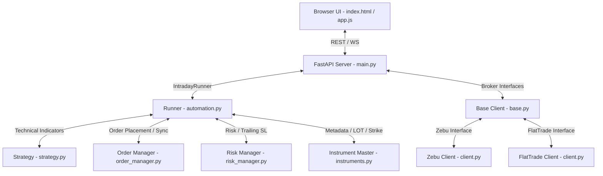

# Technical Blueprint: Multi-Broker Option Trading Algo (TVclean)

This document serves as a zero-loss technical blueprint and knowledge archive of the project. It outlines the project's purpose, architecture, state flow, and contains the complete codebase reconstruction.

---

## 1. Project Purpose & Logic

This system is a **fully automated intraday options algorithmic trading engine** designed for Indian indices and equities (NSE/BSE). It converts technical indicator signals (Raghu Oscillator + ADX + Supertrend) from spot/future candles into automated paper trading or real broker executions (supporting Zebu and FlatTrade).

### Why features exist:
- **Paper vs. Real Trade Toggle:** Allows users to backtest and verify strategies with live quotes (paper trade) before switching to real capital execution.
- **Dynamic Option Moneyness Mapping:** Automatically resolves CE/PE options contracts based on strike interval, moneyness offset (ATM, ITM, OTM), and nearest calendar expiries.
- **Fast Order Watch Loop (0.5s) & Slow Tick Loop (1.0s):** Decouples slow technical strategy candle fetching (slowed by network I/O) from high-speed stop-loss/target exit tracking.
- **Throttled Broker State Sync:** Synchronizes local execution state with the broker's position book (every 3 seconds) and order status (every 2 seconds) to handle rejections, cancellations, or manual broker modifications.
- **Voice Alerts:** Provides eyes-free audio cues for key events (trade entry, exit, modifications) using browser-based SpeechSynthesis.
- **Real-Time Active Order Adjustments:** Allows live modification of SL, Target, and Trailing SL directly from the frontend active position card.

---

## 2. System Architecture & Data Flow



### Components & State Machine
1. **Runner Threads:**
   - `_loop()` runs every `poll_seconds` (default 1s) to download candles, run strategy calculations, and identify crossovers.
   - `_order_watch_loop()` runs every `order_watch_seconds` (default 0.5s) to check stop-loss/target levels and update MTM.
2. **Order State Lifecycle:**
   - `Idle` -> `Entry_Pending` -> `Active` -> `Exit_Pending` -> `Closed`
   - Rejections during entry transition the order to `Entry_Rejected`.
   - Rejections during exit return the order to `Active` to allow retries.

---

## 3. Dependencies & Environment

### requirements.txt Dependencies
- `fastapi>=0.115.6`
- `uvicorn[standard]>=0.34.0`
- `pandas>=2.2.3`
- `numpy>=2.2.1`
- `pydantic>=2.10.4`
- `pyotp>=2.9.0`
- `requests>=2.32.3`
- `myntapi>=0.0.7`
- `selenium>=4.44.0`

### Environment Variables (.env)
- `ACTIVE_BROKER`: Selected active broker (`zebu` or `flattrade`).
- `LIVE_TRADING_ENABLED`: Master toggle (`true` or `false`) to block real capital orders.
- `ZEBU_CLIENT_ID`, `ZEBU_API_SECRET`, `ZEBU_USER_ID`, `ZEBU_PASSWORD`, `ZEBU_TOTP_SECRET`, `ZEBU_REDIRECT_URL`: Zebu API credentials.
- `ZEBU_ACCESS_TOKEN`: Persisted session token (bypasses browser login).
- `FLATTRADE_USER_ID`, `FLATTRADE_PASSWORD`, `FLATTRADE_TOTP_SECRET`, `FLATTRADE_API_KEY`, `FLATTRADE_API_SECRET`, `FLATTRADE_REDIRECT_URL`: FlatTrade V2 credentials.
- `FLATTRADE_ACCESS_TOKEN`, `FLATTRADE_SUSER_TOKEN`: FlatTrade session tokens.

---

## 4. Prompt Log & Conversational Context

- **Thread Collision Fix:** Resolved locking contention where the tick loop and order watch loop accessed the `paper_orders` list concurrently, leading to freezes. Introduced a dedicated `order_lock: threading.Lock` separate from `self.lock`.
- **Duplicate Orders Guard:** Added a strict single-position guard. When an order is in `Idle`, `Entry_Pending`, `Active`, or `Exit_Pending`, any subsequent signals are ignored. Crossover signals that occur while a position is open are not permanently marked as "seen," allowing opposite re-entries to trigger after closure.
- **UI input editing focus recovery:** When the frontend polled `/api/intraday/orders` every 500ms, typing in the `New SL` or `Target` input boxes would be overwritten/reset. Created `focusedOrderInput` tracking in `app.js` to preserve input value and cursor position during re-renders.
- **WebSocket Backoff Patch:** Monkey-patched `NorenApi` in `myntapi` to prevent memory leaks and handle socket reconnections with exponential backoff.
- **High-frequency Rate Limiting Cache:** Cached index quotes (2.5s) and active option quotes (0.8s) to prevent Zebu REST gateway from rate-limiting high-frequency API calls.

---

## 5. Complete Codebase Reconstruction

Below is the complete, production-ready code of every active file in the project.


### requirements.txt

```text
fastapi>=0.115.6
uvicorn[standard]>=0.34.0
pandas>=2.2.3
numpy>=2.2.1
pydantic>=2.10.4
pyotp>=2.9.0
requests>=2.32.3
myntapi>=0.0.7
selenium>=4.44.0
```


### .env.example

```text
ZEBU_CLIENT_ID=
ZEBU_API_SECRET=
ZEBU_USER_ID=
ZEBU_PASSWORD=
ZEBU_TOTP_SECRET=
ZEBU_ACCESS_TOKEN=
LIVE_TRADING_ENABLED=false
DEFAULT_PRODUCT_TYPE=M
DEFAULT_EXCHANGE=NSE
DEFAULT_QUANTITY=1

```


### creds.txt

```text
Vendor code	
Password:	
TOTP :		
API key : 	
API Secret:	
redirectURL: 	http://127.0.0.1:5000/zebu/callback
Client_Id:	


```


### app/__init__.py

```python
"""NSE Tools Python algo web app."""

```


### app/config.py

```python
from functools import lru_cache
from pathlib import Path
import os

from pydantic import BaseModel


BASE_DIR = Path(__file__).resolve().parents[1]
LEGACY_WORKING_DIR = BASE_DIR.parent


def _parse_key_value_file(path: Path) -> dict[str, str]:
    parsed: dict[str, str] = {}
    if not path.exists():
        return parsed
    for raw_line in path.read_text(encoding="utf-8").splitlines():
        line = raw_line.strip()
        if not line:
            continue
        if "\t" in line:
            key, value = line.split("\t", 1)
        elif ":" in line:
            key, value = line.split(":", 1)
        elif "=" in line:
            key, value = line.split("=", 1)
        else:
            continue
        clean_key = key.replace(":", "").strip().lower().replace(" ", "_")
        parsed[clean_key] = value.strip()
    return parsed


def _load_dotenv() -> None:
    env_path = BASE_DIR / ".env"
    if not env_path.exists():
        return
    for raw in env_path.read_text(encoding="utf-8").splitlines():
        line = raw.strip()
        if not line or line.startswith("#") or "=" not in line:
            continue
        key, value = line.split("=", 1)
        os.environ[key.strip()] = value.strip().strip('"').strip("'")


class Settings(BaseModel):
    active_broker: str = "zebu"  # "zebu" or "flattrade"
    
    # Zebu Credentials
    zebu_client_id: str = ""
    zebu_api_secret: str = ""
    zebu_user_id: str = ""
    zebu_password: str = ""
    zebu_totp_secret: str = ""
    zebu_redirect_url: str = ""
    zebu_access_token: str = ""
    
    # FlatTrade Credentials
    flattrade_user_id: str = ""
    flattrade_password: str = ""
    flattrade_totp_secret: str = ""
    flattrade_api_key: str = ""
    flattrade_api_secret: str = ""
    flattrade_redirect_url: str = ""
    flattrade_access_token: str = ""
    flattrade_suser_token: str = ""
    
    live_trading_enabled: bool = False
    default_product_type: str = "M"
    default_exchange: str = "NSE"
    default_quantity: int = 1
    creds_txt_loaded: bool = False


@lru_cache(maxsize=1)
def get_settings() -> Settings:
    _load_dotenv()
    
    # Read active broker from env (fallback to zebu)
    active = os.getenv("ACTIVE_BROKER", "zebu").lower()
    
    # Load Zebu creds from app/zebu/creds.txt or root creds.txt
    zebu_path = BASE_DIR / "app" / "zebu" / "creds.txt"
    if not zebu_path.exists():
        zebu_path = BASE_DIR / "creds.txt"
        if not zebu_path.exists():
            zebu_path = LEGACY_WORKING_DIR / "creds.txt"
    zebu_txt = _parse_key_value_file(zebu_path) if zebu_path.exists() else {}

    # Load FlatTrade creds from app/flattrade/creds.txt or Flattrade/creds.txt
    flattrade_path = BASE_DIR / "app" / "flattrade" / "creds.txt"
    if not flattrade_path.exists():
        flattrade_path = BASE_DIR / "Flattrade" / "creds.txt"
    flattrade_txt = _parse_key_value_file(flattrade_path) if flattrade_path.exists() else {}
    
    creds_txt_loaded = bool(zebu_txt) or bool(flattrade_txt)

    return Settings(
        active_broker=active,
        
        # Zebu
        zebu_client_id=os.getenv("ZEBU_CLIENT_ID", "") or zebu_txt.get("client_id", ""),
        zebu_api_secret=os.getenv("ZEBU_API_SECRET", "") or zebu_txt.get("api_secret", ""),
        zebu_user_id=os.getenv("ZEBU_USER_ID", "") or zebu_txt.get("vendor_code", ""),
        zebu_password=os.getenv("ZEBU_PASSWORD", "") or zebu_txt.get("password", ""),
        zebu_totp_secret=os.getenv("ZEBU_TOTP_SECRET", "") or zebu_txt.get("totp", "") or zebu_txt.get("totp_", ""),
        zebu_redirect_url=os.getenv("ZEBU_REDIRECT_URL", "") or zebu_txt.get("redirecturl", ""),
        zebu_access_token=os.getenv("ZEBU_ACCESS_TOKEN", ""),
        
        # FlatTrade
        flattrade_user_id=os.getenv("FLATTRADE_USER_ID", "") or flattrade_txt.get("vendor_code", ""),
        flattrade_password=os.getenv("FLATTRADE_PASSWORD", "") or flattrade_txt.get("password", ""),
        flattrade_totp_secret=os.getenv("FLATTRADE_TOTP_SECRET", "") or flattrade_txt.get("totp", "") or flattrade_txt.get("totp_", ""),
        flattrade_api_key=os.getenv("FLATTRADE_API_KEY", "") or flattrade_txt.get("api_key", ""),
        flattrade_api_secret=os.getenv("FLATTRADE_API_SECRET", "") or flattrade_txt.get("api_secret", ""),
        flattrade_redirect_url=os.getenv("FLATTRADE_REDIRECT_URL", "") or flattrade_txt.get("redirecturl", ""),
        flattrade_access_token=os.getenv("FLATTRADE_ACCESS_TOKEN", ""),
        flattrade_suser_token=os.getenv("FLATTRADE_SUSER_TOKEN", ""),
        
        # General Settings
        live_trading_enabled=os.getenv("LIVE_TRADING_ENABLED", "false").lower() == "true",
        default_product_type=os.getenv("DEFAULT_PRODUCT_TYPE", "M"),
        default_exchange=os.getenv("DEFAULT_EXCHANGE", "NSE"),
        default_quantity=int(os.getenv("DEFAULT_QUANTITY", "1")),
        creds_txt_loaded=creds_txt_loaded,
    )


def reload_settings() -> Settings:
    get_settings.cache_clear()
    return get_settings()


def save_token_to_env(token: str = "", broker: str = "zebu", suser_token: str = "") -> None:
    """Write or update session tokens and ACTIVE_BROKER in local .env file."""
    env_path = BASE_DIR / ".env"
    
    # Decide which keys to write
    updates = {"ACTIVE_BROKER": broker}
    if token:
        if broker == "zebu":
            updates["ZEBU_ACCESS_TOKEN"] = token
        elif broker == "flattrade":
            updates["FLATTRADE_ACCESS_TOKEN"] = token
            updates["FLATTRADE_SUSER_TOKEN"] = suser_token or token

    # Read existing lines
    lines = []
    if env_path.exists():
        lines = env_path.read_text(encoding="utf-8").splitlines()

    for key, val in updates.items():
        new_line = f"{key}={val}"
        updated = False
        for i, line in enumerate(lines):
            stripped = line.strip()
            if stripped.startswith(f"{key}=") or stripped == key:
                lines[i] = new_line
                updated = True
                break
        if not updated:
            lines.append(new_line)
            
        # Update current environment
        os.environ[key] = val

    env_path.write_text("\n".join(lines) + "\n", encoding="utf-8")
```


### app/models.py

```python
from datetime import datetime
from typing import Any, Literal

from pydantic import BaseModel, Field


class StrategyConfig(BaseModel):
    ss_length: int = 10
    ss_target: int = -1
    ss_target1_mult: int = 4
    ss_target2_mult: int = 8
    ss_target3_mult: int = 12
    vol_length: int = 20
    vol_multiplier: float = 1.5
    use_adx_filter: bool = True
    adx_length: int = 14
    adx_threshold: float = 25
    entry_lookback: int = 3
    st_atr_len: int = 10
    st_factor: float = 3.0
    ib_mins: int = 60
    orb_mins: int = 15
    strike_interval: int = 50
    delta_proxy: float = 0.5
    tsl_tp3_to_tp2: bool = True
    tsl_points_to_tp3: float = 10
    tsl_1to1_increment: bool = True


class Bar(BaseModel):
    time: datetime
    open: float
    high: float
    low: float
    close: float
    volume: float = 0


class Signal(BaseModel):
    time: datetime
    side: Literal["BUY", "SELL"]
    option_type: Literal["CE", "PE"]
    strike: int
    entry: float
    stop_loss: float
    tp1: float
    tp2: float
    tp3: float
    tsl: float
    status: str
    pnl: float = 0


class BacktestRequest(BaseModel):
    symbol: str = "NIFTY"
    bars: list[Bar]
    config: StrategyConfig = Field(default_factory=StrategyConfig)


class CsvPayload(BaseModel):
    content: str


class ZebuBarsRequest(BaseModel):
    exchange: str = "NSE"
    symbol: str
    interval: int = 5
    start: datetime | None = None
    end: datetime | None = None


class IntradayRunRequest(BaseModel):
    exchange: str = "NSE"
    underlying: str = "NIFTY"
    symbol: Literal["Spot", "Future", "Option"] = "Option"
    timeframe_minutes: int = Field(default=3, ge=1)
    qty: int = Field(default=1, ge=1)
    strategy_type: str = "2"
    option_strategy: Literal["BUY", "SELL"] = "BUY"
    option_moneyness: int = 0
    option_expiry: str = "CURRENT_WEEK"
    option_qty_lots: int = Field(default=1, ge=1)
    candle_type: Literal["ohlc"] = "ohlc"
    start_time: str = "09:15:00"
    exit_time: str = "15:15:00"
    positional_trade: bool = False
    live_trade: bool = False
    reset_saved_positions: bool = True
    trading_mode: Literal["LONG", "SHORT", "LONG_SHORT"] = "LONG_SHORT"
    max_profit: float = 10000
    max_loss: float = -10000
    max_trades_per_day: int = Field(default=11, ge=1)
    order_product_type: Literal["NRML", "MIS"] = "MIS"
    sltp_instrument: Literal["option", "spot", "strategy"] = "option"
    sl_type: Literal["percentage", "points"] = "points"
    target_type: Literal["percentage", "points"] = "points"
    stoploss_value: float = 20
    target_value: float = 150
    trailing_stoploss: bool = True
    trail_start_type: Literal["percentage", "points"] = "points"
    trail_start_value: float = 0.0
    trail_when_moves_by: float = 1
    trail_move_sl_by: float = 1
    move_sl_to_cost: bool = True
    move_sl_to_cost_points: float = 10.0
    entry_order_mode: Literal["Aggressive_Entry", "True_Limit_LTP", "Limit_Below", "Limit_Above"] = "Aggressive_Entry"
    entry_limit_price: float | None = None
    exit_order_mode: Literal["False", "Aggressive_Exit", "True_Limit_LTP", "Limit_Below", "Limit_Above"] = "Aggressive_Exit"
    exit_limit_price: float | None = None
    enable_price_chasing: bool = False
    chase_max_retries: int = Field(default=5, ge=1)
    chase_timeout_seconds: int = Field(default=20, ge=1)
    chase_slippage_pct: float = Field(default=2.0, ge=0.0)
    chase_sweep_market: bool = True
    strike_interval: int = Field(default=50, ge=1)
    tick_size: float | None = None
    poll_seconds: int = Field(default=1, ge=1, le=3600)
    order_watch_seconds: float = Field(default=0.5, ge=0.2, le=5)
    lookback_days: int = Field(default=15, ge=1, le=60)
    paper_trade: bool = True
    config: StrategyConfig = Field(default_factory=StrategyConfig)


class OrderRequest(BaseModel):
    exchange: str = "NFO"
    tradingsymbol: str
    side: Literal["BUY", "SELL"]
    quantity: int
    product_type: str = "M"
    price_type: str = "LMT"
    price: float = 0
    trigger_price: float | None = None
    confirm_live: bool = False


class OrderAdjustRequest(BaseModel):
    order_key: str
    stoploss: float | None = None
    target: float | None = None
    trailing_stoploss: bool | None = None
    trail_start_value: float | None = None
    trail_when_moves_by: float | None = None
    trail_move_sl_by: float | None = None
    move_sl_to_cost: bool | None = None
    move_sl_to_cost_points: float | None = None


class ManualTradeActionRequest(BaseModel):
    order_key: str
    action: Literal["BUY", "SELL"]
    quantity: int = Field(..., ge=1)
    price: str = "At Mkt"


class ManualTradeCancelRequest(BaseModel):
    order_key: str


class ApiResponse(BaseModel):
    ok: bool
    data: Any = None
    error: str | None = None
```


### app/utils.py

```python
from datetime import datetime, time, timedelta
from typing import Any

NSE_OPEN = time(9, 15)
NSE_CLOSE = time(15, 30)

INDEX_DATA_SYMBOLS = {
    "NIFTY": "NIFTY",
    "NIFTY50": "NIFTY",
    "NIFTY50-INDEX": "NIFTY",
    "BANKNIFTY": "BANKNIFTY",
    "FINNIFTY": "FINNIFTY",
    "MIDCPNIFTY": "MIDCPNIFTY",
    "SENSEX": "SENSEX",
}

DERIVATIVE_EXCHANGES = {"NFO", "BFO", "MCX", "CDS"}
BSE_UNDERLYINGS = {"SENSEX", "BANKEX"}

OPEN_ORDER_STATUSES = {"Idle", "Entry_Pending", "Active", "Exit_Pending"}
ACTIVE_ORDER_STATUSES = {"Active", "Exit_Pending"}
FINAL_ORDER_STATUSES = {"Entry_Rejected", "Closed", "QUOTE_ERROR"}

PRODUCT_TYPE_MAP = {"MIS": "I", "NRML": "M"}
TERMINAL_STATUS_SECONDS = 15


def _adjust_strike(base: int, option_type: str, mode: str, steps: int, interval: int) -> int:
    """Adjust option strike price based on Moneyness offset and underlying direction."""
    if mode == "ATM" or steps == 0:
        return base
    direction = 1 if option_type == "CE" else -1
    if mode == "ITM":
        direction *= -1
    return base + direction * steps * interval


def _strike_mode_from_moneyness(value: int) -> tuple[str, int]:
    """Parse integer moneyness offset into Strike Mode string and Step count."""
    if value == 0:
        return "ATM", 0
    return ("OTM" if value > 0 else "ITM"), abs(value)


def _parse_clock(value: str, fallback: time) -> time:
    """Safely parse clock string into Python time object with format try-fallbacks."""
    cleaned = value.strip().upper().replace(".", ":")
    for fmt in ("%H:%M:%S", "%H:%M", "%I:%M:%S %p", "%I:%M %p"):
        try:
            return datetime.strptime(cleaned, fmt).time()
        except ValueError:
            continue
    return fallback


def _data_symbol(underlying: str) -> str:
    """Map user-friendly underlying to corresponding cash-index symbol for candle fetching."""
    clean = underlying.strip().upper()
    return INDEX_DATA_SYMBOLS.get(clean, underlying.strip())


def _data_exchange(exchange: str, underlying: str) -> str:
    """Resolve standard cash exchange name for underlying data feed lookup."""
    clean_exchange = exchange.strip().upper()
    clean_underlying = underlying.strip().upper()
    if clean_exchange in {"BFO", "BSE"} or clean_underlying in BSE_UNDERLYINGS:
        return "BSE"
    if clean_exchange in {"NFO", "NSE", "INDICES"}:
        return "NSE"
    return clean_exchange


def _trade_exchange(exchange: str, symbol: str, underlying: str) -> str:
    """Resolve derivative exchange name for option/future contract trading lookup."""
    clean_exchange = exchange.strip().upper()
    clean_symbol = symbol.strip()
    clean_underlying = underlying.strip().upper()
    if clean_symbol == "Spot":
        return _data_exchange(clean_exchange, clean_underlying)
    if clean_exchange in DERIVATIVE_EXCHANGES:
        return clean_exchange
    if clean_exchange == "BSE" or clean_underlying in BSE_UNDERLYINGS:
        return "BFO"
    return "NFO"


def _today_session_start(now: datetime, start: time = NSE_OPEN) -> datetime:
    """Combine today's date with configured session start time."""
    return datetime.combine(now.date(), start)


def _is_market_time(now: datetime, start: time = NSE_OPEN, end: time = NSE_CLOSE) -> bool:
    """Check if current time falls within configured trading hours."""
    return start <= now.time() <= end


def _contract_name(contract: dict[str, Any] | None) -> str:
    """Extract trading symbol or fallback identifier from Zebu resolved contract dict."""
    if not contract:
        return ""
    return str(contract.get("tradingsymbol") or contract.get("token") or "")


def _clean_order_id(value: Any) -> str:
    """Normalize Zebu/Mynt order ids that may arrive as strings, numbers, or Excel-style floats."""
    if value is None:
        return ""
    text = str(value).strip()
    if not text or text.lower() in {"none", "nan", "-"}:
        return ""
    if "e" in text.lower():
        try:
            text = str(int(float(text)))
        except (TypeError, ValueError, OverflowError):
            pass
    if text.endswith(".0"):
        text = text[:-2]
    return text


def _broker_value(response: dict[str, Any], keys: tuple[str, ...]) -> Any:
    """Return the first non-empty broker value, case-insensitive across known field names."""
    lowered = {str(key).lower(): value for key, value in response.items()}
    for key in keys:
        if key in response and response[key] not in (None, ""):
            return response[key]
        value = lowered.get(key.lower())
        if value not in (None, ""):
            return value
    return None


def _broker_order_id(response: dict[str, Any] | None) -> str | None:
    """Safely extract Zebu/Mynt order id from placement, history, or order-book rows."""
    if not response:
        return None
    value = _broker_value(
        response,
        (
            "norenordno",
            "orderno",
            "order_no",
            "order_id",
            "orderid",
            "Order No",
            "NOrdNo",
            "exchordid",
        ),
    )
    cleaned = _clean_order_id(value)
    return cleaned or None


def _broker_message(response: Any) -> str | None:
    """Safely extract broker status/rejection text from Zebu client response."""
    if not response:
        return None
    if isinstance(response, dict):
        message = _broker_value(
            response,
            (
                "rejreason",
                "Order rejection reason",
                "text",
                "emsg",
                "message",
                "reason",
                "remarks",
                "Remarks",
                "dsc",
                "status",
                "Status",
                "stat",
            ),
        )
        return str(message).strip() if message not in (None, "") else None
    return str(response)


def _broker_avg_price(response: Any) -> float | None:
    if not isinstance(response, dict):
        return None
    value = _broker_value(response, ("avgprc", "avg_price", "avgprice", "Executed Price", "avg. price"))
    try:
        price = float(value)
    except (TypeError, ValueError):
        return None
    return price if price > 0 else None


def _broker_filled_qty(response: Any) -> int:
    if not isinstance(response, dict):
        return 0
    value = _broker_value(response, ("fillshares", "filledqty", "cumqty", "filled_qty", "flqty"))
    try:
        return int(float(value)) if value not in (None, "") else 0
    except (TypeError, ValueError):
        return 0


def _flatten_broker_orders(raw: Any) -> list[dict[str, Any]]:
    """Normalize Zebu order book/history responses into row dictionaries."""
    if isinstance(raw, list):
        return [item for item in raw if isinstance(item, dict)]
    if not isinstance(raw, dict):
        return []
    for key in ("orders", "values", "data", "result"):
        value = raw.get(key)
        if isinstance(value, list):
            return [item for item in value if isinstance(item, dict)]
    return [raw] if raw else []
```


### app/indicators.py

```python
import numpy as np
import pandas as pd


def true_range(df: pd.DataFrame) -> pd.Series:
    prev_close = df["close"].shift(1)
    values = pd.concat(
        [
            df["high"] - df["low"],
            (df["high"] - prev_close).abs(),
            (df["low"] - prev_close).abs(),
        ],
        axis=1,
    )
    return values.max(axis=1)


def rma(series: pd.Series, length: int) -> pd.Series:
    return series.ewm(alpha=1 / length, adjust=False, min_periods=length).mean()


def atr(df: pd.DataFrame, length: int) -> pd.Series:
    return rma(true_range(df), length)


def adx(df: pd.DataFrame, length: int) -> pd.DataFrame:
    up_move = df["high"].diff()
    down_move = -df["low"].diff()
    plus_dm = np.where((up_move > down_move) & (up_move > 0), up_move, 0.0)
    minus_dm = np.where((down_move > up_move) & (down_move > 0), down_move, 0.0)
    tr_rma = rma(true_range(df), length)
    plus_di = 100 * rma(pd.Series(plus_dm, index=df.index), length) / tr_rma
    minus_di = 100 * rma(pd.Series(minus_dm, index=df.index), length) / tr_rma
    dx = 100 * (plus_di - minus_di).abs() / (plus_di + minus_di).replace(0, np.nan)
    return pd.DataFrame(
        {
            "dmi_plus": plus_di.fillna(0),
            "dmi_minus": minus_di.fillna(0),
            "adx": rma(dx, length).fillna(0),
        },
        index=df.index,
    )


def vwap(df: pd.DataFrame) -> pd.Series:
    day = df["time"].dt.date
    typical = (df["high"] + df["low"] + df["close"]) / 3
    pv = typical * df["volume"]
    return pv.groupby(day).cumsum() / df["volume"].replace(0, np.nan).groupby(day).cumsum()


def supertrend(df: pd.DataFrame, atr_len: int, factor: float) -> pd.DataFrame:
    atr_val = atr(df, atr_len)
    hl2 = (df["high"] + df["low"]) / 2
    upper = hl2 + factor * atr_val
    lower = hl2 - factor * atr_val
    final_upper = upper.copy()
    final_lower = lower.copy()
    direction = pd.Series(1, index=df.index, dtype=float)
    trend = pd.Series(np.nan, index=df.index, dtype=float)

    for i in range(1, len(df)):
        prev = i - 1
        final_upper.iat[i] = (
            upper.iat[i]
            if upper.iat[i] < final_upper.iat[prev] or df["close"].iat[prev] > final_upper.iat[prev]
            else final_upper.iat[prev]
        )
        final_lower.iat[i] = (
            lower.iat[i]
            if lower.iat[i] > final_lower.iat[prev] or df["close"].iat[prev] < final_lower.iat[prev]
            else final_lower.iat[prev]
        )
        if direction.iat[prev] == -1 and df["close"].iat[i] > final_upper.iat[prev]:
            direction.iat[i] = 1
        elif direction.iat[prev] == 1 and df["close"].iat[i] < final_lower.iat[prev]:
            direction.iat[i] = -1
        else:
            direction.iat[i] = direction.iat[prev]
        trend.iat[i] = final_lower.iat[i] if direction.iat[i] == 1 else final_upper.iat[i]

    return pd.DataFrame({"supertrend": trend, "st_direction": direction}, index=df.index)


def crossed_over(left: pd.Series, right: pd.Series, i: int) -> bool:
    if i == 0:
        return False
    return left.iat[i - 1] <= right.iat[i - 1] and left.iat[i] > right.iat[i]


def crossed_under(left: pd.Series, right: pd.Series, i: int) -> bool:
    if i == 0:
        return False
    return left.iat[i - 1] >= right.iat[i - 1] and left.iat[i] < right.iat[i]

```


### app/risk_manager.py

```python
from typing import Any

from .models import IntradayRunRequest


class RiskManagerMixin:
    """Mixin class for IntradayRunner handling trade-level targets, stop-losses, and trailing SL updates."""

    def _sl_price(self, entry: float, request: IntradayRunRequest) -> float:
        """Calculate initial manual stoploss price based on points or percentage settings."""
        if request.sl_type == "percentage":
            move = entry * request.stoploss_value / 100
        else:
            move = request.stoploss_value
        return entry - move if request.option_strategy == "BUY" else entry + move

    def _target_price(self, entry: float, request: IntradayRunRequest) -> float:
        """Calculate initial manual target price based on points or percentage settings."""
        if request.target_type == "percentage":
            move = entry * request.target_value / 100
        else:
            move = request.target_value
        return entry + move if request.option_strategy == "BUY" else entry - move

    def _sync_strategy_sltp(self, order: dict[str, Any], request: IntradayRunRequest, strategy: dict[str, Any]) -> str | None:
        """Synchronize indicator SL/TSL/Targets dynamically if strategy-driven exits are configured."""
        if request.sltp_instrument != "strategy":
            return None
        signal = self._matching_strategy_signal(order, strategy)
        if not signal:
            return None
        status = str(signal.get("status") or "").upper()
        if status in {"SL", "TP1", "TP2", "TP3", "TSL", "OPPOSITE"}:
            return f"STRATEGY_{status}"
        return None

    @staticmethod
    def _matching_strategy_signal(order: dict[str, Any], strategy: dict[str, Any]) -> dict[str, Any] | None:
        """Helper to link a local paper order with its original strategy signal using timestamp and entry boundaries."""
        order_time = str(order.get("source_signal_time") or order.get("entry_time") or "")
        order_entry = float(order.get("source_signal_entry") or order.get("spot_entry") or 0)
        for signal in strategy.get("signals", []):
            if str(signal.get("time")) != order_time:
                continue
            if str(signal.get("side")) != str(order.get("source_signal")):
                continue
            if str(signal.get("option_type")) != str(order.get("option_type")):
                continue
            if abs(float(signal.get("entry") or 0) - order_entry) <= 0.01:
                return signal
        return None

    def _update_trailing_stop(self, order: dict[str, Any], ltp: float, request: IntradayRunRequest, direction: int) -> None:
        """Calculate and apply Trailing SL transitions and move-to-cost updates on current LTP quote."""
        entry = float(order["option_entry"])
        profit_from_entry = (ltp - entry) * direction
        
        # Prefer order-level settings over request-level global settings
        move_sl_to_cost = order.get("move_sl_to_cost") if order.get("move_sl_to_cost") is not None else request.move_sl_to_cost
        move_sl_to_cost_points = order.get("move_sl_to_cost_points") if order.get("move_sl_to_cost_points") is not None else request.move_sl_to_cost_points
        trailing_stoploss = order.get("trailing_stoploss") if order.get("trailing_stoploss") is not None else request.trailing_stoploss
        
        # 1. Handle Move-SL-To-Cost
        if move_sl_to_cost:
            cost_after = float(move_sl_to_cost_points or 0)
            if not order.get("sl_moved_to_cost", False):
                if profit_from_entry >= cost_after:
                    cost_sl = entry
                    order["sl_moved_to_cost"] = True
                    current_sl = float(order["stoploss"])
                    if direction == 1:
                        if current_sl < cost_sl:
                            order["stoploss"] = cost_sl
                    else:
                        if current_sl > cost_sl:
                            order["stoploss"] = cost_sl
                    
        if not trailing_stoploss:
            return

        current_sl = float(order["stoploss"])
        initial_sl = float(order["initial_stoploss"])
        sl_differed = (current_sl != initial_sl)

        # If move_sl_to_cost is enabled, trailing should start after cost adjustment OR if SL has differed
        if move_sl_to_cost and not order.get("sl_moved_to_cost", False) and not sl_differed:
            return
            
        # 2. Process Trailing SL Steps
        trail_start_value = float(order.get("trail_start_value") if order.get("trail_start_value") is not None else request.trail_start_value)
        trail_when_moves_by = float(order.get("trail_when_moves_by") if order.get("trail_when_moves_by") is not None else request.trail_when_moves_by)
        trail_move_sl_by = float(order.get("trail_move_sl_by") if order.get("trail_move_sl_by") is not None else request.trail_move_sl_by)
        trail_start_type = order.get("trail_start_type") if order.get("trail_start_type") is not None else request.trail_start_type
        
        if trail_start_type == "percentage":
            start_move = entry * trail_start_value / 100
            trail_when_moves_by = entry * trail_when_moves_by / 100
            trail_move_sl_by = entry * trail_move_sl_by / 100
        else:
            start_move = trail_start_value
            
        is_active = order.get("trail_active", False) or (profit_from_entry >= start_move) or sl_differed
        if not is_active:
            return
            
        if not order.get("trail_active"):
            order["trail_active"] = True
            order["trail_anchor"] = ltp

        moved_after_anchor = (ltp - float(order["trail_anchor"])) * direction
        if trail_when_moves_by <= 0 or moved_after_anchor < trail_when_moves_by:
            return
            
        steps = int(moved_after_anchor // trail_when_moves_by)
        sl_move = steps * trail_move_sl_by * direction
        next_sl = float(order["stoploss"]) + sl_move
        
        if direction == 1:
            order["stoploss"] = max(float(order["stoploss"]), next_sl)
        else:
            order["stoploss"] = min(float(order["stoploss"]), next_sl)
        order["trail_anchor"] = float(order["trail_anchor"]) + steps * trail_when_moves_by * direction
```


### app/data_feed.py

```python
from datetime import datetime, time, timedelta
from typing import Any

from .models import IntradayRunRequest
from .utils import (
    _strike_mode_from_moneyness,
    _parse_clock,
    _is_market_time,
    _adjust_strike,
    _contract_name,
    _data_exchange,
    _data_symbol,
    NSE_OPEN,
)


class DataFeedMixin:
    """Mixin class for IntradayRunner handling technical indicators and broker quote data feeds."""

    def _prefetch_pending_signals(
        self,
        strategy: dict[str, Any],
        request: IntradayRunRequest,
        now: datetime,
    ) -> dict[str, Any]:
        """Phase 1 (no lock): resolve contracts and fetch live quotes for any new signals.

        All broker REST API calls happen here, OUTSIDE order_lock, so the
        _order_watch_loop thread continues updating LTP/PnL without interruption.
        Returns a prefetch_cache dict keyed by signal key.
        """
        cache: dict[str, Any] = {}
        today = now.date()
        start_clock = _parse_clock(request.start_time, NSE_OPEN)
        exit_clock = _parse_clock(request.exit_time, time(15, 15))
        if not _is_market_time(now, start_clock, exit_clock):
            return cache

        mode, steps = _strike_mode_from_moneyness(request.option_moneyness)
        for signal in strategy.get("signals", []):
            signal_time = datetime.fromisoformat(signal["time"])
            if signal_time.date() != today:
                continue
            if request.trading_mode == "LONG" and signal["side"] != "BUY":
                continue
            if request.trading_mode == "SHORT" and signal["side"] != "SELL":
                continue
            key = f"{signal['time']}|{signal['side']}|{signal['option_type']}|{signal['entry']}"
            if key in self.seen_signal_keys:
                continue
            if self.started_at and signal_time < self.started_at:
                continue
            # Already cached this tick
            if key in cache:
                continue
            if request.symbol in {"Spot", "Future"}:
                adjusted_strike = 0
            else:
                adjusted_strike = _adjust_strike(
                    int(signal.get("strike") or 0),
                    signal.get("option_type") or "CE",
                    mode,
                    steps,
                    request.strike_interval,
                )
            # Broker REST calls happen here — no lock held
            trade_contract = self._resolve_contract(request, adjusted_strike, signal["option_type"])
            entry_price, quote_error = self._entry_price(request, signal, trade_contract)
            cache[key] = {
                "adjusted_strike": adjusted_strike,
                "trade_contract": trade_contract,
                "entry_price": entry_price,
                "quote_error": quote_error,
            }
        return cache

    def _quote_ltp(self, contract: dict[str, Any] | None) -> tuple[float | None, str | None]:
        """Fetch the current last traded price (LTP) from live broker API."""
        if not contract:
            return None, "No contract resolved."
        if contract.get("error"):
            return None, str(contract["error"])
        token = contract.get("token")
        if not token:
            return None, f"No token for {_contract_name(contract) or 'contract'}."
        try:
            quote = self.zebu.get_quote(contract["exchange"], token)
            value = self.zebu.quote_ltp(quote)
            if value is None:
                return None, f"No LTP in quote for {_contract_name(contract) or token}."
            return value, None
        except Exception as exc:
            return None, str(exc)

    def _quote_snapshot(self, order: dict[str, Any]) -> tuple[dict[str, Any] | None, str | None]:
        """Retrieve full quote snapshot including best bids, best asks, and tick size info."""
        contract = order.get("trade_contract") or {}
        if contract.get("error"):
            return None, str(contract["error"])
        token = contract.get("token")
        if not token:
            return None, f"No token for {_contract_name(contract) or 'contract'}."
        try:
            return self.zebu.quote_snapshot(contract["exchange"], token), None
        except Exception as exc:
            return None, str(exc)

    def _current_order_ltp(self, order: dict[str, Any], fallback: float) -> float | None:
        """Retrieve latest order LTP with standard contract fallback protections."""
        contract = order.get("option_contract") or {}
        price, error = self._quote_ltp(contract)
        if price is not None:
            order["quote_error"] = None
            return price
        order["quote_error"] = error
        if order.get("option_ltp") is not None:
            return float(order["option_ltp"])
        if order["instrument_type"] == "Option":
            return None
        return float(order.get("option_ltp") or fallback)
```


### app/strategy.py

```python
from dataclasses import dataclass

import numpy as np
import pandas as pd

from .indicators import adx, atr, crossed_over, crossed_under, supertrend, vwap
from .models import Signal, StrategyConfig

# ==============================================================================
# SECTION 1: CONSTANTS & TYPE DEFINITIONS
# ==============================================================================

DIR_NONE = 0
DIR_BUY = 1
DIR_SELL = -1


@dataclass
class TradeState:
    """Class to track the lifecycle status of a paper trade position."""
    signal: Signal
    tp1_hit: bool = False
    tp2_hit: bool = False
    tp3_hit: bool = False
    sl_hit: bool = False
    closed: bool = False


# ==============================================================================
# SECTION 2: DATA PREPROCESSING & NORMALIZATION
# ==============================================================================

def normalize_bars(bars: list[dict] | pd.DataFrame) -> pd.DataFrame:
    """Format, clean, and validate raw candle data columns into a standard DataFrame."""
    df = pd.DataFrame(bars).copy()
    required = {"time", "open", "high", "low", "close"}
    missing = required - set(df.columns)
    if missing:
        raise ValueError(f"Missing OHLC columns: {', '.join(sorted(missing))}")
    if "volume" not in df.columns:
        df["volume"] = 0
        
    df["time"] = pd.to_datetime(df["time"])
    for col in ["open", "high", "low", "close", "volume"]:
        df[col] = pd.to_numeric(df[col], errors="coerce")
        
    df = df.dropna(subset=["time", "open", "high", "low", "close"]).sort_values("time").reset_index(drop=True)
    return df


# ==============================================================================
# SECTION 3: OPTION STRIKE & STATUS HELPERS
# ==============================================================================

def _atm_strike(close: float, interval: int) -> int:
    """Round the spot close price to the nearest option strike interval (ATM strike)."""
    return int(round(close / interval) * interval)


def _status(state: TradeState) -> str:
    """Decode trade position markers into user-friendly status labels."""
    if state.sl_hit:
        return "SL"
    if state.tp3_hit:
        return "TP3"
    if state.tp2_hit:
        return "TP2"
    if state.tp1_hit:
        return "TP1"
    return "OPEN"


# ==============================================================================
# SECTION 4: POSITION MONITORING & TSL UPDATER
# ==============================================================================

def _update_trade(state: TradeState, row: pd.Series, cfg: StrategyConfig, opposite: bool) -> None:
    """Monitor target price triggers and update Trailing Stop-Loss thresholds for open positions."""
    sig = state.signal
    is_ce = sig.option_type == "CE"

    # 1. Evaluate immediate price touch triggers
    sl_now = row.low <= sig.stop_loss if is_ce else row.high >= sig.stop_loss
    tp1_now = row.high >= sig.tp1 if is_ce else row.low <= sig.tp1
    tp2_now = row.high >= sig.tp2 if is_ce else row.low <= sig.tp2
    tp3_now = row.high >= sig.tp3 if is_ce else row.low <= sig.tp3

    state.sl_hit = state.sl_hit or sl_now
    state.tp1_hit = state.tp1_hit or tp1_now
    state.tp2_hit = state.tp2_hit or tp2_now
    state.tp3_hit = state.tp3_hit or tp3_now

    # 2. Adjust Trailing Stop-Loss (TSL) steps
    if state.tp1_hit and sig.tsl == sig.stop_loss:
        sig.tsl = sig.entry
    if state.tp2_hit and ((is_ce and sig.tsl < sig.tp1) or (not is_ce and sig.tsl > sig.tp1)):
        sig.tsl = sig.tp1
    if state.tp3_hit and cfg.tsl_tp3_to_tp2:
        sig.tsl = sig.tp2

    # 3. Dynamic points extension beyond Target 3
    points_beyond = row.close - sig.tp3 if is_ce else sig.tp3 - row.close
    if points_beyond >= cfg.tsl_points_to_tp3:
        sig.tsl = sig.tp3
    if cfg.tsl_1to1_increment and points_beyond > cfg.tsl_points_to_tp3:
        trail = sig.tp3 + (points_beyond - cfg.tsl_points_to_tp3) * (1 if is_ce else -1)
        sig.tsl = max(sig.tsl, trail) if is_ce else min(sig.tsl, trail)

    # 4. Compile closure state and status labels
    tsl_hit = row.low <= sig.tsl if is_ce else row.high >= sig.tsl
    should_exit = sl_now or tp3_now or tsl_hit or opposite

    # Calculate live PnL based on current close or specific trigger exit price
    if should_exit:
        if tsl_hit:
            exit_price = sig.tsl
        elif sl_now:
            exit_price = sig.stop_loss
        elif tp3_now:
            exit_price = sig.tp3
        else:
            exit_price = row.close
    else:
        exit_price = row.close

    live_pnl = ((exit_price - sig.entry) if is_ce else (sig.entry - exit_price)) * cfg.delta_proxy
    sig.pnl = float(live_pnl)
    sig.status = _status(state)
    
    if should_exit:
        state.closed = True
        if tsl_hit:
            sig.status = f"{sig.status}_TSL" if sig.status != "OPEN" else "TSL"
        elif opposite:
            sig.status = f"{sig.status}_OPP" if sig.status != "OPEN" else "OPPOSITE"
        elif sl_now:
            sig.status = "SL"
        elif tp3_now:
            sig.status = "TP3"


# ==============================================================================
# SECTION 5: STRATEGY ENGINE & SIGNAL COMPUTATION
# ==============================================================================

def run_strategy(bars: list[dict] | pd.DataFrame, cfg: StrategyConfig | None = None) -> dict:
    """Calculate technical indicators, compute trend signals, and trace trade lifecycles over historical candles."""
    cfg = cfg or StrategyConfig()
    df = normalize_bars(bars)
    
    if len(df) == 0:
        raise ValueError("No historical candles available. Check connection, symbol, or trading segment.")
    
    # Auto-pad the dataframe by prepending dummy flat candles if there are fewer than 450 candles.
    # The strategy calculates ATR(200) smoothed by SMA(200), which requires a combined 400 periods
    # of warmup data to yield non-NaN indicator values for active trade signals.
    required = max(450, cfg.ss_length * 2)
    if len(df) < required:
        pad_count = required - len(df) + 10
        first_row = df.iloc[0]
        t0 = first_row["time"]
        if isinstance(t0, str):
            t0 = pd.to_datetime(t0)
            
        # Estimate timeframe interval delta
        if len(df) > 1:
            t1 = df.iloc[1]["time"]
            if isinstance(t1, str):
                t1 = pd.to_datetime(t1)
            interval_delta = t1 - t0
        else:
            interval_delta = pd.Timedelta(minutes=5)
            
        pad_rows = []
        for i in range(pad_count, 0, -1):
            pad_time = t0 - (interval_delta * i)
            pad_rows.append({
                "time": pad_time,
                "open": float(first_row["open"]),
                "high": float(first_row["high"]),
                "low": float(first_row["low"]),
                "close": float(first_row["close"]),
                "volume": 0.0,
            })
        pad_df = pd.DataFrame(pad_rows)
        # Ensure column types and structure align
        for col in df.columns:
            if col not in pad_df.columns:
                pad_df[col] = df[col].iloc[0]
        pad_df = pad_df[df.columns]
        df = pd.concat([pad_df, df], ignore_index=True)

    # 1. Calculate Technical Indicators (ATR, SMA, DMI/ADX, VWAP, Supertrend)
    df["atr_200"] = atr(df, 200)
    df["ss_atr_value"] = df["atr_200"].rolling(200, min_periods=200).mean() * 0.8
    df["sma_high"] = df["high"].rolling(cfg.ss_length, min_periods=cfg.ss_length).mean() + df["ss_atr_value"]
    df["sma_low"] = df["low"].rolling(cfg.ss_length, min_periods=cfg.ss_length).mean() - df["ss_atr_value"]
    df["avg_volume"] = df["volume"].rolling(cfg.vol_length, min_periods=cfg.vol_length).mean()
    df["high_volume"] = df["volume"] > df["avg_volume"] * cfg.vol_multiplier
    df["vwap"] = vwap(df)
    df = pd.concat([df, adx(df, cfg.adx_length), supertrend(df, cfg.st_atr_len, cfg.st_factor)], axis=1)
    
    df["signal"] = ""
    df["trend"] = False

    pending_dir = DIR_NONE
    pending_bar: int | None = None
    trend = False
    buy_count = 0
    sell_count = 0
    active: list[TradeState] = []
    all_signals: list[Signal] = []

    # 2. Iterate through candle bars to calculate trend breaks and entry triggers
    for i, row in df.iterrows():
        if np.isnan(row.sma_high) or np.isnan(row.sma_low):
            continue

        prev_trend = trend
        if crossed_over(df["close"], df["sma_high"], i):
            trend = True
        if crossed_under(df["close"], df["sma_low"], i):
            trend = False
        df.at[i, "trend"] = trend

        # Detect raw crossover signals
        raw_up = trend != prev_trend and not prev_trend
        raw_down = trend != prev_trend and prev_trend
        if raw_up:
            pending_dir = DIR_BUY
            pending_bar = i
        if raw_down:
            pending_dir = DIR_SELL
            pending_bar = i

        signal_up = False
        signal_down = False
        
        # Verify signal entry lookback and ADX filter criteria
        if pending_dir != DIR_NONE and pending_bar is not None:
            candles_since = i - pending_bar
            if candles_since < cfg.entry_lookback:
                direction_valid = trend if pending_dir == DIR_BUY else not trend
                adx_ok = (not cfg.use_adx_filter) or row.adx > cfg.adx_threshold
                if direction_valid and adx_ok:
                    signal_up = pending_dir == DIR_BUY
                    signal_down = pending_dir == DIR_SELL
                    pending_dir = DIR_NONE
                    pending_bar = None
            elif candles_since >= cfg.entry_lookback:
                pending_dir = DIR_NONE
                pending_bar = None

        opposite_for_ce = signal_down
        opposite_for_pe = signal_up
        
        # 3. Update existing active trade states on this bar
        for state in active:
            if not state.closed:
                _update_trade(
                    state, 
                    row, 
                    cfg, 
                    opposite_for_ce if state.signal.option_type == "CE" else opposite_for_pe
                )

        # 4. Trigger new signals and formulate stop/target boundaries
        if signal_up or signal_down:
            is_buy = signal_up
            buy_count += int(signal_up)
            sell_count += int(signal_down)
            
            base = row.sma_low if is_buy else row.sma_high
            atr_mult = row.ss_atr_value * (1 if is_buy else -1)
            entry = float(row.close)
            
            sig = Signal(
                time=row.time.to_pydatetime(),
                side="BUY" if is_buy else "SELL",
                option_type="CE" if is_buy else "PE",
                strike=_atm_strike(entry, cfg.strike_interval),
                entry=entry,
                stop_loss=float(base),
                tp1=float(entry + atr_mult * (cfg.ss_target1_mult + cfg.ss_target)),
                tp2=float(entry + atr_mult * (cfg.ss_target2_mult + cfg.ss_target * 2)),
                tp3=float(entry + atr_mult * (cfg.ss_target3_mult + cfg.ss_target * 3)),
                tsl=float(base),
                status="OPEN",
            )
            
            active.append(TradeState(sig))
            all_signals.append(sig)
            df.at[i, "signal"] = sig.side

    last = df.iloc[-1]
    
    return {
        "summary": {
            "bars": len(df),
            "buy_count": buy_count,
            "sell_count": sell_count,
            "last_close": float(last.close),
            "last_adx": float(last.adx),
            "last_vwap": None if pd.isna(last.vwap) else float(last.vwap),
            "last_trend": "BULLISH" if bool(last.trend) else "BEARISH",
        },
        "signals": [s.model_dump(mode="json") for s in all_signals],
        "bars": df.replace({np.nan: None}).tail(500).to_dict(orient="records"),
    }
```


### app/order_manager.py

```python
import csv
from datetime import datetime, time, timedelta
from typing import Any

from .config import BASE_DIR
from .models import IntradayRunRequest
from .utils import (
    _broker_avg_price,
    _broker_filled_qty,
    _broker_message,
    _broker_order_id,
    _broker_value,
    _clean_order_id,
    _contract_name,
    _flatten_broker_orders,
    PRODUCT_TYPE_MAP,
    ACTIVE_ORDER_STATUSES,
    OPEN_ORDER_STATUSES,
    FINAL_ORDER_STATUSES,
)


class OrderManagerMixin:
    """Mixin class for IntradayRunner handling order entry/exit formatting, broker API interactions, and CSV order logging."""

    _BROKER_SYNC_INTERVAL: float = 2.0

    def _entry_waits_for_blank_limit(self, request: IntradayRunRequest) -> bool:
        """Check if limit trigger values are blank for conditional orders."""
        return request.entry_order_mode in {"Limit_Below", "Limit_Above"} and request.entry_limit_price is None

    @staticmethod
    def _round_to_tick(price: float, tick: float, side: str) -> float:
        """Round decimal price values strictly according to exchange contract tick increments."""
        tick = tick or 0.05
        steps = price / tick
        rounded_steps = int(steps) if side == "SELL" else int(steps + 0.999999)
        return round(max(tick, rounded_steps * tick), 2)

    def _entry_limit_price(self, order: dict[str, Any], request: IntradayRunRequest) -> tuple[float | None, str | None]:
        """Formulate the exact limit price for entry placement under different modes."""
        quote, error = self._quote_snapshot(order)
        if not quote:
            return None, error
        ltp = quote.get("ltp")
        tick = float(quote.get("tick_size") or order.get("tick_size") or 0.05)
        order["option_ltp"] = ltp if ltp is not None else order.get("option_ltp")
        mode = request.entry_order_mode
        
        if mode == "Aggressive_Entry":
            raw = (quote.get("best_buy") if order["side"] == "BUY" else quote.get("best_sell")) or ltp
            if raw is None:
                return None, "No quote price available for aggressive entry."
            raw = raw + tick if order["side"] == "BUY" else raw - tick
            return self._round_to_tick(float(raw), tick, order["side"]), None
            
        if mode == "True_Limit_LTP":
            return (self._round_to_tick(float(ltp), tick, order["side"]), None) if ltp is not None else (None, "No LTP for entry.")
            
        if request.entry_limit_price is None:
            return None, None
            
        trigger = float(request.entry_limit_price)
        if mode == "Limit_Below" and (ltp is None or ltp > trigger):
            return None, None
        if mode == "Limit_Above" and (ltp is None or ltp < trigger):
            return None, None
        return self._round_to_tick(trigger, tick, order["side"]), None

    def _exit_limit_price(self, order: dict[str, Any], request: IntradayRunRequest, exit_side: str) -> tuple[float | None, str | None]:
        """Formulate the exact limit price for exit placement under different modes."""
        if request.exit_order_mode == "False":
            return None, "Exit order mode is False."
        quote, error = self._quote_snapshot(order)
        if not quote:
            return None, error
        ltp = quote.get("ltp")
        tick = float(quote.get("tick_size") or order.get("tick_size") or 0.05)
        order["option_ltp"] = ltp if ltp is not None else order.get("option_ltp")
        mode = request.exit_order_mode
        
        if mode == "Aggressive_Exit":
            raw = quote.get("best_buy") if exit_side == "SELL" else quote.get("best_sell")
            raw = raw if raw is not None else ltp
            if raw is None:
                return None, "No quote price available for aggressive exit."
            raw = raw + tick if exit_side == "SELL" else raw - tick
            return self._round_to_tick(float(raw), tick, exit_side), None
            
        if mode == "True_Limit_LTP":
            return (self._round_to_tick(float(ltp), tick, exit_side), None) if ltp is not None else (None, "No LTP for exit.")
            
        trigger = request.exit_limit_price if request.exit_limit_price is not None else order.get("target")
        if trigger is None:
            return None, None
            
        trigger = float(trigger)
        if mode == "Limit_Below" and (ltp is None or ltp > trigger):
            return None, None
        if mode == "Limit_Above" and (ltp is None or ltp < trigger):
            return None, None
        return self._round_to_tick(trigger, tick, exit_side), None

    def _process_entry_order(self, order: dict[str, Any], request: IntradayRunRequest) -> None:
        """Trigger broker entry order placement once trigger parameters match."""
        if order.get("entry_order_id") or order.get("status") not in {"Idle"}:
            return

        # 1. If trade_contract is missing or contains an "error", retry contract resolution
        contract = order.get("trade_contract")
        if not contract or contract.get("error"):
            strike = order.get("strike")
            option_type = order.get("option_type")
            if strike is not None and option_type is not None:
                new_contract = self._resolve_contract(request, int(strike), option_type)
                if new_contract and not new_contract.get("error"):
                    order["trade_contract"] = new_contract
                    order["option_contract"] = new_contract
                    order["tradingsymbol"] = _contract_name(new_contract)
                    order["tick_size"] = request.tick_size or new_contract.get("tick_size") or new_contract.get("raw", {}).get("TickSize") or 0.05
                    order["quote_error"] = None
                    contract = new_contract
                else:
                    err_msg = (new_contract.get("error") if new_contract else None) or "Failed to resolve contract"
                    order["quote_error"] = err_msg
                    order["entry_remarks"] = f"Contract resolution retry failed: {err_msg}"
                    order["quote_retry_count"] = order.get("quote_retry_count", 0) + 1
                    if order["quote_retry_count"] >= 10:
                        order["status"] = "QUOTE_ERROR"
                    return

        # 2. Get entry limit price
        price, error = self._entry_limit_price(order, request)
        if price is None or error:
            err_msg = error or "Entry limit price not available yet"
            order["quote_error"] = err_msg
            order["entry_remarks"] = f"Quote retry: {err_msg}"
            order["quote_retry_count"] = order.get("quote_retry_count", 0) + 1
            if order["quote_retry_count"] >= 10:
                order["status"] = "QUOTE_ERROR"
                order["entry_remarks"] = f"Permanent quote error: {err_msg}"
            return

        # 3. If a valid price is found, proceed with entry
        order["quote_retry_count"] = 0
        order["quote_error"] = None
        order["option_entry"] = price
        order["option_ltp"] = price
        order["entry_order_price"] = price

        if order.get("stoploss") is None:
            sl_val = self._sl_price(price, request)
            order["initial_stoploss"] = sl_val
            order["stoploss"] = sl_val
        if order.get("target") is None:
            tgt_val = self._target_price(price, request)
            order["target"] = tgt_val

        if not request.live_trade:
            order["status"] = "Active"
            order["entry_remarks"] = "Paper entry active"
            return
            
        order["paper"] = False
        if request.enable_price_chasing:
            import threading
            order["chasing_active"] = True
            order["status"] = "Entry_Pending"
            order["entry_remarks"] = "Starting entry price chasing..."
            threading.Thread(
                target=self._run_price_chasing_loop,
                args=(order, order["side"], price, "ENTRY", request, int(order["quantity"]), True),
                daemon=True
            ).start()
        else:
            response, live_error = self._place_limit_order(order, order["side"], price, "ENTRY", request)
            order["entry_order_response"] = response
            order["entry_order_id"] = self._order_id(response)
            order["entry_remarks"] = live_error or _broker_message(response)
            
            if live_error and not order["entry_order_id"]:
                order["status"] = "Entry_Rejected"
                order["quote_error"] = live_error
            elif order["entry_order_id"]:
                order["status"] = "Entry_Pending"
            else:
                order["status"] = "Entry_Rejected"

    def _place_limit_order(
        self,
        order: dict[str, Any],
        side: str,
        price: float,
        reason: str,
        request: IntradayRunRequest,
        quantity: int | None = None,
    ) -> tuple[dict[str, Any] | None, str | None]:
        """Perform raw limit order placement calling Zebu Client API."""
        try:
            qty = quantity if quantity is not None else int(order["quantity"])
            response = self.zebu.place_order(
                exchange=order["trade_contract"]["exchange"],
                tradingsymbol=order["tradingsymbol"],
                side=side,
                quantity=qty,
                product_type=PRODUCT_TYPE_MAP.get(request.order_product_type, "I"),
                price_type="LMT",
                price=price,
                trigger_price=0,
                confirm_live=True,
            )
            if response.get("paper"):
                return response, response.get("message", "Live order blocked.")
            if response.get("stat") == "Not_Ok":
                return response, response.get("emsg", f"{reason} order rejected.")
            return response, None
        except Exception as exc:
            return None, f"{reason} order failed: {exc}"

    def _place_market_order(
        self,
        order: dict[str, Any],
        side: str,
        reason: str,
        request: IntradayRunRequest,
        quantity: int,
    ) -> tuple[dict[str, Any] | None, str | None]:
        """Perform aggressive limit order placement at any cost to emulate market order execution."""
        try:
            quote_val = 0.0
            contract = order.get("option_contract")
            if contract:
                quote_val, _ = self._quote_ltp(contract)
            if not quote_val:
                quote_val = float(order.get("option_ltp") or order.get("option_entry") or 100.0)
            
            tick = float(order.get("tick_size") or 0.05)
            if side == "BUY":
                aggressive_price = quote_val * 1.10
            else:
                aggressive_price = quote_val * 0.90
                
            aggressive_price = self._round_to_tick(aggressive_price, tick, side)
            print(f"[SWEEP] Placing aggressive limit {side} order at any cost: price={aggressive_price:.2f} qty={quantity} (LTP={quote_val:.2f})", flush=True)

            response = self.zebu.place_order(
                exchange=order["trade_contract"]["exchange"],
                tradingsymbol=order["tradingsymbol"],
                side=side,
                quantity=quantity,
                product_type=PRODUCT_TYPE_MAP.get(request.order_product_type, "I"),
                price_type="LMT",
                price=aggressive_price,
                trigger_price=0,
                confirm_live=True,
            )
            if response.get("paper"):
                return response, response.get("message", "Live order blocked.")
            if response.get("stat") == "Not_Ok":
                return response, response.get("emsg", f"{reason} aggressive limit sweep rejected.")
            return response, None
        except Exception as exc:
            return None, f"{reason} aggressive limit sweep failed: {exc}"

    def _run_price_chasing_loop(
        self,
        order: dict[str, Any],
        side: str,
        initial_price: float,
        reason: str,
        request: IntradayRunRequest,
        total_quantity: int,
        is_entry: bool,
    ) -> None:
        """Asynchronous execution loop to guarantee 100% order execution via price chasing and market sweep fallback."""
        import time
        from datetime import datetime

        print(f"[CHASE] Starting chasing thread for order={order.get('id')} side={side} qty={total_quantity} price={initial_price}", flush=True)

        current_order_id = order.get("entry_order_id" if is_entry else "exit_order_id")
        current_price = initial_price
        
        filled_qty_so_far = 0
        order_fills = {}  # mapping order_id -> (filled_qty, avg_price)
        
        if current_order_id:
            order_fills[current_order_id] = (0, current_price)
            
        retry_count = 0
        start_time = datetime.now()
        
        timeout_seconds = request.chase_timeout_seconds
        max_retries = request.chase_max_retries
        slippage_pct = request.chase_slippage_pct
        sweep_market = request.chase_sweep_market
        tick = order.get("tick_size") or 0.05

        def get_total_filled():
            return sum(qty for qty, _ in order_fills.values())

        # Main polling loop
        while get_total_filled() < total_quantity:
            now_time = datetime.now()
            elapsed = (now_time - start_time).total_seconds()
            
            if elapsed >= timeout_seconds or retry_count >= max_retries:
                print(f"[CHASE] Timeout/retries exceeded (elapsed={elapsed:.1f}s, retries={retry_count}). Triggering safeguard...", flush=True)
                break
                
            if not current_order_id:
                remaining = total_quantity - get_total_filled()
                if remaining <= 0:
                    break
                print(f"[CHASE] Placing new limit order for remaining={remaining} @ price={current_price:.2f}", flush=True)
                live_response, live_error = self._place_limit_order(order, side, current_price, reason, request, quantity=remaining)
                current_order_id = self._order_id(live_response)
                
                with self.order_lock:
                    if is_entry:
                        order["entry_order_id"] = current_order_id
                        order["entry_order_price"] = current_price
                        order["entry_remarks"] = live_error or _broker_message(live_response)
                    else:
                        order["exit_order_id"] = current_order_id
                        order["exit_order_price"] = current_price
                        order["exit_remarks"] = live_error or _broker_message(live_response)
                        
                if not current_order_id:
                    print(f"[CHASE] Failed to place limit order: {live_error}. Sleeping before retry...", flush=True)
                    time.sleep(1.0)
                    retry_count += 1
                    continue
                    
                order_fills[current_order_id] = (0, current_price)
                retry_count += 1
                
            time.sleep(0.5)
            try:
                broker_status = self._broker_order_status(str(current_order_id))
                state = self._mapped_broker_state(broker_status)
                filled_qty = _broker_filled_qty(broker_status)
                avg_price = _broker_avg_price(broker_status) or current_price
                
                order_fills[current_order_id] = (filled_qty, avg_price)
                
                if state == "filled" or get_total_filled() >= total_quantity:
                    break
                    
                if state == "rejected":
                    print(f"[CHASE] Order {current_order_id} rejected. Resetting order ID to re-fire.", flush=True)
                    current_order_id = None
                    continue
                    
                if is_entry:
                    new_price, price_error = self._entry_limit_price(order, request)
                else:
                    new_price, price_error = self._exit_limit_price(order, request, side)
                
                if new_price is None or price_error:
                    ltp, err = self._quote_ltp(order.get("option_contract"))
                    new_price = ltp
                    
                if new_price is not None:
                    should_modify = False
                    if side == "BUY" and new_price > current_price:
                        should_modify = True
                    elif side == "SELL" and new_price < current_price:
                        should_modify = True
                        
                    if should_modify:
                        print(f"[CHASE] Price moved from {current_price:.2f} to calculated {new_price:.2f}. Cancelling order {current_order_id}...", flush=True)
                        
                        try:
                            self.zebu.cancel_order(str(current_order_id))
                        except Exception as e:
                            print(f"[CHASE] Error cancelling order: {e}", flush=True)
                            
                        cancel_confirmed = False
                        for _ in range(25):  # up to 5 seconds
                            time.sleep(0.2)
                            b_stat = self._broker_order_status(str(current_order_id))
                            b_state = self._mapped_broker_state(b_stat)
                            filled_qty = _broker_filled_qty(b_stat)
                            avg_price = _broker_avg_price(b_stat) or current_price
                            order_fills[current_order_id] = (filled_qty, avg_price)
                            
                            if b_state in {"cancelled", "rejected", "filled"} or get_total_filled() >= total_quantity:
                                cancel_confirmed = True
                                break
                                
                        print(f"[CHASE] Cancel confirmation check done. Filled qty: {get_total_filled()}/{total_quantity}", flush=True)
                        if get_total_filled() >= total_quantity:
                            break
                            
                        if side == "BUY":
                            max_allowed = initial_price * (1 + slippage_pct / 100.0)
                            current_price = min(new_price, max_allowed)
                        else:
                            min_allowed = initial_price * (1 - slippage_pct / 100.0)
                            current_price = max(new_price, min_allowed)
                            
                        current_price = self._round_to_tick(current_price, tick, side)
                        current_order_id = None
            except Exception as e:
                print(f"[CHASE] Error in chase loop: {e}", flush=True)
                time.sleep(1.0)
                
        # --- Safeguard / Market Sweep Fallback ---
        final_filled = get_total_filled()
        if final_filled < total_quantity:
            remaining = total_quantity - final_filled
            print(f"[CHASE] Safeguard triggered. Final filled={final_filled}/{total_quantity}. Remaining={remaining}", flush=True)
            
            if current_order_id:
                try:
                    print(f"[CHASE] Cancelling limit order {current_order_id} before sweep...", flush=True)
                    self.zebu.cancel_order(str(current_order_id))
                except Exception as e:
                    print(f"[CHASE] Error cancelling order during safeguard: {e}", flush=True)
                    
                for _ in range(15):  # up to 3 seconds
                    time.sleep(0.2)
                    b_stat = self._broker_order_status(str(current_order_id))
                    b_state = self._mapped_broker_state(b_stat)
                    filled_qty = _broker_filled_qty(b_stat)
                    avg_price = _broker_avg_price(b_stat) or current_price
                    order_fills[current_order_id] = (filled_qty, avg_price)
                    if b_state in {"cancelled", "rejected", "filled"}:
                        break
                        
            final_filled = get_total_filled()
            remaining = total_quantity - final_filled
            
            if remaining > 0:
                if sweep_market:
                    print(f"[CHASE] Sweeping remaining {remaining} quantity with Market order...", flush=True)
                    sweep_response, sweep_error = self._place_market_order(order, side, reason, request, quantity=remaining)
                    sweep_id = self._order_id(sweep_response)
                    
                    if sweep_id:
                        sweep_filled = 0
                        sweep_price = current_price
                        for _ in range(15):  # up to 3 seconds
                            time.sleep(0.2)
                            b_stat = self._broker_order_status(str(sweep_id))
                            b_state = self._mapped_broker_state(b_stat)
                            if b_state == "filled":
                                sweep_filled = _broker_filled_qty(b_stat)
                                sweep_price = _broker_avg_price(b_stat) or current_price
                                break
                        if sweep_filled > 0:
                            order_fills[sweep_id] = (sweep_filled, sweep_price)
                    else:
                        print(f"[CHASE] Market sweep order failed to place: {sweep_error}", flush=True)
                else:
                    print(f"[CHASE] Market sweep disabled. Remaining quantity left unfilled.", flush=True)

        final_filled = get_total_filled()
        total_cost = sum(qty * prc for qty, prc in order_fills.values())
        avg_fill_price = total_cost / final_filled if final_filled > 0 else initial_price

        print(f"[CHASE] Finished. Total filled={final_filled}/{total_quantity} @ avg_price={avg_fill_price:.2f}", flush=True)

        with self.lock:
            with self.order_lock:
                if is_entry:
                    if final_filled > 0:
                        order["status"] = "Active"
                        order["option_entry"] = avg_fill_price
                        order["entry_order_price"] = avg_fill_price
                        
                        sl_val = self._sl_price(avg_fill_price, request)
                        order["initial_stoploss"] = sl_val
                        order["stoploss"] = sl_val
                        tgt_val = self._target_price(avg_fill_price, request)
                        order["target"] = tgt_val
                        
                        order["entry_remarks"] = f"Filled via Chasing @ {avg_fill_price:.2f}"
                    else:
                        order["status"] = "Entry_Rejected"
                        order["entry_remarks"] = "Chasing completed with 0 filled quantity."
                else:
                    if final_filled > 0:
                        self._mark_order_closed(order, reason, datetime.now(), avg_fill_price, remaining_qty=final_filled)
                        order["exit_remarks"] = f"Exited via Chasing @ {avg_fill_price:.2f}"
                    else:
                        order["status"] = "Active"
                        order["exit_order_id"] = None
                        order["exit_order_price"] = None
                        order["exit_remarks"] = "Chasing failed to execute any exit quantity."
                        
                order["chasing_active"] = False

        if hasattr(self, "_normalize_order_rows"):
            getattr(self, "_normalize_order_rows")()

    def _sync_broker_order_state(self, order: dict[str, Any]) -> None:
        """Poll the broker for order status updates, throttled to every 2 s per order.

        Only Entry_Pending and Exit_Pending orders trigger REST API calls.
        Active orders only need LTP quotes (handled separately in _current_order_ltp),
        so they are skipped here to keep the order-watch loop fast.
        """
        if not order.get("live_trade"):
            return

        if order.get("chasing_active"):
            return

        needs_sync = (
            (order.get("entry_order_id") and order.get("status") == "Entry_Pending")
            or (order.get("exit_order_id") and order.get("status") == "Exit_Pending")
        )
        if not needs_sync:
            return

        # Throttle: skip if we polled this order less than 2 s ago
        last_sync = order.get("_broker_sync_at")
        now_ts = datetime.now().timestamp()
        if last_sync is not None and (now_ts - last_sync) < self._BROKER_SYNC_INTERVAL:
            return
        order["_broker_sync_at"] = now_ts

        if order.get("entry_order_id") and order.get("status") == "Entry_Pending":
            broker = self._broker_order_status(str(order["entry_order_id"]))
            order["broker_entry_status"] = broker
            state = self._mapped_broker_state(broker)
            if state == "filled":
                avg_price = _broker_avg_price(broker)
                if avg_price is not None:
                    order["option_entry"] = avg_price
                    order["entry_order_price"] = avg_price
                order["status"] = "Active"
                order["entry_remarks"] = _broker_message(broker) or order.get("entry_remarks")
            elif state == "rejected":
                reason = _broker_message(broker) or "Entry order rejected by broker"
                order["status"] = "Entry_Rejected"
                order["entry_remarks"] = reason
                order["quote_error"] = reason
                self.last_skip_reason = (
                    f"Entry rejected for {order.get('tradingsymbol')}: {reason}. "
                    "Waiting for the next candle signal."
                )
                clock = datetime.now().strftime("%H:%M:%S")
                print(
                    f"[{clock}] [ORDER] Entry REJECTED for {order.get('tradingsymbol')} "
                    f"id={order.get('entry_order_id')} reason={order.get('entry_remarks')}",
                    flush=True,
                )

        if order.get("exit_order_id") and order.get("status") == "Exit_Pending":
            broker = self._broker_order_status(str(order["exit_order_id"]))
            order["broker_exit_status"] = broker
            state = self._mapped_broker_state(broker)
            if state == "filled":
                exit_price = _broker_avg_price(broker) or order.get("option_ltp")
                self._mark_order_closed(order, order.get("pending_exit_reason") or "Closed", datetime.now(), exit_price)
                order["exit_remarks"] = _broker_message(broker) or order.get("exit_remarks")
            elif state == "rejected":
                exit_id = order.get("exit_order_id")
                reason = _broker_message(broker) or "Exit order rejected by broker"
                order["status"] = "Active"
                order["exit_remarks"] = f"Exit rejected: {reason}"
                order["last_exit_error"] = order["exit_remarks"]
                order["exit_order_id"] = None
                order["exit_order_price"] = None
                self.last_skip_reason = (
                    f"Exit rejected for {order.get('tradingsymbol')}: {reason}. "
                    "Order row is Active again for the next exit check."
                )
                clock = datetime.now().strftime("%H:%M:%S")
                print(
                    f"[{clock}] [ORDER] Exit REJECTED for {order.get('tradingsymbol')} "
                    f"id={order.get('exit_order_id')} reason={order.get('exit_remarks')} — resetting to Active",
                    flush=True,
                )

    def _broker_order_status(self, order_id: str) -> Any:
        """Query individual order history from Zebu; falls back to order-book if history returns nothing."""
        normalized_order_id = _clean_order_id(order_id)
        try:
            history = self.zebu.single_order_history(order_id)
            best_item = self._best_broker_status(_flatten_broker_orders(history), "")
            if best_item is not None:
                return best_item
            if isinstance(history, dict):
                if history.get("stat") != "Not_Ok":
                    if history.get("status") or history.get("Status") or history.get("stat"):
                        return history
        except Exception as exc:
            clock = datetime.now().strftime("%H:%M:%S")
            print(f"[{clock}] [ORDER] single_order_history error for {order_id}: {exc}", flush=True)

        order_book_fetched = False
        found_item = None
        try:
            order_book = self.zebu.get_order_book()
            if isinstance(order_book, (list, dict)):
                if isinstance(order_book, dict) and order_book.get("stat") == "Not_Ok":
                    pass
                else:
                    order_book_fetched = True
                    found_item = self._best_broker_status(_flatten_broker_orders(order_book), normalized_order_id)
        except Exception as exc:
            clock = datetime.now().strftime("%H:%M:%S")
            print(f"[{clock}] [ORDER] get_order_book fallback error for {order_id}: {exc}", flush=True)

        if found_item is not None:
            return found_item

        if order_book_fetched:
            return {
                "status": "REJECTED",
                "stat": "Not_Ok",
                "rejreason": "Order not found in broker history or order book"
            }

        return None

    @staticmethod
    def _best_broker_status(rows: list[dict[str, Any]], order_id: str) -> dict[str, Any] | None:
        """Pick the most meaningful broker row for one order id."""
        best_item = None
        best_rank = 0
        for item in rows:
            item_order_id = _broker_order_id(item)
            if order_id and item_order_id and item_order_id != order_id:
                continue
            if order_id and not item_order_id:
                continue
            state = OrderManagerMixin._mapped_broker_state(item)
            rank = 1
            if state == "rejected":
                rank = 2
            elif state == "filled":
                rank = 3
            if rank > best_rank or best_item is None:
                best_rank = rank
                best_item = item
        return best_item

    @staticmethod
    def _mapped_broker_state(broker: Any) -> str:
        """Decode multi-faceted broker response statuses into standard states: pending, filled, rejected."""
        if not isinstance(broker, dict):
            return "pending"
        explicit_status = str(
            _broker_value(
                broker,
                ("status", "Status", "order_status", "ordstatus", "ord_status", "stat"),
            )
            or ""
        ).upper().strip()
        if explicit_status in ("COMPLETE", "FILLED", "TRADED", "EXECUTED"):
            return "filled"
        if explicit_status in ("REJECTED", "CANCELLED", "CANCELED", "FAILED", "REJECT", "NOT_OK"):
            return "rejected"
        raw = " ".join(
            str(value)
            for key, value in broker.items()
            if any(word in str(key).lower() for word in ("status", "stat", "rej", "remark", "msg", "reason", "text"))
        ).lower()
        if any(word in raw for word in ("complete", "filled", "traded", "executed")):
            return "filled"
        if any(word in raw for word in ("reject", "cancel", "fail", "insufficient", "no fund", "margin", "block", "denied", "not found", "not_ok", "not ok", "nonsqroff", "negativecash", "not a multiple")):
            return "rejected"
        if str(broker.get("stat", "")).lower() == "not_ok" and not _broker_order_id(broker):
            return "rejected"
        return "pending"

    @staticmethod
    def _order_id(response: dict[str, Any] | None) -> str | None:
        """Safely extract order ID string from a placing response dict."""
        return _broker_order_id(response)

    def _close_open_paper_orders(self, reason: str, now: datetime) -> None:
        """Close out all active tracking order rows at session exit."""
        total = 0.0
        for order in self.paper_orders:
            if order["status"] not in ACTIVE_ORDER_STATUSES:
                total += float(order.get("pnl") or 0)
                continue
            self._close_order(order, reason, now)
            total += float(order["pnl"])
        self.day_pnl = total

    def _close_order(self, order: dict[str, Any], reason: str, now: datetime, ltp: float | None = None) -> bool:
        """Trigger an order close request by submitting opposite order parameters."""
        if ltp is None:
            ltp = self._current_order_ltp(order, float(order.get("option_ltp") or 0))
        if ltp is None:
            ltp = order.get("option_ltp")
        if ltp is None:
            ltp = order.get("option_entry")
        if ltp is None:
            return False
        if order.get("status") not in ACTIVE_ORDER_STATUSES:
            return False
        if order.get("exit_order_id"):
            return True
            
        if order.get("live_trade") and order.get("status") == "Active":
            if not self.request:
                return False
            algo_qty = int(order["quantity"])
            broker_qty = order.get("broker_net_qty", algo_qty)
            exit_qty = min(algo_qty, broker_qty)
            
            if exit_qty <= 0:
                print(f"[CloseOrder] Exit quantity capped to {exit_qty} <= 0. Skipping broker order and marking local order closed.", flush=True)
                self._mark_order_closed(order, reason, now, ltp)
                return True

            exit_side = "SELL" if order["side"] == "BUY" else "BUY"
            price, price_error = self._exit_limit_price(order, self.request, exit_side)
            if price_error:
                order["exit_remarks"] = price_error
                order["last_exit_error"] = price_error
                return False
            if price is None:
                return False
                
            if self.request.enable_price_chasing:
                import threading
                order["chasing_active"] = True
                order["status"] = "Exit_Pending"
                order["pending_exit_reason"] = reason
                order["exit_remarks"] = "Starting exit price chasing..."
                threading.Thread(
                    target=self._run_price_chasing_loop,
                    args=(order, exit_side, price, reason, self.request, exit_qty, False),
                    daemon=True
                ).start()
                return True
            else:
                live_response, live_error = self._place_limit_order(order, exit_side, price, reason, self.request, quantity=exit_qty)
                order["exit_order_response"] = live_response
                order["exit_order_id"] = self._order_id(live_response)
                order["exit_order_price"] = price
                order["exit_remarks"] = live_error or _broker_message(live_response)
                
                if live_error:
                    order["quote_error"] = live_error
                    order["last_exit_error"] = live_error
                    return False
                if order["exit_order_id"]:
                    order["status"] = "Exit_Pending"
                    order["pending_exit_reason"] = reason
                    return True
                return False
            
        self._mark_order_closed(order, reason, now, ltp)
        return True

    def _mark_order_closed(self, order: dict[str, Any], reason: str, now: datetime, ltp: float | None = None) -> None:
        """Commit an order status locally as 'Closed', mapping PnL calculations."""
        if ltp is None:
            ltp = order.get("option_ltp")
        direction = 1 if order["side"] == "BUY" else -1
        order["option_ltp"] = ltp
        order["option_exit"] = ltp
        order["exit_time"] = now.isoformat(timespec="seconds")
        order["status"] = "Closed"
        order["exit_reason"] = reason
        
        if not order.get("live_trade") and order.get("entry_remarks") == "Paper entry active":
            order["entry_remarks"] = "Paper entry closed"
        if not order.get("live_trade"):
            order["exit_remarks"] = reason
        order["pnl"] = (float(ltp) - float(order["option_entry"])) * direction * order["quantity"]

    def _log_orders_to_csv(self) -> None:
        """Log final status orders to orders.csv and keep only the last 30 days of entries."""
        csv_path = BASE_DIR / "orders.csv"
        
        final_orders = [o for o in self.paper_orders if o.get("status") in FINAL_ORDER_STATUSES]
        if not final_orders:
            return
            
        existing_rows = []
        existing_keys = set()
        
        thirty_days_ago = datetime.now() - timedelta(days=30)
        
        if csv_path.exists():
            try:
                with open(csv_path, mode="r", newline="", encoding="utf-8") as f:
                    reader = csv.DictReader(f)
                    for row in reader:
                        entry_time_str = row.get("entry_time") or row.get("time") or ""
                        keep = True
                        if entry_time_str:
                            try:
                                entry_dt = datetime.fromisoformat(entry_time_str)
                                if entry_dt < thirty_days_ago:
                                    keep = False
                            except ValueError:
                                pass
                        
                        if keep:
                            existing_rows.append(row)
                            order_key = row.get("order_key")
                            if order_key:
                                existing_keys.add(order_key)
            except Exception as e:
                print(f"Error reading CSV file: {e}", flush=True)

        new_added = False
        headers = [
            "order_key",
            "trading_date",
            "entry_time",
            "exit_time",
            "underlying",
            "instrument_type",
            "tradingsymbol",
            "side",
            "quantity",
            "option_entry",
            "option_exit",
            "pnl",
            "status",
            "exit_reason",
            "entry_remarks",
            "exit_remarks",
            "trade_mode"
        ]

        for o in final_orders:
            okey = self._order_row_key(o)
            if okey not in existing_keys:
                entry_time_str = o.get("entry_time") or o.get("time") or ""
                keep = True
                if entry_time_str:
                    try:
                        entry_dt = datetime.fromisoformat(entry_time_str)
                        if entry_dt < thirty_days_ago:
                            keep = False
                    except ValueError:
                        pass
                if not keep:
                    continue

                row = {
                    "order_key": okey,
                    "trading_date": self.trading_date or datetime.now().date().isoformat(),
                    "entry_time": o.get("entry_time") or o.get("time"),
                    "exit_time": o.get("exit_time"),
                    "underlying": o.get("underlying"),
                    "instrument_type": o.get("instrument_type"),
                    "tradingsymbol": o.get("tradingsymbol"),
                    "side": o.get("side"),
                    "quantity": o.get("quantity"),
                    "option_entry": o.get("option_entry"),
                    "option_exit": o.get("option_exit"),
                    "pnl": o.get("pnl"),
                    "status": o.get("status"),
                    "exit_reason": o.get("exit_reason"),
                    "entry_remarks": o.get("entry_remarks"),
                    "exit_remarks": o.get("exit_remarks"),
                    "trade_mode": "REAL" if o.get("live_trade") else "PAPER"
                }
                existing_rows.append(row)
                existing_keys.add(okey)
                new_added = True

        if new_added or not csv_path.exists():
            try:
                csv_path.parent.mkdir(parents=True, exist_ok=True)
                with open(csv_path, mode="w", newline="", encoding="utf-8") as f:
                    writer = csv.DictWriter(f, fieldnames=headers)
                    writer.writeheader()
                    for r in existing_rows:
                        row_to_write = {k: r.get(k) for k in headers}
                        writer.writerow(row_to_write)
                print(f"Logged/updated CSV file at {csv_path}. Total rows: {len(existing_rows)}", flush=True)
            except Exception as e:
                print(f"Error writing CSV file: {e}", flush=True)
```


### app/automation.py

```python
from __future__ import annotations

from dataclasses import dataclass, field
from datetime import datetime, time, timedelta
import threading
from typing import Any
import uuid

import csv
from .config import BASE_DIR
from .models import IntradayRunRequest, OrderAdjustRequest
from .strategy import run_strategy
from .brokers.base import BaseBrokerClient

# ==============================================================================
# SECTION 1: GLOBAL CONSTANTS & CONFIGURATIONS
# ==============================================================================

NSE_OPEN = time(9, 15)
NSE_CLOSE = time(15, 30)

INDEX_DATA_SYMBOLS = {
    "NIFTY": "NIFTY",
    "NIFTY50": "NIFTY",
    "NIFTY50-INDEX": "NIFTY",
    "BANKNIFTY": "BANKNIFTY",
    "FINNIFTY": "FINNIFTY",
    "MIDCPNIFTY": "MIDCPNIFTY",
    "SENSEX": "SENSEX",
    "BANKEX": "BANKEX",
}

DERIVATIVE_EXCHANGES = {"NFO", "BFO", "MCX", "CDS"}
BSE_UNDERLYINGS = {"SENSEX", "BANKEX"}

OPEN_ORDER_STATUSES = {"Idle", "Entry_Pending", "Active", "Exit_Pending"}
ACTIVE_ORDER_STATUSES = {"Active", "Exit_Pending"}
FINAL_ORDER_STATUSES = {"Entry_Rejected", "Closed", "QUOTE_ERROR"}

PRODUCT_TYPE_MAP = {"MIS": "I", "NRML": "M"}
TERMINAL_STATUS_SECONDS = 15


# ==============================================================================
# SECTION 2: METADATA & PARSING UTILITIES
# ==============================================================================

def _adjust_strike(base: int, option_type: str, mode: str, steps: int, interval: int) -> int:
    """Adjust option strike price based on Moneyness offset and underlying direction."""
    if mode == "ATM" or steps == 0:
        return base
    direction = 1 if option_type == "CE" else -1
    if mode == "ITM":
        direction *= -1
    return base + direction * steps * interval


def _strike_mode_from_moneyness(value: int) -> tuple[str, int]:
    """Parse integer moneyness offset into Strike Mode string and Step count."""
    if value == 0:
        return "ATM", 0
    return ("OTM" if value > 0 else "ITM"), abs(value)


def _parse_clock(value: str, fallback: time) -> time:
    """Safely parse clock string into Python time object with format try-fallbacks."""
    cleaned = value.strip().upper().replace(".", ":")
    for fmt in ("%H:%M:%S", "%H:%M", "%I:%M:%S %p", "%I:%M %p"):
        try:
            return datetime.strptime(cleaned, fmt).time()
        except ValueError:
            continue
    return fallback


def _data_symbol(underlying: str) -> str:
    """Map user-friendly underlying to corresponding cash-index symbol for candle fetching."""
    clean = underlying.strip().upper()
    return INDEX_DATA_SYMBOLS.get(clean, underlying.strip())


def _data_exchange(exchange: str, underlying: str) -> str:
    """Resolve standard cash exchange name for underlying data feed lookup."""
    clean_exchange = exchange.strip().upper()
    clean_underlying = underlying.strip().upper()
    if clean_exchange in {"BFO", "BSE"} or clean_underlying in BSE_UNDERLYINGS:
        return "BSE"
    if clean_exchange in {"NFO", "NSE", "INDICES"}:
        return "NSE"
    return clean_exchange


def _trade_exchange(exchange: str, symbol: str, underlying: str) -> str:
    """Resolve derivative exchange name for option/future contract trading lookup."""
    clean_exchange = exchange.strip().upper()
    clean_symbol = symbol.strip()
    clean_underlying = underlying.strip().upper()
    if clean_symbol == "Spot":
        return _data_exchange(clean_exchange, clean_underlying)
    if clean_exchange in DERIVATIVE_EXCHANGES:
        return clean_exchange
    if clean_exchange == "BSE" or clean_underlying in BSE_UNDERLYINGS:
        return "BFO"
    return "NFO"


def _resolved_option_type(signal_side: str, option_strategy: str) -> str:
    """Determine the option contract type (CE/PE) to trade based on signal side and option strategy."""
    if signal_side.strip().upper() == "BUY":
        return "CE" if option_strategy.strip().upper() == "BUY" else "PE"
    else:
        return "PE" if option_strategy.strip().upper() == "BUY" else "CE"


def _today_session_start(now: datetime, start: time = NSE_OPEN) -> datetime:
    """Combine today's date with configured session start time."""
    return datetime.combine(now.date(), start)


def _is_market_time(now: datetime, start: time = NSE_OPEN, end: time = NSE_CLOSE) -> bool:
    """Check if current time falls within configured trading hours."""
    return start <= now.time() <= end


def _contract_name(contract: dict[str, Any] | None) -> str:
    """Extract trading symbol or fallback identifier from Zebu resolved contract dict."""
    if not contract:
        return ""
    return str(contract.get("tradingsymbol") or contract.get("token") or "")


def _clean_order_id(value: Any) -> str:
    """Normalize Zebu/Mynt order ids that may arrive as strings, numbers, or Excel-style floats."""
    if value is None:
        return ""
    text = str(value).strip()
    if not text or text.lower() in {"none", "nan", "-"}:
        return ""
    if "e" in text.lower():
        try:
            text = str(int(float(text)))
        except (TypeError, ValueError, OverflowError):
            pass
    if text.endswith(".0"):
        text = text[:-2]
    return text


def _broker_value(response: dict[str, Any], keys: tuple[str, ...]) -> Any:
    """Return the first non-empty broker value, case-insensitive across known field names."""
    lowered = {str(key).lower(): value for key, value in response.items()}
    for key in keys:
        if key in response and response[key] not in (None, ""):
            return response[key]
        value = lowered.get(key.lower())
        if value not in (None, ""):
            return value
    return None


def _broker_order_id(response: dict[str, Any] | None) -> str | None:
    """Safely extract Zebu/Mynt order id from placement, history, or order-book rows."""
    if not response:
        return None
    value = _broker_value(
        response,
        (
            "norenordno",
            "orderno",
            "order_no",
            "order_id",
            "orderid",
            "Order No",
            "NOrdNo",
            "exchordid",
        ),
    )
    cleaned = _clean_order_id(value)
    return cleaned or None


def _broker_message(response: Any) -> str | None:
    """Safely extract broker status/rejection text from Zebu client response."""
    if not response:
        return None
    if isinstance(response, dict):
        message = _broker_value(
            response,
            (
                "rejreason",
                "Order rejection reason",
                "text",
                "emsg",
                "message",
                "reason",
                "remarks",
                "Remarks",
                "dsc",
                "status",
                "Status",
                "stat",
            ),
        )
        return str(message).strip() if message not in (None, "") else None
    return str(response)


def _broker_avg_price(response: Any) -> float | None:
    if not isinstance(response, dict):
        return None
    value = _broker_value(response, ("avgprc", "avg_price", "avgprice", "Executed Price", "avg. price"))
    try:
        price = float(value)
    except (TypeError, ValueError):
        return None
    return price if price > 0 else None


def _broker_filled_qty(response: Any) -> int:
    if not isinstance(response, dict):
        return 0
    value = _broker_value(response, ("fillshares", "filledqty", "cumqty", "filled_qty", "flqty"))
    try:
        return int(float(value)) if value not in (None, "") else 0
    except (TypeError, ValueError):
        return 0


def _flatten_broker_orders(raw: Any) -> list[dict[str, Any]]:
    """Normalize Zebu order book/history responses into row dictionaries."""
    if isinstance(raw, list):
        return [item for item in raw if isinstance(item, dict)]
    if not isinstance(raw, dict):
        return []
    for key in ("orders", "values", "data", "result"):
        value = raw.get(key)
        if isinstance(value, list):
            return [item for item in value if isinstance(item, dict)]
    return [raw] if raw else []


# ==============================================================================
# SECTION 3: INTRADAYRUNNER CLASS - DEFINITION & STATE
# ==============================================================================

@dataclass
class IntradayRunner:
    broker: BaseBrokerClient | None = None

    @property
    def zebu(self) -> BaseBrokerClient:
        if self.broker is None:
            raise RuntimeError("No broker client is connected. Please connect from the landing page.")
        return self.broker
    lock: threading.RLock = field(default_factory=threading.RLock)
    
    # order_lock guards paper_orders list mutations in the fast-path order watcher
    # and the strategy signal loop independently of the main lock so the two threads
    # never block each other for the expensive candle-fetch + strategy compute work.
    order_lock: threading.RLock = field(default_factory=threading.RLock)
    
    active: bool = False
    request: IntradayRunRequest | None = None
    thread: threading.Thread | None = None
    order_thread: threading.Thread | None = None
    last_error: str | None = None
    last_order_error: str | None = None
    last_update: str | None = None
    last_order_update: str | None = None
    last_skip_reason: str | None = None
    phase: str = "IDLE"
    last_strategy: dict[str, Any] | None = None
    paper_orders: list[dict[str, Any]] = field(default_factory=list)
    seen_signal_keys: set[str] = field(default_factory=set)
    day_pnl: float = 0
    broker_day_pnl: float = 0.0
    started_at: datetime | None = None
    trading_date: str | None = None
    last_terminal_status_at: datetime | None = None
    last_terminal_message: str | None = None
    run_id: str = ""

    # --------------------------------------------------------------------------
    # Life-Cycle Management (Start, Stop, Status Reports)
    # --------------------------------------------------------------------------

    def start(self, request: IntradayRunRequest) -> dict[str, Any]:
        """Start the intraday execution threads."""
        with self.lock:
            if self.active:
                raise RuntimeError("Intraday runner is already active. Stop it before starting a new scrip.")
            if request.live_trade and not self.zebu.settings.live_trading_enabled:
                raise RuntimeError("Real Trade mode is blocked. Set LIVE_TRADING_ENABLED=true before starting live orders.")
            
            request.config.strike_interval = request.strike_interval
            request.paper_trade = not request.live_trade
            self.request = request
            self.active = True
            self.last_error = None
            self.last_order_error = None
            self.phase = "STARTING"
            self.last_terminal_status_at = None
            self.last_terminal_message = None
            self.last_strategy = None
            # Preserve the bar cache across same-day restarts ONLY if trading the same scrip, exchange, and timeframe.
            # Wipe the cache to prevent corrupting indicators by mixing candles from different assets.
            cache_date = getattr(self, "_cached_bars_date", None)
            cache_symbol = getattr(self, "_cached_bars_symbol", None)
            cache_timeframe = getattr(self, "_cached_bars_timeframe", None)
            cache_exchange = getattr(self, "_cached_bars_exchange", None)
            
            today_str = datetime.now().date().isoformat()
            current_symbol = request.underlying
            current_timeframe = request.timeframe_minutes
            current_exchange = request.exchange
            
            if (cache_date != today_str or 
                cache_symbol != current_symbol or 
                cache_timeframe != current_timeframe or 
                cache_exchange != current_exchange):
                self._cached_bars = None
                self._cached_bars_date = today_str
                self._cached_bars_symbol = current_symbol
                self._cached_bars_timeframe = current_timeframe
                self._cached_bars_exchange = current_exchange
            if hasattr(self.zebu, "_quote_cache"):
                self.zebu._quote_cache = {}
                self.zebu._quote_cache_time = {}
            if hasattr(self.zebu, "_token_cache"):
                self.zebu._token_cache = {}
            
            today = datetime.now().date().isoformat()
            if self.trading_date != today:
                self.paper_orders = []
                self.seen_signal_keys = set()
                self.day_pnl = 0
                self.broker_day_pnl = 0.0
                self.trading_date = today
                
            self.started_at = datetime.now()
            self.run_id = str(uuid.uuid4())
            self.thread = threading.Thread(target=self._loop, args=(self.run_id,), daemon=True)
            self.order_thread = threading.Thread(target=self._order_watch_loop, args=(self.run_id,), daemon=True)
            self.thread.start()
            self.order_thread.start()
        return self.status()

    def stop(self) -> dict[str, Any]:
        """Request the active runner loops to stop execution."""
        with self.lock:
            self.active = False
        return self.status()

    def status(self) -> dict[str, Any]:
        """Return a complete status snapshot of the runner."""
        with self.lock:
            self._normalize_order_rows()
            
            strategy_copy = None
            if self.last_strategy:
                import copy
                strategy_copy = copy.deepcopy(self.last_strategy)
                if self.request:
                    symbol_mode = self.request.symbol
                    signals = strategy_copy.get("signals", [])
                    for s in signals:
                        matching_order = None
                        s_time = s.get("time")
                        s_side = s.get("side")
                        
                        for o in self.paper_orders:
                            if o.get("source_signal_time") == s_time and o.get("source_signal") == s_side:
                                matching_order = o
                                break
                        
                        if matching_order:
                            # Preserve the pure strategy indicator status (OPEN/SL/TP1/TP2/TP3/TSL/OPPOSITE)
                            # and add order_status separately so the Signals block is never polluted
                            # with execution states like Entry_Pending, Active, Closed etc.
                            s["order_status"] = matching_order.get("status")
                            
                            if symbol_mode == "Spot":
                                s["option_type"] = "SPOT"
                                s["strike"] = ""
                            elif symbol_mode == "Future":
                                s["option_type"] = "FUT"
                                s["strike"] = ""
                            else:
                                s["option_type"] = matching_order.get("option_type")
                                s["strike"] = matching_order.get("strike")
                        else:
                            if symbol_mode == "Spot":
                                s["option_type"] = "SPOT"
                                s["strike"] = ""
                            elif symbol_mode == "Future":
                                s["option_type"] = "FUT"
                                s["strike"] = ""
                                
            return {
                "active": self.active,
                "request": self.request.model_dump(mode="json") if self.request else None,
                "last_error": self.last_error,
                "last_order_error": self.last_order_error,
                "last_skip_reason": self.last_skip_reason,
                "last_terminal_message": self.last_terminal_message,
                "last_update": self.last_update,
                "last_order_update": self.last_order_update,
                "phase": self.phase,
                "worker_alive": bool(self.thread and self.thread.is_alive()),
                "order_worker_alive": bool(self.order_thread and self.order_thread.is_alive()),
                "strategy": strategy_copy,
                "paper_orders": list(self.paper_orders),
                "trade_mode": "REAL" if self.request and self.request.live_trade else "PAPER",
                "day_pnl": self.day_pnl,
                "broker_day_pnl": self.broker_day_pnl,
            }

    def orders_status(self) -> dict[str, Any]:
        """Return a lightweight orders-only status dictionary for high-frequency polling."""
        with self.lock:
            self._normalize_order_rows()
            self._log_terminal_status_locked()
            return {
                "active": self.active,
                "paper_orders": list(self.paper_orders),
                "trade_mode": "REAL" if self.request and self.request.live_trade else "PAPER",
                "day_pnl": self.day_pnl,
                "broker_day_pnl": self.broker_day_pnl,
                "last_order_error": self.last_order_error,
                "last_skip_reason": self.last_skip_reason,
                "last_terminal_message": self.last_terminal_message,
                "last_order_update": self.last_order_update,
                "order_worker_alive": bool(self.order_thread and self.order_thread.is_alive()),
            }


    # ==============================================================================
    # SECTION 4: ENGINE LOOPS & TICK PROCESSORS
    # ==============================================================================

    def _loop(self, run_id: str) -> None:
        """Main strategy polling and candle-fetching worker thread loop."""
        while True:
            with self.lock:
                if not self.active or self.run_id != run_id or not self.request:
                    return
                request = self.request
            now = datetime.now()
            exit_time = _parse_clock(request.exit_time, time(15, 15))
            if not request.positional_trade:
                if now.time() > exit_time:
                    # 1. If we are past the exit time cutoff of 15:25 (3:25 PM), stop the runner
                    if now.time() >= time(15, 25):
                        if request.order_product_type == "MIS":
                            # Check if any open orders exist
                            open_order = self._open_paper_order()
                            if open_order:
                                # Trigger exits for orders that are still Active (not Exit_Pending)
                                active_exists = any(o.get("status") == "Active" for o in self.paper_orders)
                                if active_exists:
                                    self._close_open_paper_orders("MIS_EXIT", now)
                                # Wait for real trades to fill before stopping the runner
                            else:
                                with self.lock:
                                    self.active = False
                                    self.phase = "STOPPED_AFTER_EXIT_TIME"
                                    self.last_update = now.isoformat(timespec="seconds")
                                with self.order_lock:
                                    self._log_orders_to_csv()
                                return
                        else:
                            # For NRML: carry forward (do not close), stop runner immediately
                            with self.lock:
                                self.active = False
                                self.phase = "STOPPED_AFTER_EXIT_TIME"
                                self.last_update = now.isoformat(timespec="seconds")
                            with self.order_lock:
                                self._log_orders_to_csv()
                            return
                    else:
                        # 2. Between exit_time and 15:25, keep running to trail active trades,
                        # but if there are no active open orders left, shut down early.
                        open_order = self._open_paper_order()
                        if not open_order:
                            with self.lock:
                                self.active = False
                                self.phase = "STOPPED_AFTER_EXIT_TIME"
                                self.last_update = now.isoformat(timespec="seconds")
                            with self.order_lock:
                                self._log_orders_to_csv()
                            return

            self._tick(request)
            open_order = self._open_paper_order()
            if open_order:
                sleep_time = max(5.0, float(request.poll_seconds))
            else:
                sleep_time = max(2.0, float(request.poll_seconds))
            threading.Event().wait(sleep_time)

    def _order_watch_loop(self, run_id: str) -> None:
        """High-frequency watch loop dedicated to checking active order status and price thresholds."""
        while True:
            with self.lock:
                if not self.active or self.run_id != run_id or not self.request:
                    return
                request = self.request
                strategy = self.last_strategy
            try:
                # order_lock ensures this fast-path loop is the sole writer of
                # paper_orders price/SL/status fields. _tick() no longer calls
                # _update_open_order_prices() so the two threads never collide.
                with self.order_lock:
                    self._update_open_order_prices(request, strategy, allow_exit=True)
                    self._log_orders_to_csv()
                with self.lock:
                    self.last_order_error = None
                    self.last_order_update = datetime.now().isoformat(timespec="seconds")
            except Exception as exc:
                with self.lock:
                    self.last_order_error = str(exc)
                    self.last_order_update = datetime.now().isoformat(timespec="seconds")
            threading.Event().wait(request.order_watch_seconds)

    def _tick(self, request: IntradayRunRequest) -> None:
        """Fetch candles, compile technical strategy calculations, and flag signals."""
        try:
            now = datetime.now()
            start_clock = _parse_clock(request.start_time, NSE_OPEN)
            # Automatically calculate lookback calendar days to ensure we always fetch at least 250 candles
            tf_mins = request.timeframe_minutes
            bars_per_day = 375.0 / max(1, tf_mins)
            required_trading_days = int(250.0 / bars_per_day) + 1
            # Add weekend/non-trading days buffer (approx 1.5x + 2 days)
            required_calendar_days = max(request.lookback_days, int(required_trading_days * 1.5) + 2)
            start = _today_session_start(now, start_clock) - timedelta(days=required_calendar_days)
            with self.lock:
                self.phase = "FETCHING_BROKER_CANDLES"
                self.last_update = datetime.now().isoformat(timespec="seconds")
            
            # get_bars() is a network call that can take several seconds.
            # It runs without holding any lock so the order watcher continues
            # updating prices at full speed during candle fetch.
            if getattr(self, "_cached_bars", None) is not None and len(self._cached_bars) >= 220:
                # Cache is warm — only fetch the last 2 hours to pick up new candles.
                # This keeps each tick fast (<1s) instead of refetching 2 days of data.
                fetch_start = now - timedelta(hours=2)
            else:
                fetch_start = start

            contract_exchange = _data_exchange(request.exchange, request.underlying)
            contract_symbol = _data_symbol(request.underlying)
            future_token = None
            
            if request.exchange in {"NFO", "CDS", "MCX", "BFO"} and request.underlying.strip().upper() not in {"SENSEX", "BANKEX"}:
                try:
                    future_contract = self.zebu.resolve_future(request.underlying, request.exchange, request.option_expiry)
                    if future_contract:
                        contract_exchange = request.exchange
                        contract_symbol = future_contract["tradingsymbol"]
                        future_token = future_contract.get("token")
                except Exception as exc:
                    print(f"Error resolving underlying future contract: {exc}", flush=True)

            fetched_bars = self.zebu.get_bars(
                exchange=contract_exchange,
                symbol=contract_symbol,
                interval=request.timeframe_minutes,
                start=fetch_start,
                end=now,
            )

            if getattr(self, "_cached_bars", None) is not None:
                merged = {b["time"]: b for b in self._cached_bars}
                for b in fetched_bars:
                    merged[b["time"]] = b
                sorted_keys = sorted(merged.keys())
                self._cached_bars = [merged[k] for k in sorted_keys[-3000:]]
            else:
                self._cached_bars = fetched_bars

            bars = [dict(b) for b in self._cached_bars]
            # Inject the real-time live LTP of the underlying into the bars list
            # so the parent strategy indicators and Signals block P&L update in real time.
            try:
                underlying_ex = contract_exchange
                underlying_sym = contract_symbol
                if underlying_ex.upper() == "INDICES" or underlying_sym in ["NIFTY", "BANKNIFTY", "FINNIFTY", "MIDCPNIFTY"]:
                    idx_quote = self.zebu.get_single_index_quote(underlying_sym)
                    live_ltp = idx_quote["ltp"] if idx_quote else None
                else:
                    broker_exchange = "NSE" if underlying_ex.upper() == "INDICES" else underlying_ex
                    search_ex = "INDICES" if underlying_ex.upper() == "INDICES" else broker_exchange
                    token = future_token if (underlying_ex == request.exchange and future_token) else self.zebu.search_token(search_ex, underlying_sym)
                    if token:
                        quote = self.zebu.get_quote(broker_exchange, token)
                        live_ltp = self.zebu.quote_ltp(quote)
                    if live_ltp is not None:
                        T = request.timeframe_minutes
                        candle_start = now.replace(minute=(now.minute // T) * T, second=0, microsecond=0)
                        if bars:
                            last_bar = bars[-1]
                            last_time = last_bar["time"]
                            if isinstance(last_time, str):
                                last_time = datetime.fromisoformat(last_time)
                            elif hasattr(last_time, "to_pydatetime"):
                                last_time = last_time.to_pydatetime()
                            
                            last_time_naive = last_time.replace(tzinfo=None)
                            candle_start_naive = candle_start.replace(tzinfo=None)
                            
                            if last_time_naive == candle_start_naive:
                                last_bar["close"] = live_ltp
                                last_bar["high"] = max(last_bar["high"], live_ltp)
                                last_bar["low"] = min(last_bar["low"], live_ltp)
                            elif last_time_naive < candle_start_naive:
                                new_bar = {
                                    "time": candle_start_naive,
                                    "open": last_bar["close"],
                                    "high": max(last_bar["close"], live_ltp),
                                    "low": min(last_bar["close"], live_ltp),
                                    "close": live_ltp,
                                    "volume": 0
                                }
                                bars.append(new_bar)
            except Exception as e:
                # Silently ignore known transient broker rate limits or quote fetch failures to keep console clean
                err_msg = str(e)
                if "Quote fetch failed" not in err_msg and "rate limit" not in err_msg.lower():
                    print(f"Error fetching/injecting live LTP for underlying: {e}", flush=True)

            with self.lock:
                self.phase = "RUNNING_STRATEGY"
                self.last_update = datetime.now().isoformat(timespec="seconds")
            strategy = run_strategy(bars, request.config)
            
            if request.paper_trade or request.live_trade:
                with self.lock:
                    self.phase = "UPDATING_PAPER_TRADES"
                    self.last_update = datetime.now().isoformat(timespec="seconds")
                # ------------------------------------------------------------------
                # TWO-PHASE SIGNAL ENTRY to keep order_lock free during broker calls:
                #
                # Phase 1 (NO lock): Resolve contracts, fetch live quotes from broker.
                #          Broker REST calls can take 2-8s — we must NOT hold order_lock
                #          here or the _order_watch_loop will freeze and LTP stops updating.
                #
                # Phase 2 (WITH lock): Commit resolved order data to paper_orders list.
                #          This critical section is fast (pure in-memory work, <1ms).
                # ------------------------------------------------------------------
                prefetch = self._prefetch_pending_signals(strategy, request, now)
                with self.order_lock:
                    self._paper_trade_new_today_signals(strategy, request, now, prefetch_cache=prefetch)
                    self._log_orders_to_csv()
            with self.lock:
                self.last_strategy = strategy
                self.last_update = datetime.now().isoformat(timespec="seconds")
                self.phase = "WAITING_FOR_NEXT_POLL"
                self.last_error = None
                # Print terminal status on every tick so the console stays live
                # even when the browser UI tab is idle/sleeping.
                self._log_terminal_status_locked(force=True)
        except Exception as exc:
            with self.lock:
                self.last_error = str(exc)
                self.phase = "ERROR"
                self.last_update = datetime.now().isoformat(timespec="seconds")
                self._log_terminal_status_locked(force=True)


# ==============================================================================
# SECTION 5: SIGNAL EVALUATION & ENTRY ORDER PLACEMENT
# ==============================================================================

    def _prefetch_pending_signals(
        self,
        strategy: dict[str, Any],
        request: IntradayRunRequest,
        now: datetime,
    ) -> dict[str, Any]:
        """Phase 1 (no lock): resolve contracts and fetch live quotes for any new signals.

        All broker REST API calls happen here, OUTSIDE order_lock, so the
        _order_watch_loop thread continues updating LTP/PnL without interruption.
        Returns a prefetch_cache dict keyed by signal key.
        """
        cache: dict[str, Any] = {}
        today = now.date()
        start_clock = _parse_clock(request.start_time, NSE_OPEN)
        exit_clock = _parse_clock(request.exit_time, time(15, 15))
        if not _is_market_time(now, start_clock, exit_clock):
            return cache

        mode, steps = _strike_mode_from_moneyness(request.option_moneyness)
        for signal in strategy.get("signals", []):
            signal_time = datetime.fromisoformat(signal["time"])
            if signal_time.date() != today:
                continue
            if request.trading_mode == "LONG" and signal["side"] != "BUY":
                continue
            if request.trading_mode == "SHORT" and signal["side"] != "SELL":
                continue
            key = f"{signal['time']}|{signal['side']}|{signal['option_type']}|{signal['entry']}"
            if key in self.seen_signal_keys:
                continue
            if self.started_at and signal_time < self.started_at:
                continue
            # Already cached this tick
            if key in cache:
                continue
            if request.symbol in {"Spot", "Future"}:
                adjusted_strike = 0
                resolved_opt_type = "CE"
            else:
                resolved_opt_type = _resolved_option_type(signal["side"], request.option_strategy)
                adjusted_strike = _adjust_strike(
                    int(signal.get("strike") or 0),
                    resolved_opt_type,
                    mode,
                    steps,
                    request.strike_interval,
                )
            # Broker REST calls happen here — no lock held
            trade_contract = self._resolve_contract(request, adjusted_strike, resolved_opt_type)
            entry_price, quote_error = self._entry_price(request, signal, trade_contract)
            cache[key] = {
                "adjusted_strike": adjusted_strike,
                "resolved_option_type": resolved_opt_type,
                "trade_contract": trade_contract,
                "entry_price": entry_price,
                "quote_error": quote_error,
            }
        return cache

    def _paper_trade_new_today_signals(
        self,
        strategy: dict[str, Any],
        request: IntradayRunRequest,
        now: datetime,
        prefetch_cache: dict[str, Any] | None = None,
    ) -> None:
        """Phase 2 (order_lock held): commit new signals to paper_orders using pre-fetched data.

        Broker API work was already done in _prefetch_pending_signals() before
        this function is called, so the lock is held for <1 ms (pure memory ops).
        """
        today = now.date()
        start_clock = _parse_clock(request.start_time, NSE_OPEN)
        exit_clock = _parse_clock(request.exit_time, time(15, 15))
        market_open = _is_market_time(now, start_clock, exit_clock)

        if not market_open:
            self.last_skip_reason = "Signal ignored because current time is outside Start Time / Exit Time."
            return
        if self.day_pnl >= request.max_profit or self.day_pnl <= request.max_loss:
            self.last_skip_reason = f"Signal ignored because day P&L {self.day_pnl:.2f} reached Max Profit/Loss limits."
            return

        mode, steps = _strike_mode_from_moneyness(request.option_moneyness)
        cache = prefetch_cache or {}

        for signal in sorted(strategy.get("signals", []), key=lambda item: item["time"], reverse=True):
            signal_time = datetime.fromisoformat(signal["time"])
            if signal_time.date() != today:
                continue
            if request.trading_mode == "LONG" and signal["side"] != "BUY":
                continue
            if request.trading_mode == "SHORT" and signal["side"] != "SELL":
                continue

            key = f"{signal['time']}|{signal['side']}|{signal['option_type']}|{signal['entry']}"
            if key in self.seen_signal_keys:
                continue
            if self.started_at and signal_time < self.started_at:
                self.seen_signal_keys.add(key)
                continue

            open_order = self._open_paper_order()
            valid_trades_count = sum(
                1 for o in self.paper_orders
                if o.get("status") not in {"Entry_Rejected", "QUOTE_ERROR"}
            )
            if valid_trades_count >= request.max_trades_per_day and not open_order:
                self.last_skip_reason = f"Signal ignored because Max Trades Per Day is {request.max_trades_per_day}."
                break
            closed_order = None
            if open_order:
                if open_order.get("status") != "Active":
                    self.last_skip_reason = f"Signal ignored because an order is already {open_order.get('status')}."
                    continue
                if open_order.get("source_signal") == signal["side"]:
                    self.last_skip_reason = "Signal ignored because same-side order is already running."
                    continue
                if not self._close_order(open_order, "OPPOSITE_SIGNAL", now):
                    self.last_skip_reason = "Opposite signal could not close the current order."
                    continue
                closed_order = open_order
                open_order = None

            # Use pre-fetched contract/quote data (resolved outside the lock).
            # Fall back to inline resolution only when cache is missing (e.g. first tick).
            cached = cache.get(key)
            if cached:
                adjusted_strike = cached["adjusted_strike"]
                resolved_option_type = cached.get("resolved_option_type", "CE")
                trade_contract = cached["trade_contract"]
                entry_price = cached["entry_price"]
                quote_error = cached["quote_error"]
            else:
                if request.symbol in {"Spot", "Future"}:
                    adjusted_strike = 0
                    resolved_option_type = "CE"
                else:
                    resolved_option_type = _resolved_option_type(signal["side"], request.option_strategy)
                    adjusted_strike = _adjust_strike(
                        int(signal.get("strike") or 0),
                        resolved_option_type,
                        mode,
                        steps,
                        request.strike_interval,
                    )
                trade_contract = self._resolve_contract(request, adjusted_strike, resolved_option_type)
                entry_price, quote_error = self._entry_price(request, signal, trade_contract)

            entry_ready = entry_price is not None

            if entry_ready and self._entry_waits_for_blank_limit(request):
                self.last_skip_reason = "Conditional entry is waiting because Entry Limit Price is blank."
                continue

            sl_price = self._sl_price(entry_price, request) if entry_ready else None
            target_price = self._target_price(entry_price, request) if entry_ready else None

            import uuid
            order = {
                "order_key": str(uuid.uuid4()),
                "time": signal["time"],
                "entry_time": signal["time"],
                "scripname": request.underlying,
                "underlying": request.underlying,
                "instrument_type": request.symbol,
                "side": request.option_strategy,
                "paper": True,
                "live_trade": request.live_trade,
                "market_open": market_open,
                "quantity": request.qty,
                "option_type": resolved_option_type if request.symbol == "Option" else ("FUT" if request.symbol == "Future" else "SPOT"),
                "strike_mode": mode,
                "strike": adjusted_strike,
                "trade_contract": trade_contract,
                "option_contract": trade_contract,
                "tradingsymbol": _contract_name(trade_contract),
                "tick_size": request.tick_size or (trade_contract or {}).get("tick_size") or (trade_contract or {}).get("raw", {}).get("TickSize") or 0.05,
                "option_entry": entry_price,
                "option_ltp": entry_price,
                "option_exit": None,
                "exit_time": None,
                "initial_stoploss": sl_price,
                "stoploss": sl_price,
                "target": target_price,
                "spot_entry": signal["entry"],
                "status": "Idle",
                "pnl": 0,
                "quote_error": quote_error,
                "quote_retry_count": 0,
                "source_signal": signal["side"],
                "source_signal_time": signal["time"],
                "source_signal_entry": signal["entry"],
                "trail_anchor": entry_price,
                "trail_active": False,
                "entry_order_id": None,
                "entry_order_price": None,
                "entry_remarks": quote_error if not entry_ready else None,
                "entry_order_response": None,
                "exit_order_id": None,
                "exit_order_price": None,
                "exit_remarks": None,
                "exit_order_response": None,
                "broker_entry_status": None,
                "broker_exit_status": None,
                "pending_exit_reason": None,
                "last_exit_error": None,
                "trailing_stoploss": request.trailing_stoploss,
                "trail_start_type": request.trail_start_type,
                "trail_start_value": request.trail_start_value,
                "trail_when_moves_by": request.trail_when_moves_by,
                "trail_move_sl_by": request.trail_move_sl_by,
                "move_sl_to_cost": request.move_sl_to_cost,
                "move_sl_to_cost_points": request.move_sl_to_cost_points,
                "sl_moved_to_cost": False,
            }

            # Guard: only append if no open order exists (excluding the one we just closed).
            has_other_open = False
            for o in self.paper_orders:
                if o.get("status") in OPEN_ORDER_STATUSES:
                    if closed_order and o.get("order_key") == closed_order.get("order_key"):
                        continue
                    has_other_open = True
                    break

            if has_other_open:
                self.last_skip_reason = "New signal ignored because another order became active/pending first."
                continue

            self.paper_orders.append(order)

            # Mark as seen ONLY after the order row is successfully appended.
            self.seen_signal_keys.add(key)
            self.last_skip_reason = None

            if entry_ready:
                self._process_entry_order(order, request)
            break

    def _open_paper_order(self) -> dict[str, Any] | None:
        """Find the latest open (Idle/Pending/Active) order row in the local database list."""
        for order in reversed(self.paper_orders):
            if order.get("status") in OPEN_ORDER_STATUSES:
                return order
        return None

    def _resolve_contract(self, request: IntradayRunRequest, strike: int, option_type: str) -> dict[str, Any] | None:
        """Resolve specific instrument metadata for derivatives from Zebu's cached Master."""
        try:
            trade_exchange = _trade_exchange(request.exchange, request.symbol, request.underlying)
            if request.symbol == "Spot":
                return self.zebu.resolve_spot(trade_exchange, request.underlying)
            if request.symbol == "Future":
                return self.zebu.resolve_future(request.underlying, trade_exchange, request.option_expiry)
            return self.zebu.resolve_option(request.underlying, strike, option_type, request.option_expiry, trade_exchange)
        except Exception as exc:
            return {
                "error": str(exc),
                "exchange": _trade_exchange(request.exchange, request.symbol, request.underlying),
                "tradingsymbol": f"{request.underlying} {request.symbol} {strike} {option_type}",
                "token": None,
            }

    def _entry_price(self, request: IntradayRunRequest, signal: dict[str, Any], contract: dict[str, Any] | None) -> tuple[float | None, str | None]:
        """Fetch option entry LTP quote from Zebu, falling back to spot signal price if cash/future."""
        price, error = self._quote_ltp(contract)
        if price is not None:
            return price, None
        if request.symbol == "Option":
            return None, error or "No live option quote available for selected contract."
        return float(signal["entry"]), error

    def _sl_price(self, entry: float, request: IntradayRunRequest) -> float:
        """Calculate initial manual stoploss price based on points or percentage settings."""
        if request.sl_type == "percentage":
            move = entry * request.stoploss_value / 100
        else:
            move = request.stoploss_value
        return entry - move if request.option_strategy == "BUY" else entry + move

    def _target_price(self, entry: float, request: IntradayRunRequest) -> float:
        """Calculate initial manual target price based on points or percentage settings."""
        if request.target_type == "percentage":
            move = entry * request.target_value / 100
        else:
            move = request.target_value
        return entry + move if request.option_strategy == "BUY" else entry - move


# ==============================================================================
# SECTION 6: HIGH-FREQUENCY ORDER PROCESSOR & PRICE UPDATER
# ==============================================================================

    def _update_open_order_prices(self, request: IntradayRunRequest, strategy: dict[str, Any] | None = None, allow_exit: bool = True) -> None:
        """Poll quotes for active orders, calculate MTM, adjust trailing stops, and handle limits/stops."""
        strategy = strategy or {}
        last_close = float(strategy.get("summary", {}).get("last_close") or 0)
        total = 0.0
        
        # Throttled broker position sync
        now_ts = datetime.now().timestamp()
        if request.live_trade and (not hasattr(self, "_last_positions_sync_at") or (now_ts - self._last_positions_sync_at) >= 3.0):
            self._last_positions_sync_at = now_ts
            self._sync_broker_positions(request)
            
        for order in self.paper_orders:
            self._sync_broker_order_state(order)
            if order["status"] == "Idle":
                self._process_entry_order(order, request)
                
            if order["status"] not in ACTIVE_ORDER_STATUSES:
                total += float(order.get("pnl") or 0)
                continue
                
            ltp = self._current_order_ltp(order, last_close)
            if ltp is None:
                order["quote_error"] = "Live option quote unavailable while updating order."
                continue
                
            order["option_ltp"] = ltp
            
            # Trigger any pending manual limit orders
            if order.get("pending_manual_orders"):
                remaining_pending = []
                for p_order in order["pending_manual_orders"]:
                    p_action = p_order["action"]
                    p_qty = p_order["quantity"]
                    p_price = p_order["price"]
                    p_id = p_order.get("order_id")
                    
                    triggered = False
                    fill_price = p_price
                    
                    if p_id: # Live trade pending manual order
                        try:
                            # Synchronize status from broker
                            broker = self._broker_order_status(str(p_id))
                            state = self._mapped_broker_state(broker)
                            if state == "filled":
                                triggered = True
                                fill_price = _broker_avg_price(broker) or p_price
                            elif state == "rejected" or state == "cancelled":
                                # Discard it from pending queue (don't add to remaining)
                                continue
                        except Exception as e:
                            # Log error and retry next tick
                            print(f"[AutomationRunner] Error syncing pending manual order {p_id}: {e}", flush=True)
                            remaining_pending.append(p_order)
                            continue
                    else: # Paper mode pending manual order
                        if p_action == "BUY" and ltp <= p_price:
                            triggered = True
                        elif p_action == "SELL" and ltp >= p_price:
                            triggered = True
                    
                    if triggered:
                        self._apply_manual_trade_fill(order, p_action, p_qty, fill_price)
                        order["adjusted_at"] = datetime.now().isoformat(timespec="seconds")
                        self.last_order_update = order["adjusted_at"]
                    else:
                        remaining_pending.append(p_order)
                
                order["pending_manual_orders"] = remaining_pending
                
                # Check if position became closed as a result of manual fills
                if order["status"] not in ACTIVE_ORDER_STATUSES:
                    total += float(order.get("pnl") or 0)
                    continue
            
            direction = 1 if order["side"] == "BUY" else -1
            pnl = (ltp - order["option_entry"]) * direction * order["quantity"] + order.get("realized_pnl", 0.0)
            order["pnl"] = pnl
            total += pnl
            
            order_trailing = order.get("trailing_stoploss") if order.get("trailing_stoploss") is not None else request.trailing_stoploss
            order_move_to_cost = order.get("move_sl_to_cost") if order.get("move_sl_to_cost") is not None else request.move_sl_to_cost
            if order_trailing or order_move_to_cost:
                self._update_trailing_stop(order, ltp, request, direction)
                
            strategy_exit = self._sync_strategy_sltp(order, request, strategy)
            if strategy_exit and allow_exit and order["status"] == "Active":
                self._close_order(order, strategy_exit, datetime.now(), ltp)
                continue
                
            if request.sltp_instrument == "strategy":
                # Check manual option-level SL and Target overrides even under strategy mode
                hit_sl = False
                hit_target = False
                if order.get("manual_stoploss") and order.get("stoploss") is not None:
                    hit_sl = ltp <= order["stoploss"] if order["side"] == "BUY" else ltp >= order["stoploss"]
                if order.get("manual_target") and order.get("target") is not None:
                    hit_target = ltp >= order["target"] if order["side"] == "BUY" else ltp <= order["target"]
                if allow_exit and order["status"] == "Active":
                    if hit_sl:
                        self._close_order(order, "SL", datetime.now(), ltp)
                        continue
                    elif hit_target:
                        self._close_order(order, "TARGET", datetime.now(), ltp)
                        continue
                continue
                
            hit_sl = ltp <= order["stoploss"] if order["side"] == "BUY" else ltp >= order["stoploss"]
            hit_target = ltp >= order["target"] if order["side"] == "BUY" else ltp <= order["target"]
            if allow_exit and order["status"] == "Active":
                if hit_sl:
                    self._close_order(order, "SL", datetime.now(), ltp)
                elif hit_target:
                    self._close_order(order, "TARGET", datetime.now(), ltp)
        self.day_pnl = total

    def _sync_broker_positions(self, request: IntradayRunRequest) -> None:
        """Fetch positions from broker and synchronize quantities, entry prices, PnL, and import manual trades."""
        if not self.broker or not self.zebu.connected:
            return
            
        try:
            positions = self.zebu.get_positions()
        except Exception as e:
            print(f"[BrokerSync] Error fetching broker positions: {e}", flush=True)
            return
            
        try:
            if not positions:
                positions = []
            elif isinstance(positions, dict):
                if positions.get("stat") == "Not_Ok":
                    return
                positions = [positions]
                
            flat_positions = []
            if isinstance(positions, list):
                for pos in positions:
                    if isinstance(pos, dict) and pos.get("stat") != "Not_Ok":
                        flat_positions.append(pos)
                        
            active_orders_map = {}
            for order in self.paper_orders:
                if order.get("status") in ACTIVE_ORDER_STATUSES and order.get("live_trade"):
                    active_orders_map[order["tradingsymbol"]] = order
                        
            matched_tsyms = set()
            underlying_prefix = request.underlying.upper().strip()
            
            total_broker_mtm = 0.0
            
            for pos in flat_positions:
                tsym = pos.get("tsym")
                if not tsym:
                    continue
                    
                netqty = int(float(pos.get("netqty", 0)))
                
                # Check underlying prefix match
                if underlying_prefix == "NIFTY" and tsym.upper().startswith("NIFTYNXT"):
                    continue
                if not tsym.upper().startswith(underlying_prefix):
                    continue
                    
                urmtom = float(pos.get("urmtom") or 0.0)
                rpnl = float(pos.get("rpnl") or 0.0)
                total_broker_mtm += (urmtom + rpnl)
                
                matched_tsyms.add(tsym)
                
                if tsym in active_orders_map:
                    order = active_orders_map[tsym]
                    order["broker_net_qty"] = abs(netqty)
                            
            self.broker_day_pnl = total_broker_mtm
            
            # Check for active tracked orders that are absent at broker (closed/not created)
            for tsym, order in active_orders_map.items():
                if tsym not in matched_tsyms:
                    order["broker_net_qty"] = 0
                        
        except Exception as e:
            print(f"[BrokerSync] Error synchronizing broker positions: {e}", flush=True)


# ==============================================================================
# SECTION 7: RISK MANAGEMENT & TRAILING STOP-LOSS ENGINE
# ==============================================================================

    def _sync_strategy_sltp(self, order: dict[str, Any], request: IntradayRunRequest, strategy: dict[str, Any]) -> str | None:
        """Synchronize indicator SL/TSL/Targets dynamically if strategy-driven exits are configured."""
        if request.sltp_instrument != "strategy":
            return None
        signal = self._matching_strategy_signal(order, strategy, request)
        if not signal:
            return None
        status = str(signal.get("status") or "").upper()
        if status in {"SL", "TP1", "TP2", "TP3", "TSL", "OPPOSITE"}:
            return f"STRATEGY_{status}"
        return None

    @staticmethod
    def _matching_strategy_signal(order: dict[str, Any], strategy: dict[str, Any], request: IntradayRunRequest) -> dict[str, Any] | None:
        """Helper to link a local paper order with its original strategy signal using timestamp and entry boundaries."""
        order_time = str(order.get("source_signal_time") or order.get("entry_time") or "")
        order_entry = float(order.get("source_signal_entry") or order.get("spot_entry") or 0)
        for signal in strategy.get("signals", []):
            if str(signal.get("time")) != order_time:
                continue
            if str(signal.get("side")) != str(order.get("source_signal")):
                continue
            expected_opt_type = _resolved_option_type(signal.get("side"), request.option_strategy) if order.get("instrument_type") == "Option" else (
                "FUT" if order.get("instrument_type") == "Future" else "SPOT"
            )
            if str(expected_opt_type) != str(order.get("option_type")):
                continue
            if abs(float(signal.get("entry") or 0) - order_entry) <= 0.01:
                return signal
        return None

    def _update_trailing_stop(self, order: dict[str, Any], ltp: float, request: IntradayRunRequest, direction: int) -> None:
        """Calculate and apply Trailing SL transitions and move-to-cost updates on current LTP quote."""
        entry = float(order["option_entry"])
        profit_from_entry = (ltp - entry) * direction
        
        # Prefer order-level settings over request-level global settings
        move_sl_to_cost = order.get("move_sl_to_cost") if order.get("move_sl_to_cost") is not None else request.move_sl_to_cost
        move_sl_to_cost_points = order.get("move_sl_to_cost_points") if order.get("move_sl_to_cost_points") is not None else request.move_sl_to_cost_points
        trailing_stoploss = order.get("trailing_stoploss") if order.get("trailing_stoploss") is not None else request.trailing_stoploss
        
        # 1. Handle Move-SL-To-Cost
        if move_sl_to_cost:
            cost_after = float(move_sl_to_cost_points or 0)
            if not order.get("sl_moved_to_cost", False):
                if profit_from_entry >= cost_after:
                    cost_sl = entry
                    order["sl_moved_to_cost"] = True
                    current_sl = float(order["stoploss"])
                    if direction == 1:
                        if current_sl < cost_sl:
                            order["stoploss"] = cost_sl
                    else:
                        if current_sl > cost_sl:
                            order["stoploss"] = cost_sl
                    
        if not trailing_stoploss:
            return

        current_sl = float(order["stoploss"])
        initial_sl = float(order["initial_stoploss"])
        sl_differed = (current_sl != initial_sl)

        # If move_sl_to_cost is enabled, trailing should start after cost adjustment OR if SL has differed
        if move_sl_to_cost and not order.get("sl_moved_to_cost", False) and not sl_differed:
            return
            
        # 2. Process Trailing SL Steps
        trail_start_value = float(order.get("trail_start_value") if order.get("trail_start_value") is not None else request.trail_start_value)
        trail_when_moves_by = float(order.get("trail_when_moves_by") if order.get("trail_when_moves_by") is not None else request.trail_when_moves_by)
        trail_move_sl_by = float(order.get("trail_move_sl_by") if order.get("trail_move_sl_by") is not None else request.trail_move_sl_by)
        trail_start_type = order.get("trail_start_type") if order.get("trail_start_type") is not None else request.trail_start_type
        
        if trail_start_type == "percentage":
            start_move = entry * trail_start_value / 100
            trail_when_moves_by = entry * trail_when_moves_by / 100
            trail_move_sl_by = entry * trail_move_sl_by / 100
        else:
            start_move = trail_start_value
            
        is_active = order.get("trail_active", False) or (profit_from_entry >= start_move) or sl_differed
        if not is_active:
            return
            
        if not order.get("trail_active"):
            order["trail_active"] = True
            if order.get("sl_moved_to_cost"):
                order["trail_anchor"] = ltp
            else:
                if direction == 1:
                    order["trail_anchor"] = entry + start_move
                else:
                    order["trail_anchor"] = entry - start_move
            
        moved_after_anchor = (ltp - float(order["trail_anchor"])) * direction
        if trail_when_moves_by <= 0 or moved_after_anchor < trail_when_moves_by:
            return
            
        steps = int(moved_after_anchor // trail_when_moves_by)
        sl_move = steps * trail_move_sl_by * direction
        next_sl = float(order["stoploss"]) + sl_move
        
        if direction == 1:
            order["stoploss"] = max(float(order["stoploss"]), next_sl)
        else:
            order["stoploss"] = min(float(order["stoploss"]), next_sl)
        order["trail_anchor"] = float(order["trail_anchor"]) + steps * trail_when_moves_by * direction


# ==============================================================================
# SECTION 8: LIMIT ORDER MATH & TICK SIZE ROUNDING UTILITIES
# ==============================================================================

    def _quote_ltp(self, contract: dict[str, Any] | None) -> tuple[float | None, str | None]:
        """Fetch the current last traded price (LTP) from live broker API."""
        if not contract:
            return None, "No contract resolved."
        if contract.get("error"):
            return None, str(contract["error"])
        token = contract.get("token")
        if not token:
            return None, f"No token for {_contract_name(contract) or 'contract'}."
        try:
            quote = self.zebu.get_quote(contract["exchange"], token)
            value = self.zebu.quote_ltp(quote)
            if value is None:
                return None, f"No LTP in quote for {_contract_name(contract) or token}."
            return value, None
        except Exception as exc:
            return None, str(exc)

    def _entry_waits_for_blank_limit(self, request: IntradayRunRequest) -> bool:
        """Check if limit trigger values are blank for conditional orders."""
        return request.entry_order_mode in {"Limit_Below", "Limit_Above"} and request.entry_limit_price is None

    @staticmethod
    def _round_to_tick(price: float, tick: float, side: str) -> float:
        """Round decimal price values strictly according to exchange contract tick increments."""
        tick = tick or 0.05
        steps = price / tick
        rounded_steps = int(steps) if side == "SELL" else int(steps + 0.999999)
        return round(max(tick, rounded_steps * tick), 2)

    def _quote_snapshot(self, order: dict[str, Any]) -> tuple[dict[str, Any] | None, str | None]:
        """Retrieve full quote snapshot including best bids, best asks, and tick size info."""
        contract = order.get("trade_contract") or {}
        if contract.get("error"):
            return None, str(contract["error"])
        token = contract.get("token")
        if not token:
            return None, f"No token for {_contract_name(contract) or 'contract'}."
        try:
            return self.zebu.quote_snapshot(contract["exchange"], token), None
        except Exception as exc:
            return None, str(exc)

    def _entry_limit_price(self, order: dict[str, Any], request: IntradayRunRequest) -> tuple[float | None, str | None]:
        """Formulate the exact limit price for entry placement under different modes."""
        quote, error = self._quote_snapshot(order)
        if not quote:
            return None, error
        ltp = quote.get("ltp")
        tick = float(quote.get("tick_size") or order.get("tick_size") or 0.05)
        order["option_ltp"] = ltp if ltp is not None else order.get("option_ltp")
        mode = request.entry_order_mode
        
        if mode == "Aggressive_Entry":
            raw = (quote.get("best_buy") if order["side"] == "BUY" else quote.get("best_sell")) or ltp
            if raw is None:
                return None, "No quote price available for aggressive entry."
            raw = raw + tick if order["side"] == "BUY" else raw - tick
            return self._round_to_tick(float(raw), tick, order["side"]), None
            
        if mode == "True_Limit_LTP":
            return (self._round_to_tick(float(ltp), tick, order["side"]), None) if ltp is not None else (None, "No LTP for entry.")
            
        if request.entry_limit_price is None:
            return None, None
            
        trigger = float(request.entry_limit_price)
        if mode == "Limit_Below" and (ltp is None or ltp > trigger):
            return None, None
        if mode == "Limit_Above" and (ltp is None or ltp < trigger):
            return None, None
        return self._round_to_tick(trigger, tick, order["side"]), None

    def _exit_limit_price(self, order: dict[str, Any], request: IntradayRunRequest, exit_side: str) -> tuple[float | None, str | None]:
        """Formulate the exact limit price for exit placement under different modes."""
        if request.exit_order_mode == "False":
            return None, "Exit order mode is False."
        quote, error = self._quote_snapshot(order)
        if not quote:
            return None, error
        ltp = quote.get("ltp")
        tick = float(quote.get("tick_size") or order.get("tick_size") or 0.05)
        order["option_ltp"] = ltp if ltp is not None else order.get("option_ltp")
        mode = request.exit_order_mode
        
        if mode == "Aggressive_Exit":
            raw = quote.get("best_buy") if exit_side == "SELL" else quote.get("best_sell")
            raw = raw if raw is not None else ltp
            if raw is None:
                return None, "No quote price available for aggressive exit."
            raw = raw + tick if exit_side == "SELL" else raw - tick
            return self._round_to_tick(float(raw), tick, exit_side), None
            
        if mode == "True_Limit_LTP":
            return (self._round_to_tick(float(ltp), tick, exit_side), None) if ltp is not None else (None, "No LTP for exit.")
            
        trigger = request.exit_limit_price if request.exit_limit_price is not None else order.get("target")
        if trigger is None:
            return None, None
            
        trigger = float(trigger)
        if mode == "Limit_Below" and (ltp is None or ltp > trigger):
            return None, None
        if mode == "Limit_Above" and (ltp is None or ltp < trigger):
            return None, None
        return self._round_to_tick(trigger, tick, exit_side), None


# ==============================================================================
# SECTION 9: BROKER API INTEGRATION & TRANSACTION LIFECYCLE
# ==============================================================================

    def _process_entry_order(self, order: dict[str, Any], request: IntradayRunRequest) -> None:
        """Trigger broker entry order placement once trigger parameters match."""
        if order.get("entry_order_id") or order.get("status") not in {"Idle"}:
            return

        # 1. If trade_contract is missing or contains an "error", retry contract resolution
        contract = order.get("trade_contract")
        if not contract or contract.get("error"):
            strike = order.get("strike")
            option_type = order.get("option_type")
            if strike is not None and option_type is not None:
                new_contract = self._resolve_contract(request, int(strike), option_type)
                if new_contract and not new_contract.get("error"):
                    order["trade_contract"] = new_contract
                    order["option_contract"] = new_contract
                    order["tradingsymbol"] = _contract_name(new_contract)
                    order["tick_size"] = request.tick_size or new_contract.get("tick_size") or new_contract.get("raw", {}).get("TickSize") or 0.05
                    order["quote_error"] = None
                    contract = new_contract
                else:
                    err_msg = (new_contract.get("error") if new_contract else None) or "Failed to resolve contract"
                    order["quote_error"] = err_msg
                    order["entry_remarks"] = f"Contract resolution retry failed: {err_msg}"
                    order["quote_retry_count"] = order.get("quote_retry_count", 0) + 1
                    if order["quote_retry_count"] >= 10:
                        order["status"] = "QUOTE_ERROR"
                    return

        # 2. Get entry limit price
        price, error = self._entry_limit_price(order, request)
        if price is None or error:
            err_msg = error or "Entry limit price not available yet"
            order["quote_error"] = err_msg
            order["entry_remarks"] = f"Quote retry: {err_msg}"
            order["quote_retry_count"] = order.get("quote_retry_count", 0) + 1
            if order["quote_retry_count"] >= 10:
                order["status"] = "QUOTE_ERROR"
                order["entry_remarks"] = f"Permanent quote error: {err_msg}"
            return

        # 3. If a valid price is found, proceed with entry
        order["quote_retry_count"] = 0
        order["quote_error"] = None
        order["option_entry"] = price
        order["option_ltp"] = price
        order["entry_order_price"] = price

        if order.get("stoploss") is None:
            sl_val = self._sl_price(price, request)
            order["initial_stoploss"] = sl_val
            order["stoploss"] = sl_val
        if order.get("target") is None:
            tgt_val = self._target_price(price, request)
            order["target"] = tgt_val

        if not request.live_trade:
            order["status"] = "Active"
            order["entry_remarks"] = "Paper entry active"
            return
            
        order["paper"] = False
        if request.enable_price_chasing:
            order["chasing_active"] = True
            order["status"] = "Entry_Pending"
            order["entry_remarks"] = "Starting entry price chasing..."
            threading.Thread(
                target=self._run_price_chasing_loop,
                args=(order, order["side"], price, "ENTRY", request, int(order["quantity"]), True),
                daemon=True
            ).start()
        else:
            response, live_error = self._place_limit_order(order, order["side"], price, "ENTRY", request)
            order["entry_order_response"] = response
            order["entry_order_id"] = self._order_id(response)
            order["entry_remarks"] = live_error or _broker_message(response)
            
            if live_error and not order["entry_order_id"]:
                order["status"] = "Entry_Rejected"
                order["quote_error"] = live_error
            elif order["entry_order_id"]:
                order["status"] = "Entry_Pending"
            else:
                order["status"] = "Entry_Rejected"

    def _place_limit_order(
        self,
        order: dict[str, Any],
        side: str,
        price: float,
        reason: str,
        request: IntradayRunRequest,
        quantity: int | None = None,
    ) -> tuple[dict[str, Any] | None, str | None]:
        """Perform raw limit order placement calling Zebu Client API."""
        try:
            qty = quantity if quantity is not None else int(order["quantity"])
            response = self.zebu.place_order(
                exchange=order["trade_contract"]["exchange"],
                tradingsymbol=order["tradingsymbol"],
                side=side,
                quantity=qty,
                product_type=PRODUCT_TYPE_MAP.get(request.order_product_type, "I"),
                price_type="LMT",
                price=price,
                trigger_price=0,
                confirm_live=True,
            )
            if response.get("paper"):
                return response, response.get("message", "Live order blocked.")
            if response.get("stat") == "Not_Ok":
                return response, response.get("emsg", f"{reason} order rejected.")
            return response, None
        except Exception as exc:
            return None, f"{reason} order failed: {exc}"

    def _place_market_order(
        self,
        order: dict[str, Any],
        side: str,
        reason: str,
        request: IntradayRunRequest,
        quantity: int,
    ) -> tuple[dict[str, Any] | None, str | None]:
        """Perform aggressive limit order placement at any cost to emulate market order execution."""
        try:
            quote_val = 0.0
            contract = order.get("option_contract")
            if contract:
                quote_val, _ = self._quote_ltp(contract)
            if not quote_val:
                quote_val = float(order.get("option_ltp") or order.get("option_entry") or 100.0)
            
            tick = float(order.get("tick_size") or 0.05)
            if side == "BUY":
                aggressive_price = quote_val * 1.10
            else:
                aggressive_price = quote_val * 0.90
                
            aggressive_price = self._round_to_tick(aggressive_price, tick, side)
            print(f"[SWEEP] Placing aggressive limit {side} order at any cost: price={aggressive_price:.2f} qty={quantity} (LTP={quote_val:.2f})", flush=True)

            response = self.zebu.place_order(
                exchange=order["trade_contract"]["exchange"],
                tradingsymbol=order["tradingsymbol"],
                side=side,
                quantity=quantity,
                product_type=PRODUCT_TYPE_MAP.get(request.order_product_type, "I"),
                price_type="LMT",
                price=aggressive_price,
                trigger_price=0,
                confirm_live=True,
            )
            if response.get("paper"):
                return response, response.get("message", "Live order blocked.")
            if response.get("stat") == "Not_Ok":
                return response, response.get("emsg", f"{reason} aggressive limit sweep rejected.")
            return response, None
        except Exception as exc:
            return None, f"{reason} aggressive limit sweep failed: {exc}"

    def _run_price_chasing_loop(
        self,
        order: dict[str, Any],
        side: str,
        initial_price: float,
        reason: str,
        request: IntradayRunRequest,
        total_quantity: int,
        is_entry: bool,
    ) -> None:
        """Asynchronous execution loop to guarantee 100% order execution via price chasing and market sweep fallback."""
        import time
        from datetime import datetime

        print(f"[CHASE] Starting chasing thread for order={order.get('id')} side={side} qty={total_quantity} price={initial_price}", flush=True)

        current_order_id = order.get("entry_order_id" if is_entry else "exit_order_id")
        current_price = initial_price
        
        filled_qty_so_far = 0
        order_fills = {}  # mapping order_id -> (filled_qty, avg_price)
        
        if current_order_id:
            order_fills[current_order_id] = (0, current_price)
            
        retry_count = 0
        start_time = datetime.now()
        
        timeout_seconds = request.chase_timeout_seconds
        max_retries = request.chase_max_retries
        slippage_pct = request.chase_slippage_pct
        sweep_market = request.chase_sweep_market
        tick = order.get("tick_size") or 0.05

        def get_total_filled():
            return sum(qty for qty, _ in order_fills.values())

        # Main polling loop
        while get_total_filled() < total_quantity:
            now_time = datetime.now()
            elapsed = (now_time - start_time).total_seconds()
            
            if elapsed >= timeout_seconds or retry_count >= max_retries:
                print(f"[CHASE] Timeout/retries exceeded (elapsed={elapsed:.1f}s, retries={retry_count}). Triggering safeguard...", flush=True)
                break
                
            if not current_order_id:
                remaining = total_quantity - get_total_filled()
                if remaining <= 0:
                    break
                print(f"[CHASE] Placing new limit order for remaining={remaining} @ price={current_price:.2f}", flush=True)
                live_response, live_error = self._place_limit_order(order, side, current_price, reason, request, quantity=remaining)
                current_order_id = self._order_id(live_response)
                
                with self.order_lock:
                    if is_entry:
                        order["entry_order_id"] = current_order_id
                        order["entry_order_price"] = current_price
                        order["entry_remarks"] = live_error or _broker_message(live_response)
                    else:
                        order["exit_order_id"] = current_order_id
                        order["exit_order_price"] = current_price
                        order["exit_remarks"] = live_error or _broker_message(live_response)
                        
                if not current_order_id:
                    print(f"[CHASE] Failed to place limit order: {live_error}. Sleeping before retry...", flush=True)
                    time.sleep(1.0)
                    retry_count += 1
                    continue
                    
                order_fills[current_order_id] = (0, current_price)
                retry_count += 1
                
            time.sleep(0.5)
            try:
                broker_status = self._broker_order_status(str(current_order_id))
                state = self._mapped_broker_state(broker_status)
                filled_qty = _broker_filled_qty(broker_status)
                avg_price = _broker_avg_price(broker_status) or current_price
                
                order_fills[current_order_id] = (filled_qty, avg_price)
                
                if state == "filled" or get_total_filled() >= total_quantity:
                    break
                    
                if state == "rejected":
                    print(f"[CHASE] Order {current_order_id} rejected. Resetting order ID to re-fire.", flush=True)
                    current_order_id = None
                    continue
                    
                if is_entry:
                    new_price, price_error = self._entry_limit_price(order, request)
                else:
                    new_price, price_error = self._exit_limit_price(order, request, side)
                
                if new_price is None or price_error:
                    ltp, err = self._quote_ltp(order.get("option_contract"))
                    new_price = ltp
                    
                if new_price is not None:
                    should_modify = False
                    if side == "BUY" and new_price > current_price:
                        should_modify = True
                    elif side == "SELL" and new_price < current_price:
                        should_modify = True
                        
                    if should_modify:
                        print(f"[CHASE] Price moved from {current_price:.2f} to calculated {new_price:.2f}. Cancelling order {current_order_id}...", flush=True)
                        
                        try:
                            self.zebu.cancel_order(str(current_order_id))
                        except Exception as e:
                            print(f"[CHASE] Error cancelling order: {e}", flush=True)
                            
                        cancel_confirmed = False
                        for _ in range(25):  # up to 5 seconds
                            time.sleep(0.2)
                            b_stat = self._broker_order_status(str(current_order_id))
                            b_state = self._mapped_broker_state(b_stat)
                            filled_qty = _broker_filled_qty(b_stat)
                            avg_price = _broker_avg_price(b_stat) or current_price
                            order_fills[current_order_id] = (filled_qty, avg_price)
                            
                            if b_state in {"cancelled", "rejected", "filled"} or get_total_filled() >= total_quantity:
                                cancel_confirmed = True
                                break
                                
                        print(f"[CHASE] Cancel confirmation check done. Filled qty: {get_total_filled()}/{total_quantity}", flush=True)
                        if get_total_filled() >= total_quantity:
                            break
                            
                        if side == "BUY":
                            max_allowed = initial_price * (1 + slippage_pct / 100.0)
                            current_price = min(new_price, max_allowed)
                        else:
                            min_allowed = initial_price * (1 - slippage_pct / 100.0)
                            current_price = max(new_price, min_allowed)
                            
                        current_price = self._round_to_tick(current_price, tick, side)
                        current_order_id = None
            except Exception as e:
                print(f"[CHASE] Error in chase loop: {e}", flush=True)
                time.sleep(1.0)
                
        # --- Safeguard / Market Sweep Fallback ---
        final_filled = get_total_filled()
        if final_filled < total_quantity:
            remaining = total_quantity - final_filled
            print(f"[CHASE] Safeguard triggered. Final filled={final_filled}/{total_quantity}. Remaining={remaining}", flush=True)
            
            if current_order_id:
                try:
                    print(f"[CHASE] Cancelling limit order {current_order_id} before sweep...", flush=True)
                    self.zebu.cancel_order(str(current_order_id))
                except Exception as e:
                    print(f"[CHASE] Error cancelling order during safeguard: {e}", flush=True)
                    
                for _ in range(15):  # up to 3 seconds
                    time.sleep(0.2)
                    b_stat = self._broker_order_status(str(current_order_id))
                    b_state = self._mapped_broker_state(b_stat)
                    filled_qty = _broker_filled_qty(b_stat)
                    avg_price = _broker_avg_price(b_stat) or current_price
                    order_fills[current_order_id] = (filled_qty, avg_price)
                    if b_state in {"cancelled", "rejected", "filled"}:
                        break
                        
            final_filled = get_total_filled()
            remaining = total_quantity - final_filled
            
            if remaining > 0:
                if sweep_market:
                    print(f"[CHASE] Sweeping remaining {remaining} quantity with Market order...", flush=True)
                    sweep_response, sweep_error = self._place_market_order(order, side, reason, request, quantity=remaining)
                    sweep_id = self._order_id(sweep_response)
                    
                    if sweep_id:
                        sweep_filled = 0
                        sweep_price = current_price
                        for _ in range(15):  # up to 3 seconds
                            time.sleep(0.2)
                            b_stat = self._broker_order_status(str(sweep_id))
                            b_state = self._mapped_broker_state(b_stat)
                            if b_state == "filled":
                                sweep_filled = _broker_filled_qty(b_stat)
                                sweep_price = _broker_avg_price(b_stat) or current_price
                                break
                        if sweep_filled > 0:
                            order_fills[sweep_id] = (sweep_filled, sweep_price)
                    else:
                        print(f"[CHASE] Market sweep order failed to place: {sweep_error}", flush=True)
                else:
                    print(f"[CHASE] Market sweep disabled. Remaining quantity left unfilled.", flush=True)

        final_filled = get_total_filled()
        total_cost = sum(qty * prc for qty, prc in order_fills.values())
        avg_fill_price = total_cost / final_filled if final_filled > 0 else initial_price

        print(f"[CHASE] Finished. Total filled={final_filled}/{total_quantity} @ avg_price={avg_fill_price:.2f}", flush=True)

        with self.lock:
            with self.order_lock:
                if is_entry:
                    if final_filled > 0:
                        order["status"] = "Active"
                        order["option_entry"] = avg_fill_price
                        order["entry_order_price"] = avg_fill_price
                        
                        sl_val = self._sl_price(avg_fill_price, request)
                        order["initial_stoploss"] = sl_val
                        order["stoploss"] = sl_val
                        tgt_val = self._target_price(avg_fill_price, request)
                        order["target"] = tgt_val
                        
                        order["entry_remarks"] = f"Filled via Chasing @ {avg_fill_price:.2f}"
                    else:
                        order["status"] = "Entry_Rejected"
                        order["entry_remarks"] = "Chasing completed with 0 filled quantity."
                else:
                    if final_filled > 0:
                        self._mark_order_closed(order, reason, datetime.now(), avg_fill_price, remaining_qty=final_filled)
                        order["exit_remarks"] = f"Exited via Chasing @ {avg_fill_price:.2f}"
                    else:
                        order["status"] = "Active"
                        order["exit_order_id"] = None
                        order["exit_order_price"] = None
                        order["exit_remarks"] = "Chasing failed to execute any exit quantity."
                        
                order["chasing_active"] = False

        self._normalize_order_rows()

    # Minimum seconds between broker REST status polls per order.
    # LTP/quote polling in _update_open_order_prices continues unthrottled at 0.5s.
    _BROKER_SYNC_INTERVAL: float = 2.0

    def _sync_broker_order_state(self, order: dict[str, Any]) -> None:
        """Poll the broker for order status updates, throttled to every 2 s per order.

        Only Entry_Pending and Exit_Pending orders trigger REST API calls.
        Active orders only need LTP quotes (handled separately in _current_order_ltp),
        so they are skipped here to keep the order-watch loop fast.
        """
        if not order.get("live_trade"):
            return

        if order.get("chasing_active"):
            return

        needs_sync = (
            (order.get("entry_order_id") and order.get("status") == "Entry_Pending")
            or (order.get("exit_order_id") and order.get("status") == "Exit_Pending")
        )
        if not needs_sync:
            return

        # Throttle: skip if we polled this order less than 2 s ago
        last_sync = order.get("_broker_sync_at")
        now_ts = datetime.now().timestamp()
        if last_sync is not None and (now_ts - last_sync) < self._BROKER_SYNC_INTERVAL:
            return
        order["_broker_sync_at"] = now_ts

        if order.get("entry_order_id") and order.get("status") == "Entry_Pending":
            broker = self._broker_order_status(str(order["entry_order_id"]))
            order["broker_entry_status"] = broker
            state = self._mapped_broker_state(broker)
            if state == "filled":
                avg_price = _broker_avg_price(broker)
                if avg_price is not None:
                    order["option_entry"] = avg_price
                    order["entry_order_price"] = avg_price
                order["status"] = "Active"
                order["entry_remarks"] = _broker_message(broker) or order.get("entry_remarks")
            elif state == "rejected":
                reason = _broker_message(broker) or "Entry order rejected by broker"
                order["status"] = "Entry_Rejected"
                order["entry_remarks"] = reason
                order["quote_error"] = reason
                self.last_skip_reason = (
                    f"Entry rejected for {order.get('tradingsymbol')}: {reason}. "
                    "Waiting for the next candle signal."
                )
                print(
                    f"[ORDER] Entry REJECTED for {order.get('tradingsymbol')} "
                    f"id={order.get('entry_order_id')} reason={order.get('entry_remarks')}",
                    flush=True,
                )

        if order.get("exit_order_id") and order.get("status") == "Exit_Pending":
            broker = self._broker_order_status(str(order["exit_order_id"]))
            order["broker_exit_status"] = broker
            state = self._mapped_broker_state(broker)
            if state == "filled":
                exit_price = _broker_avg_price(broker) or order.get("option_ltp")
                self._mark_order_closed(order, order.get("pending_exit_reason") or "Closed", datetime.now(), exit_price)
                order["exit_remarks"] = _broker_message(broker) or order.get("exit_remarks")
            elif state == "rejected":
                exit_id = order.get("exit_order_id")
                reason = _broker_message(broker) or "Exit order rejected by broker"
                order["status"] = "Active"
                order["exit_remarks"] = f"Exit rejected: {reason}"
                order["last_exit_error"] = order["exit_remarks"]
                order["exit_order_id"] = None
                order["exit_order_price"] = None
                self.last_skip_reason = (
                    f"Exit rejected for {order.get('tradingsymbol')}: {reason}. "
                    "Order row is Active again for the next exit check."
                )
                print(
                    f"[ORDER] Exit REJECTED for {order.get('tradingsymbol')} "
                    f"id={order.get('exit_order_id')} reason={order.get('exit_remarks')} — resetting to Active",
                    flush=True,
                )

    def _broker_order_status(self, order_id: str) -> Any:
        """Query individual order history from Zebu; falls back to order-book if history returns nothing."""
        normalized_order_id = _clean_order_id(order_id)
        try:
            history = self.zebu.single_order_history(order_id)
            best_item = self._best_broker_status(_flatten_broker_orders(history), "")
            if best_item is not None:
                return best_item
            if isinstance(history, dict):
                if history.get("stat") != "Not_Ok":
                    if history.get("status") or history.get("Status") or history.get("stat"):
                        return history
        except Exception as exc:
            print(f"[ORDER] single_order_history error for {order_id}: {exc}", flush=True)

        # Fallback: scan order book for this order id (covers REJECTED orders that
        # may not appear in single_order_history on Zebu/Shoonya API)
        order_book_fetched = False
        found_item = None
        try:
            order_book = self.zebu.get_order_book()
            if isinstance(order_book, (list, dict)):
                if isinstance(order_book, dict) and order_book.get("stat") == "Not_Ok":
                    pass
                else:
                    order_book_fetched = True
                    found_item = self._best_broker_status(_flatten_broker_orders(order_book), normalized_order_id)
        except Exception as exc:
            print(f"[ORDER] get_order_book fallback error for {order_id}: {exc}", flush=True)

        if found_item is not None:
            return found_item

        # If history query failed/returned nothing and order book fetch succeeded but order ID is not found,
        # it is a broker rejection (e.g. order rejected instantly before registering or invalid).
        if order_book_fetched:
            return {
                "status": "REJECTED",
                "stat": "Not_Ok",
                "rejreason": "Order not found in broker history or order book"
            }

        return None

    @staticmethod
    def _best_broker_status(rows: list[dict[str, Any]], order_id: str) -> dict[str, Any] | None:
        """Pick the most meaningful broker row for one order id."""
        best_item = None
        best_rank = 0
        for item in rows:
            item_order_id = _broker_order_id(item)
            if order_id and item_order_id and item_order_id != order_id:
                continue
            if order_id and not item_order_id:
                continue
            state = IntradayRunner._mapped_broker_state(item)
            rank = 1
            if state == "rejected":
                rank = 2
            elif state == "filled":
                rank = 3
            if rank > best_rank or best_item is None:
                best_rank = rank
                best_item = item
        return best_item

    @staticmethod
    def _mapped_broker_state(broker: Any) -> str:
        """Decode multi-faceted broker response statuses into standard states: pending, filled, rejected."""
        if not isinstance(broker, dict):
            return "pending"
        # 1. Check the explicit 'status' field first — most reliable for Zebu/Shoonya
        explicit_status = str(
            _broker_value(
                broker,
                ("status", "Status", "order_status", "ordstatus", "ord_status", "stat"),
            )
            or ""
        ).upper().strip()
        if explicit_status in ("COMPLETE", "FILLED", "TRADED", "EXECUTED"):
            return "filled"
        if explicit_status in ("REJECTED", "CANCELLED", "CANCELED", "FAILED", "REJECT", "NOT_OK"):
            return "rejected"
        # 2. Fallback: substring scan across all relevant fields
        raw = " ".join(
            str(value)
            for key, value in broker.items()
            if any(word in str(key).lower() for word in ("status", "stat", "rej", "remark", "msg", "reason", "text"))
        ).lower()
        if any(word in raw for word in ("complete", "filled", "traded", "executed")):
            return "filled"
        # Comprehensive rejection detection: handles Zebu/Shoonya broker rejection states
        # including 'REJECTED', 'CANCELLED', 'CANCELED', 'not_ok', insufficient funds msgs
        if any(word in raw for word in ("reject", "cancel", "fail", "insufficient", "no fund", "margin", "block", "denied", "not found", "not_ok", "not ok", "nonsqroff", "negativecash", "not a multiple")):
            return "rejected"
        # If stat is explicitly Not_Ok with no order id context → rejection
        if str(broker.get("stat", "")).lower() == "not_ok" and not _broker_order_id(broker):
            return "rejected"
        return "pending"

    @staticmethod
    def _order_id(response: dict[str, Any] | None) -> str | None:
        """Safely extract order ID string from a placing response dict."""
        return _broker_order_id(response)

    def _current_order_ltp(self, order: dict[str, Any], fallback: float) -> float | None:
        """Retrieve latest order LTP with standard contract fallback protections."""
        contract = order.get("option_contract") or {}
        price, error = self._quote_ltp(contract)
        if price is not None:
            order["quote_error"] = None
            return price
        order["quote_error"] = error
        if order.get("option_ltp") is not None:
            return float(order["option_ltp"])
        if order["instrument_type"] == "Option":
            return None
        return float(order.get("option_ltp") or fallback)

    def _close_open_paper_orders(self, reason: str, now: datetime) -> None:
        """Close out all active tracking order rows at session exit."""
        total = 0.0
        for order in self.paper_orders:
            if order["status"] not in ACTIVE_ORDER_STATUSES:
                total += float(order.get("pnl") or 0)
                continue
            self._close_order(order, reason, now)
            total += float(order["pnl"])
        self.day_pnl = total

    def _close_order(self, order: dict[str, Any], reason: str, now: datetime, ltp: float | None = None) -> bool:
        """Trigger an order close request by submitting opposite order parameters."""
        if ltp is None:
            ltp = self._current_order_ltp(order, float(order.get("option_ltp") or 0))
        if ltp is None:
            ltp = order.get("option_ltp")
        if ltp is None:
            ltp = order.get("option_entry")
        if ltp is None:
            return False
        if order.get("status") not in ACTIVE_ORDER_STATUSES:
            return False
        if order.get("exit_order_id"):
            return True
            
        if order.get("live_trade") and order.get("status") == "Active":
            if not self.request:
                return False
            
            # Cancel any pending manual limit orders first to free up margin and prevent order conflicts
            pending_orders = order.get("pending_manual_orders", [])
            if pending_orders:
                import time
                for p_order in pending_orders:
                    p_id = p_order.get("order_id")
                    if p_id:
                        try:
                            print(f"[CloseOrder] Cancelling pending manual order {p_id} before exit...", flush=True)
                            self.zebu.cancel_order(str(p_id))
                        except Exception as e:
                            print(f"[CloseOrder] Error cancelling pending manual order {p_id}: {e}", flush=True)
                order["pending_manual_orders"] = []
                time.sleep(0.15)  # Brief sleep to allow broker to release blocked margin
                
            algo_qty = int(order["quantity"])
            broker_qty = order.get("broker_net_qty", algo_qty)
            exit_qty = min(algo_qty, broker_qty)
            
            if exit_qty <= 0:
                print(f"[CloseOrder] Exit quantity capped to {exit_qty} <= 0. Skipping broker order and marking local order closed.", flush=True)
                self._mark_order_closed(order, reason, now, ltp)
                return True

            exit_side = "SELL" if order["side"] == "BUY" else "BUY"
            price, price_error = self._exit_limit_price(order, self.request, exit_side)
            if price_error:
                order["exit_remarks"] = price_error
                order["last_exit_error"] = price_error
                return False
            if price is None:
                return False
                
            if self.request.enable_price_chasing:
                order["chasing_active"] = True
                order["status"] = "Exit_Pending"
                order["pending_exit_reason"] = reason
                order["exit_remarks"] = "Starting exit price chasing..."
                threading.Thread(
                    target=self._run_price_chasing_loop,
                    args=(order, exit_side, price, reason, self.request, exit_qty, False),
                    daemon=True
                ).start()
                return True
            else:
                live_response, live_error = self._place_limit_order(order, exit_side, price, reason, self.request, quantity=exit_qty)
                order["exit_order_response"] = live_response
                order["exit_order_id"] = self._order_id(live_response)
                order["exit_order_price"] = price
                order["exit_remarks"] = live_error or _broker_message(live_response)
                
                if live_error:
                    order["quote_error"] = live_error
                    order["last_exit_error"] = live_error
                    return False
                if order["exit_order_id"]:
                    order["status"] = "Exit_Pending"
                    order["pending_exit_reason"] = reason
                    return True
                return False
            
        self._mark_order_closed(order, reason, now, ltp)
        return True

    def _mark_order_closed(self, order: dict[str, Any], reason: str, now: datetime, ltp: float | None = None, remaining_qty: int | None = None) -> None:
        """Commit an order status locally as 'Closed', mapping PnL calculations."""
        if ltp is None:
            ltp = order.get("option_ltp")
        direction = 1 if order["side"] == "BUY" else -1
        order["option_ltp"] = ltp
        order["option_exit"] = ltp
        order["exit_time"] = now.isoformat(timespec="seconds")
        order["status"] = "Closed"
        order["exit_reason"] = reason
        
        if not order.get("live_trade") and order.get("entry_remarks") == "Paper entry active":
            order["entry_remarks"] = "Paper entry closed"
        if not order.get("live_trade"):
            order["exit_remarks"] = reason
        calc_qty = order["quantity"] if remaining_qty is None else remaining_qty
        order["pnl"] = (float(ltp) - float(order["option_entry"])) * direction * calc_qty + order.get("realized_pnl", 0.0)


# ==============================================================================
# SECTION 10: USER-FACING CONTROL PANEL & ADJUSTMENT ACTIONS
# ==============================================================================

    def adjust_order(self, request: OrderAdjustRequest) -> dict[str, Any]:
        """User action handler: manually adjust SL, Target, or Trailing parameters for an active order."""
        with self.lock:
            order = self._find_order(request.order_key)
            if not order:
                raise RuntimeError("Order row not found.")
            if request.stoploss is not None:
                order["stoploss"] = float(request.stoploss)
                order["manual_stoploss"] = True
            if request.target is not None:
                order["target"] = float(request.target)
                order["manual_target"] = True
            if request.trail_start_value is not None:
                order["trail_start_value"] = float(request.trail_start_value)
            if request.trailing_stoploss is not None:
                order["trailing_stoploss"] = bool(request.trailing_stoploss)
            if request.trail_when_moves_by is not None:
                order["trail_when_moves_by"] = float(request.trail_when_moves_by)
            if request.trail_move_sl_by is not None:
                order["trail_move_sl_by"] = float(request.trail_move_sl_by)
            if request.move_sl_to_cost is not None:
                if bool(request.move_sl_to_cost):
                    order["move_sl_to_cost"] = True
                    if not order.get("sl_moved_to_cost", False):
                        direction = 1 if order["side"] == "BUY" else -1
                        cost_sl = float(order["option_entry"])
                        current_sl = float(order["stoploss"])
                        if direction == 1:
                            if current_sl < cost_sl:
                                order["stoploss"] = cost_sl
                        else:
                            if current_sl > cost_sl:
                                order["stoploss"] = cost_sl
                        order["sl_moved_to_cost"] = True
                else:
                    if self.request:
                        order["move_sl_to_cost"] = self.request.move_sl_to_cost
                        order["move_sl_to_cost_points"] = self.request.move_sl_to_cost_points
                    else:
                        order["move_sl_to_cost"] = False
            if request.move_sl_to_cost_points is not None:
                order["move_sl_to_cost_points"] = float(request.move_sl_to_cost_points)
                
            order["entry_remarks"] = order.get("entry_remarks") or "Manual controls updated"
            order["adjusted_at"] = datetime.now().isoformat(timespec="seconds")
            self.last_order_update = order["adjusted_at"]
        return self.orders_status()

    def exit_open_order(self) -> dict[str, Any]:
        """User action handler: manually trigger immediate exit closure for any active trade."""
        with self.lock:
            order = self._open_paper_order()
        if not order:
            with self.lock:
                self.last_error = None
            return self.status()
            
        closed = self._close_order(order, "MANUAL_EXIT", datetime.now())
        with self.lock:
            if not closed:
                self.last_error = "Manual exit failed. Check quote availability or live exit order response."
            self.last_update = datetime.now().isoformat(timespec="seconds")
        return self.status()

    def manual_trade_action(self, order_key: str, action: str, quantity: int, price_str: str) -> dict[str, Any]:
        """Place manual BUY or SELL order for the active trade scrip, adjusting quantity and cost average."""
        import time
        
        with self.lock:
            order = self._find_order(order_key)
            if not order:
                raise RuntimeError("No active order found matching the key.")
            if order["status"] not in ACTIVE_ORDER_STATUSES:
                raise RuntimeError(f"Order is not active (current status: {order['status']}).")
            
            contract = order.get("option_contract")
            if not contract or contract.get("error"):
                raise RuntimeError("No active option contract resolved.")
            
            # Extract variables needed for quote snapshot fetching and checks outside the lock
            exchange = contract.get("exchange")
            token = contract.get("token")
            symbol_name = _contract_name(contract)
            order_side = order["side"]
            order_tick_size = order.get("tick_size")
            order_option_ltp = order.get("option_ltp")
            live_trade = order.get("live_trade", False)
            
            # Determine limit price based on market or manual price
            price_str_clean = price_str.strip().lower()
            is_market = price_str_clean in {"at mkt", "market", "", "mkt"}
            
            tradingsymbol = order.get("tradingsymbol") or ""
            product_type = PRODUCT_TYPE_MAP.get(self.request.order_product_type if self.request else "MIS", "I")

        if not token:
            raise RuntimeError(f"No token for {symbol_name or 'contract'}.")

        # Retrieve quote outside the lock to prevent blocking watcher loop on API delays
        quote = None
        error = None
        try:
            quote = self.zebu.quote_snapshot(exchange, token)
        except Exception as exc:
            error = str(exc)
            # Try to fall back to WebSocket cache if REST API fails or times out
            try:
                ws_key = (exchange.upper(), str(token))
                if self.zebu._ws_feed_opened and ws_key in self.zebu._ws_quotes:
                    ws_quote = self.zebu._ws_quotes[ws_key]
                    ltp = self.zebu.quote_ltp(ws_quote)
                    best_buy = self.zebu._quote_number(ws_quote, ("bp1", "best_buy", "best_bid", "bid", "b1", "bp"))
                    best_sell = self.zebu._quote_number(ws_quote, ("sp1", "best_sell", "best_ask", "ask", "a1", "sp"))
                    tick_size = self.zebu._quote_number(ws_quote, ("ti", "tick_size", "ticksize", "tick", "pp"))
                    quote = {
                        "raw": ws_quote,
                        "ltp": ltp,
                        "best_buy": best_buy,
                        "best_sell": best_sell,
                        "tick_size": tick_size or 0.05,
                    }
                    print(f"[manual_trade_action] Zebu REST API failed ({error}). Successfully fell back to WebSocket quote cache.", flush=True)
            except Exception as ws_err:
                print(f"[manual_trade_action] WebSocket cache fallback failed: {ws_err}", flush=True)

        if not quote and is_market:
            raise RuntimeError(error or f"Could not fetch quote snapshot for market price (Symbol: {symbol_name}, Token: {token}).")
        
        tick = float((quote or {}).get("tick_size") or order_tick_size or 0.05)
        ltp = (quote or {}).get("ltp") or order_option_ltp
        
        if is_market:
            # Same logic as aggressive entry/exit in Order Management
            if action == order_side:
                raw = (quote.get("best_buy") if action == "BUY" else quote.get("best_sell")) or ltp
                if raw is None:
                    raise RuntimeError("No quote price available for market entry.")
                raw = raw + tick if action == "BUY" else raw - tick
                price = self._round_to_tick(float(raw), tick, action)
            else:
                raw = quote.get("best_buy") if action == "SELL" else quote.get("best_sell")
                raw = raw if raw is not None else ltp
                if raw is None:
                    raise RuntimeError("No quote price available for market exit.")
                raw = raw + tick if action == "SELL" else raw - tick
                price = self._round_to_tick(float(raw), tick, action)
        else:
            try:
                price = self._round_to_tick(float(price_str), tick, action)
            except ValueError:
                raise RuntimeError(f"Invalid manual price format: {price_str}")
        
        if not live_trade:
            # Paper Mode: queue as a pending limit order or fill immediately if marketable
            with self.lock:
                order = self._find_order(order_key)
                if not order or order["status"] not in ACTIVE_ORDER_STATUSES:
                    raise RuntimeError("Order became inactive while fetching quote.")
                
                # Retrieve current option ltp or quote ltp
                current_ltp = float(order.get("option_ltp") or ltp or 0.0)
                
                # Check trigger condition for pending limit order
                is_pending = False
                if not is_market:
                    if action == "BUY" and price < current_ltp:
                        is_pending = True
                    elif action == "SELL" and price > current_ltp:
                        is_pending = True
                
                if is_pending:
                    # Queue it as a pending manual order
                    if "pending_manual_orders" not in order:
                        order["pending_manual_orders"] = []
                    order["pending_manual_orders"].append({
                        "action": action,
                        "quantity": int(quantity),
                        "price": price,
                        "created_at": datetime.now().isoformat(timespec="seconds")
                    })
                    # Set temporary remarks to inform the user
                    order["entry_remarks"] = f"Pending Manual {action} Limit @ {price:.2f} (Qty: {quantity})"
                    order["adjusted_at"] = datetime.now().isoformat(timespec="seconds")
                    self.last_order_update = order["adjusted_at"]
                else:
                    # Fill immediately
                    self._apply_manual_trade_fill(order, action, quantity, price)
                    order["adjusted_at"] = datetime.now().isoformat(timespec="seconds")
                    self.last_order_update = order["adjusted_at"]
                    
            with self.order_lock:
                self._log_orders_to_csv()
            return self.orders_status()

        # Outside the lock for Zebu REST calls to prevent blocking the watcher loop
        try:
            response = self.zebu.place_order(
                exchange=exchange,
                tradingsymbol=tradingsymbol,
                side=action,
                quantity=int(quantity),
                product_type=product_type,
                price_type="LMT",
                price=price,
                trigger_price=0,
                confirm_live=True,
            )
            if response.get("paper"):
                raise RuntimeError(response.get("message", "Live order blocked."))
            if response.get("stat") == "Not_Ok":
                raise RuntimeError(response.get("emsg", "Broker rejected order."))
            order_id = self._order_id(response)
            if not order_id:
                raise RuntimeError("No order ID returned by broker.")
        except Exception as exc:
            raise RuntimeError(f"Live order placement failed: {exc}")
        
        # Poll the broker to check if filled
        filled = False
        fill_price = price
        for _ in range(6): # 6 * 500ms = 3s
            time.sleep(0.5)
            broker_status = self._broker_order_status(str(order_id))
            state = self._mapped_broker_state(broker_status)
            if state == "filled":
                filled = True
                fill_price = _broker_avg_price(broker_status) or price
                break
            elif state == "rejected":
                reason = _broker_message(broker_status) or "Broker rejected the order"
                raise RuntimeError(f"Broker rejected: {reason}")
        
        if not filled:
            # Queue as a pending manual order for live broker polling in background
            with self.lock:
                order = self._find_order(order_key)
                if not order or order["status"] not in ACTIVE_ORDER_STATUSES:
                    raise RuntimeError("Order became inactive while waiting for fill.")
                
                if "pending_manual_orders" not in order:
                    order["pending_manual_orders"] = []
                order["pending_manual_orders"].append({
                    "action": action,
                    "quantity": int(quantity),
                    "price": price,
                    "order_id": str(order_id),
                    "created_at": datetime.now().isoformat(timespec="seconds")
                })
                # Set temporary remarks to inform the user
                order["entry_remarks"] = f"Pending Manual {action} Limit @ {price:.2f} (Qty: {quantity})"
                order["adjusted_at"] = datetime.now().isoformat(timespec="seconds")
                self.last_order_update = order["adjusted_at"]
            with self.order_lock:
                self._log_orders_to_csv()
            return self.orders_status()
        
        with self.lock:
            order = self._find_order(order_key)
            if not order or order["status"] not in ACTIVE_ORDER_STATUSES:
                raise RuntimeError("Order became inactive while waiting for fill.")
            self._apply_manual_trade_fill(order, action, quantity, fill_price)
            order["adjusted_at"] = datetime.now().isoformat(timespec="seconds")
            self.last_order_update = order["adjusted_at"]
        with self.order_lock:
            self._log_orders_to_csv()
        return self.orders_status()

    def cancel_manual_trade_action(self, order_key: str) -> dict[str, Any]:
        """Cancel any pending manual limit orders for the active trade."""
        with self.lock:
            order = self._find_order(order_key)
            if not order:
                raise RuntimeError("No active order found matching the key.")
            
            pending_orders = order.get("pending_manual_orders", [])
            if not pending_orders:
                return self.orders_status()
            
            # If it is a live trade, cancel open orders at the broker
            if order.get("live_trade"):
                for p_order in pending_orders:
                    p_id = p_order.get("order_id")
                    if p_id:
                        try:
                            self.zebu.cancel_order(str(p_id))
                        except Exception as e:
                            print(f"[AutomationRunner] Error canceling broker order {p_id}: {e}", flush=True)
            
            # Clear pending manual orders list
            order["pending_manual_orders"] = []
            
            # Reset remarks to original active state remarks
            if order.get("status") == "Active":
                order["entry_remarks"] = "Paper entry active" if not order.get("live_trade") else (order.get("entry_remarks") or "")
            
            order["adjusted_at"] = datetime.now().isoformat(timespec="seconds")
            self.last_order_update = order["adjusted_at"]
            
        with self.order_lock:
            self._log_orders_to_csv()
        return self.orders_status()


    def _apply_manual_trade_fill(self, order: dict[str, Any], action: str, quantity: int, price: float) -> None:
        """Apply a manual buy/sell fill to the active order, adjusting quantity and cost average."""
        old_qty = int(order["quantity"])
        old_entry = float(order["option_entry"])
        direction = 1 if order["side"] == "BUY" else -1
        
        if action == order["side"]:
            # Adding to position
            new_qty = old_qty + quantity
            new_entry = ((old_qty * old_entry) + (quantity * price)) / new_qty
            order["quantity"] = new_qty
            order["option_entry"] = new_entry
            
            # Recalculate SL and target if they are not manual
            if self.request:
                if not order.get("manual_stoploss"):
                    sl_val = self._sl_price(new_entry, self.request)
                    order["initial_stoploss"] = sl_val
                    order["stoploss"] = sl_val
                if not order.get("manual_target"):
                    order["target"] = self._target_price(new_entry, self.request)
            
            order["entry_remarks"] = f"Added {quantity} qty @ {price:.2f}"
        else:
            # Reducing position
            trade_qty = min(quantity, old_qty)
            new_qty = old_qty - trade_qty
            
            # Realize the P&L on the exited portion
            realized = (price - old_entry) * direction * trade_qty
            order["realized_pnl"] = order.get("realized_pnl", 0.0) + realized
            
            if new_qty == 0:
                # Position is fully closed
                self._mark_order_closed(order, "MANUAL_EXIT", datetime.now(), price, remaining_qty=0)
                order["exit_remarks"] = f"Fully closed via manual Sell @ {price:.2f}"
            else:
                order["quantity"] = new_qty
                # Update current active P&L
                ltp = float(order.get("option_ltp") or price)
                order["pnl"] = (ltp - old_entry) * direction * new_qty + order.get("realized_pnl", 0.0)
                order["entry_remarks"] = f"Exited {trade_qty} qty @ {price:.2f}"


# ==============================================================================
# SECTION 11: WORKER STATE NORMALIZATION & DIAGNOSTIC PRINTS
# ==============================================================================

    def _normalize_order_rows(self) -> None:
        """Ensure local tracking order descriptions, remarks, and states conform exactly to standard labels."""
        for order in self.paper_orders:
            if order.get("status") == "Closed" and order.get("entry_remarks") == "Paper entry active":
                order["entry_remarks"] = "Paper entry closed"
            if order.get("status") == "Closed" and not order.get("exit_remarks") and order.get("exit_reason"):
                order["exit_remarks"] = order.get("exit_reason")
            if order.get("status") == "QUOTE_ERROR" and order.get("quote_error") and not order.get("entry_remarks"):
                order["entry_remarks"] = order.get("quote_error")
            # Entry_Rejected: ensure exit_remarks shows "Rejected" so Orders block is unambiguous
            if order.get("status") == "Entry_Rejected":
                if not order.get("exit_remarks"):
                    order["exit_remarks"] = "Rejected"
                # Ensure entry_remarks carries the broker rejection reason (emsg / rejreason)
                if not order.get("entry_remarks") and order.get("broker_entry_status"):
                    order["entry_remarks"] = _broker_message(order["broker_entry_status"]) or "Entry Rejected by broker"

    def _log_terminal_status_locked(self, force: bool = False) -> None:
        """Write regular execution metrics update messages to the system terminal stdout."""
        now = datetime.now()
        if not force and self.last_terminal_status_at:
            elapsed = (now - self.last_terminal_status_at).total_seconds()
            if elapsed < TERMINAL_STATUS_SECONDS:
                return
        self.last_terminal_status_at = now
        clock = now.strftime("%H:%M:%S")
        mode = "REAL" if self.request and self.request.live_trade else "PAPER"
        active = "RUNNING" if self.active else "STOPPED"
        open_order = self._open_paper_order()
        
        open_text = "No open order"
        if open_order:
            status = open_order.get("status")
            symbol = open_order.get("tradingsymbol") or ""
            qty = open_order.get("quantity") or 0
            
            # Retrieve lot size from contract metadata to show current position in lots
            lot_size = None
            contract = open_order.get("trade_contract") or open_order.get("option_contract")
            if isinstance(contract, dict):
                lot_size = contract.get("lot_size")
                if not lot_size:
                    raw = contract.get("raw")
                    if isinstance(raw, dict):
                        lot_size = raw.get("LotSize") or raw.get("Lotsize") or raw.get("Lot Size")
            
            try:
                if lot_size:
                    lot_size = float(lot_size)
                    if lot_size > 0:
                        lots = qty / lot_size
                        lots_str = f"{int(lots)}" if lots.is_integer() else f"{lots:.2f}"
                        open_text = f"{status} {symbol} ({qty} qty / {lots_str} lots)"
                    else:
                        open_text = f"{status} {symbol} ({qty} qty)"
                else:
                    open_text = f"{status} {symbol} ({qty} qty)"
            except Exception:
                open_text = f"{status} {symbol} ({qty} qty)"
        
        # Get strategy OHLC metrics
        ohlc_text = ""
        if self.last_strategy and self.last_strategy.get("bars"):
            last_bar = self.last_strategy["bars"][-1]
            o = last_bar.get("open")
            h = last_bar.get("high")
            l = last_bar.get("low")
            c = last_bar.get("close")
            if all(v is not None for v in (o, h, l, c)):
                ohlc_text = f" | OHLC: {o:.2f}/{h:.2f}/{l:.2f}/{c:.2f}"

        # Get active broker name
        broker_name = "Unknown"
        if self.broker and hasattr(self.broker, "settings"):
            raw_broker = str(self.broker.settings.active_broker).lower()
            if raw_broker == "flattrade":
                broker_name = "FlatTrade"
            elif raw_broker == "zebu":
                broker_name = "Zebu"
            else:
                broker_name = raw_broker.capitalize()
        else:
            try:
                from .config import get_settings
                raw_broker = str(get_settings().active_broker).lower()
                if raw_broker == "flattrade":
                    broker_name = "FlatTrade"
                elif raw_broker == "zebu":
                    broker_name = "Zebu"
                else:
                    broker_name = raw_broker.capitalize()
            except Exception:
                pass

        if self.last_error or self.last_order_error:
            message = f"[{clock}] ERROR | {broker_name} | {mode.capitalize()} | {self.last_error or self.last_order_error}"
        else:
            message = (
                f"[{clock}] OK | {broker_name} | {mode.capitalize()} | {self.phase} | "
                f"Orders {len(self.paper_orders)} | {open_text} | MTM {self.day_pnl:.2f}{ohlc_text}"
            )
        self.last_terminal_message = message
        print(message, flush=True)

    def _find_order(self, key: str) -> dict[str, Any] | None:
        """Find order dictionary inside the day's local tracking list matching unique identifier."""
        # 1. Try exact match (checks UUID first if present, else fallback)
        for order in self.paper_orders:
            if self._order_row_key(order) == key:
                return order
        
        # 2. Try normalized fallback match (resilient to space vs 'T' mismatches and stale frontend caches)
        normalized_key = key.replace(" ", "T")
        for order in self.paper_orders:
            fallback = f"{order.get('entry_time') or order.get('time')}|{order.get('tradingsymbol') or ''}|{order.get('option_type') or ''}|{order.get('strike') or ''}"
            if fallback.replace(" ", "T") == normalized_key:
                return order
                
        # 3. Raise diagnostic error if both fail
        available_keys = [self._order_row_key(o) for o in self.paper_orders]
        raise RuntimeError(f"No active order matching key. Requested: {key} | Available: {available_keys}")

    @staticmethod
    def _order_row_key(order: dict[str, Any]) -> str:
        """Build the standard unique identifier string for indexing individual order rows."""
        return str(
            order.get("order_key")
            or order.get("entry_order_id")
            or f"{order.get('entry_time') or order.get('time')}|{order.get('tradingsymbol') or ''}|{order.get('option_type') or ''}|{order.get('strike') or ''}"
        )

    def _log_orders_to_csv(self) -> None:
        """Log final status orders to orders.csv and keep only the last 30 days of entries."""
        csv_path = BASE_DIR / "orders.csv"
        
        final_orders = [o for o in self.paper_orders if o.get("status") in FINAL_ORDER_STATUSES]
        if not final_orders:
            return
            
        existing_rows = []
        existing_keys = set()
        
        thirty_days_ago = datetime.now() - timedelta(days=30)
        
        if csv_path.exists():
            try:
                with open(csv_path, mode="r", newline="", encoding="utf-8") as f:
                    reader = csv.DictReader(f)
                    for row in reader:
                        entry_time_str = row.get("entry_time") or row.get("time") or ""
                        keep = True
                        if entry_time_str:
                            try:
                                entry_dt = datetime.fromisoformat(entry_time_str)
                                if entry_dt < thirty_days_ago:
                                    keep = False
                            except ValueError:
                                pass
                        
                        if keep:
                            existing_rows.append(row)
                            order_key = row.get("order_key")
                            if order_key:
                                existing_keys.add(order_key)
            except Exception as e:
                print(f"Error reading CSV file: {e}", flush=True)

        new_added = False
        headers = [
            "order_key",
            "trading_date",
            "entry_time",
            "exit_time",
            "underlying",
            "instrument_type",
            "tradingsymbol",
            "side",
            "quantity",
            "option_entry",
            "option_exit",
            "pnl",
            "status",
            "exit_reason",
            "entry_remarks",
            "exit_remarks",
            "trade_mode"
        ]

        for o in final_orders:
            okey = self._order_row_key(o)
            if okey not in existing_keys:
                entry_time_str = o.get("entry_time") or o.get("time") or ""
                keep = True
                if entry_time_str:
                    try:
                        entry_dt = datetime.fromisoformat(entry_time_str)
                        if entry_dt < thirty_days_ago:
                            keep = False
                    except ValueError:
                        pass
                if not keep:
                    continue

                row = {
                    "order_key": okey,
                    "trading_date": self.trading_date or datetime.now().date().isoformat(),
                    "entry_time": o.get("entry_time") or o.get("time"),
                    "exit_time": o.get("exit_time"),
                    "underlying": o.get("underlying"),
                    "instrument_type": o.get("instrument_type"),
                    "tradingsymbol": o.get("tradingsymbol"),
                    "side": o.get("side"),
                    "quantity": o.get("quantity"),
                    "option_entry": o.get("option_entry"),
                    "option_exit": o.get("option_exit"),
                    "pnl": o.get("pnl"),
                    "status": o.get("status"),
                    "exit_reason": o.get("exit_reason"),
                    "entry_remarks": o.get("entry_remarks"),
                    "exit_remarks": o.get("exit_remarks"),
                    "trade_mode": "REAL" if o.get("live_trade") else "PAPER"
                }
                existing_rows.append(row)
                existing_keys.add(okey)
                new_added = True

        if new_added or not csv_path.exists():
            try:
                csv_path.parent.mkdir(parents=True, exist_ok=True)
                with open(csv_path, mode="w", newline="", encoding="utf-8") as f:
                    writer = csv.DictWriter(f, fieldnames=headers)
                    writer.writeheader()
                    for r in existing_rows:
                        row_to_write = {k: r.get(k) for k in headers}
                        writer.writerow(row_to_write)
                print(f"Logged/updated CSV file at {csv_path}. Total rows: {len(existing_rows)}", flush=True)
            except Exception as e:
                print(f"Error writing CSV file: {e}", flush=True)
```


### app/instruments.py

```python
from __future__ import annotations

from dataclasses import dataclass
from datetime import date, datetime
from io import BytesIO
from pathlib import Path
import zipfile
from typing import Any

import pandas as pd
import requests

# ==============================================================================
# SECTION 1: GLOBAL CONSTANTS & CONFIGURATIONS
# ==============================================================================

EXCHANGES = ("NSE", "BSE", "NFO", "BFO", "CDS", "MCX")
DERIVATIVE_EXCHANGES = {"NFO", "BFO", "CDS", "MCX"}
BSE_UNDERLYINGS = {"SENSEX", "BANKEX", "SENSEX50"}


# ==============================================================================
# SECTION 2: PARSING HELPERS
# ==============================================================================

def trade_exchange(exchange: str, symbol: str, underlying: str) -> str:
    """Resolve the trading derivative exchange name from standard inputs."""
    clean_exchange = exchange.strip().upper()
    clean_symbol = symbol.strip()
    clean_underlying = underlying.strip().upper()
    
    if clean_symbol == "Spot":
        if clean_exchange in {"BFO", "BSE"} or clean_underlying in BSE_UNDERLYINGS:
            return "BSE"
        if clean_exchange in {"NFO", "NSE", "INDICES"}:
            return "NSE"
        return clean_exchange
        
    if clean_exchange in DERIVATIVE_EXCHANGES:
        return clean_exchange
    if clean_exchange == "BSE" or clean_underlying in BSE_UNDERLYINGS:
        return "BFO"
    return "NFO"


def _parse_expiry(value: Any) -> date | None:
    """Safely parse various date string representations into a Python date object."""
    if value in (None, ""):
        return None
    parsed = pd.to_datetime(value, errors="coerce", dayfirst=True)
    if pd.isna(parsed):
        return None
    return parsed.date()


def _expiry_text(value: Any) -> str:
    """Convert an expiry date object or string into standardized 'DD-MM-YYYY' text format."""
    parsed = _parse_expiry(value)
    return parsed.strftime("%d-%m-%Y") if parsed else ""


def _num(value: Any) -> float | None:
    """Safely convert strings or numbers to floats, falling back to None if parsing fails."""
    try:
        if value in (None, ""):
            return None
        return float(value)
    except (TypeError, ValueError):
        return None


# ==============================================================================
# SECTION 3: INSTRUMENTMASTER CLASS & CACHE INITIALIZATION
# ==============================================================================

@dataclass
class InstrumentMaster:
    """Central manager to load, download, and index contract master files from Shoonya API."""
    root: Path
    frames: dict[str, pd.DataFrame]

    @classmethod
    def create(cls, root: Path) -> "InstrumentMaster":
        """Instantiate InstrumentMaster and load already downloaded CSV frames from cache."""
        inst = cls(root=root, frames={})
        inst.load_cached()
        return inst

    @property
    def folder(self) -> Path:
        """The absolute directory path containing local instrument symbols CSV cache."""
        return self.root / "instruments"

    def load_cached(self) -> None:
        """Scan the local directory and load existing symbols files into Pandas DataFrames."""
        self.folder.mkdir(exist_ok=True)
        for exchange in EXCHANGES:
            path = self.folder / f"{exchange}_symbols.csv"
            if path.exists():
                self.frames[exchange] = self._read_csv(path, exchange)


# ==============================================================================
# SECTION 4: DOWNLOAD & SHAPE NORMALIZATION UTILITIES
# ==============================================================================

    def ensure_daily(self, exchanges: tuple[str, ...] = EXCHANGES) -> None:
        """Download missing or outdated symbols files from Shoonya API for current day."""
        self.folder.mkdir(exist_ok=True)
        today = date.today()
        for exchange in exchanges:
            path = self.folder / f"{exchange}_symbols.csv"
            if path.exists() and datetime.fromtimestamp(path.stat().st_mtime).date() == today:
                if exchange not in self.frames:
                    self.frames[exchange] = self._read_csv(path, exchange)
                continue
            self.frames[exchange] = self._download_exchange(exchange, path)

    def _download_exchange(self, exchange: str, path: Path) -> pd.DataFrame:
        """Fetch zip symbols txt from api.shoonya.com, extract, and write CSV cache locally."""
        url = f"https://api.shoonya.com/{exchange}_symbols.txt.zip"
        response = requests.get(url, allow_redirects=True, timeout=30)
        response.raise_for_status()
        
        with zipfile.ZipFile(BytesIO(response.content)) as archive:
            name = archive.namelist()[0]
            with archive.open(name) as handle:
                df = pd.read_csv(handle)
                
        df = self._normalize(df, exchange)
        df.to_csv(path, index=False)
        return df

    def _read_csv(self, path: Path, exchange: str) -> pd.DataFrame:
        """Read standard columns from local CSV cache file."""
        return self._normalize(pd.read_csv(path), exchange)

    def _normalize(self, df: pd.DataFrame, exchange: str) -> pd.DataFrame:
        """Clean and map inconsistent header fields in Shoonya API raw contract lists."""
        df = df.copy()
        rename = {
            "TradingSy": "TradingSymbol",
            "TradingSym": "TradingSymbol",
            "Trading Symbol": "TradingSymbol",
            "OptionTyp": "OptionType",
            "Option Type": "OptionType",
            "StrikePric": "StrikePrice",
            "Strike Price": "StrikePrice",
            "TickSiz": "TickSize",
            "Tick Size": "TickSize",
            "Lotsize": "LotSize",
            "Lot Size": "LotSize",
        }
        df.rename(columns={k: v for k, v in rename.items() if k in df.columns}, inplace=True)
        
        if "Exchange" not in df.columns:
            df.insert(0, "Exchange", exchange)
        if "Symbol" not in df.columns and "TradingSymbol" in df.columns and exchange == "BFO":
            symbols = df["TradingSymbol"].astype(str).str.extract(r"([A-Z]+)", expand=False).fillna("")
            df.insert(3, "Symbol", symbols)
            
        if "Symbol" in df.columns:
            df["Symbol"] = df["Symbol"].astype(str).str.upper().str.strip()
        if "OptionType" in df.columns:
            df["OptionType"] = df["OptionType"].astype(str).str.upper().str.strip()
        if "Instrument" in df.columns:
            df["Instrument"] = df["Instrument"].astype(str).str.upper().str.strip()
            
        if "Expiry" in df.columns:
            expiry_dates = pd.to_datetime(df["Expiry"], errors="coerce", format="mixed", dayfirst=True)
            df["ExpiryText"] = expiry_dates.dt.strftime("%d-%m-%Y").fillna("")
            df["_ExpiryDate"] = expiry_dates
        else:
            df["ExpiryText"] = ""
            df["_ExpiryDate"] = pd.NaT
            
        if "StrikePrice" in df.columns:
            df["_Strike"] = pd.to_numeric(df["StrikePrice"], errors="coerce")
        else:
            df["_Strike"] = pd.NA
            
        return df


# ==============================================================================
# SECTION 5: METADATA & NEAREST EXPIRY SELECTOR
# ==============================================================================

    def metadata(self, exchange: str, symbol: str, underlying: str) -> dict[str, Any]:
        """Compile lot size, strike gap, and sorted expiries list for client dropdown forms."""
        exch = trade_exchange(exchange, symbol, underlying)
        df = self._filtered(exch, symbol, underlying)
        if df.empty:
            return {
                "exchange": exch,
                "underlying": underlying.upper(),
                "expiries": [],
                "lot_size": None,
                "strike_gap": None,
                "tick_size": None
            }
            
        # Extract unique expiries and sort by date chronologically (nearest first)
        raw_expiries = [x for x in df["ExpiryText"].dropna().unique().tolist() if x]
        def _sort_key(text: str):
            try:
                return datetime.strptime(text, "%d-%m-%Y")
            except ValueError:
                return datetime.max
        expiries = sorted(raw_expiries, key=_sort_key)
        
        # Select the nearest upcoming expiry (or fallback to soonest available)
        today = date.today()
        upcoming = [e for e in expiries if _sort_key(e).date() >= today]
        default_expiry = upcoming[0] if upcoming else (expiries[0] if expiries else "")
        
        lot_size = self._first_number(df, "LotSize")
        tick_size = self._first_number(df, "TickSize")
        strike_gap = self._strike_gap(df)
        
        return {
            "exchange": exch,
            "underlying": underlying.upper(),
            "expiries": expiries,
            "default_expiry": default_expiry,
            "lot_size": int(lot_size) if lot_size and lot_size.is_integer() else lot_size,
            "strike_gap": int(strike_gap) if strike_gap and strike_gap.is_integer() else strike_gap,
            "tick_size": tick_size,
        }


# ==============================================================================
# SECTION 6: CONTRACT RESOLUTION API
# ==============================================================================

    def resolve_future(self, underlying: str, exchange: str, expiry: str = "CURRENT_MONTH") -> dict[str, Any] | None:
        """Find the matching future contract row from cached exchange masters."""
        df = self._filtered(exchange, "Future", underlying, "CURRENT_MONTH")
        if "Instrument" in df.columns:
            df = df[df["Instrument"].isin(["FUTIDX", "FUTSTK", "FUTCUR", "FUTCOM"])]
        row = self._first_expiry_row(df)
        return self._row_contract(row, exchange) if row is not None else None

    def resolve_option(self, underlying: str, strike: int, option_type: str, expiry: str, exchange: str) -> dict[str, Any] | None:
        """Find the matching option contract row from cached exchange masters."""
        df = self._filtered(exchange, "Option", underlying, expiry)
        if "OptionType" in df.columns:
            df = df[df["OptionType"] == option_type.upper()]
        if "_Strike" in df.columns:
            df = df[df["_Strike"] == float(strike)]
        row = self._first_expiry_row(df)
        return self._row_contract(row, exchange) if row is not None else None


# ==============================================================================
# SECTION 7: SEARCH FILTERS & EXTRACTION HELPERS
# ==============================================================================

    def _filtered(self, exchange: str, symbol: str, underlying: str, expiry: str | None = None) -> pd.DataFrame:
        """Utility query to subset exchange master frames by underlying, type, and expiry."""
        df = self.frames.get(exchange)
        if df is None or df.empty:
            return pd.DataFrame()
        result = df.copy()
        clean = underlying.strip().upper()
        
        if "Symbol" in result.columns:
            result = result[result["Symbol"] == clean]
        if symbol == "Option" and "Instrument" in result.columns:
            result = result[result["Instrument"].isin(["OPTIDX", "OPTSTK", "OPTCUR", "OPTFUT", "OPTCOM"])]
        if symbol == "Future" and "Instrument" in result.columns:
            result = result[result["Instrument"].isin(["FUTIDX", "FUTSTK", "FUTCUR", "FUTCOM"])]
            
        if expiry and expiry not in {"CURRENT_WEEK", "CURRENT_MONTH"}:
            wanted = _expiry_text(expiry)
            if wanted:
                result = result[result["ExpiryText"] == wanted]
        return result

    def _first_expiry_row(self, df: pd.DataFrame) -> pd.Series | None:
        """Sort rows chronologically by expiry date and return the first matching contract row."""
        if df.empty:
            return None
        sort_cols = [col for col in ["_ExpiryDate", "_Strike"] if col in df.columns]
        if sort_cols:
            df = df.sort_values(sort_cols)
        return df.iloc[0]

    def _row_contract(self, row: pd.Series, exchange: str) -> dict[str, Any]:
        """Map standard pandas series record values into Zebu contract dictionary layout."""
        return {
            "exchange": exchange,
            "tradingsymbol": str(row.get("TradingSymbol") or row.get("Symbol") or ""),
            "token": str(row.get("Token") or ""),
            "expiry": str(row.get("ExpiryText") or ""),
            "lot_size": _num(row.get("LotSize")),
            "tick_size": _num(row.get("TickSize")) or 0.05,
            "strike": _num(row.get("StrikePrice")),
            "raw": row.drop(labels=[c for c in ("_ExpiryDate", "_Strike") if c in row.index]).to_dict(),
        }

    def _first_number(self, df: pd.DataFrame, column: str) -> float | None:
        """Find the first valid positive numeric value from a specified column."""
        if column not in df.columns:
            return None
        for value in df[column].dropna().tolist():
            number = _num(value)
            if number is not None and number > 0:
                return number
        return None

    def _strike_gap(self, df: pd.DataFrame) -> float | None:
        """Find the minimum strike increment gap by analyzing adjacent strike intervals."""
        if "_Strike" not in df.columns:
            return None
        strikes = sorted(set(float(x) for x in df["_Strike"].dropna().tolist() if float(x) > 0))
        diffs = [round(b - a, 6) for a, b in zip(strikes, strikes[1:]) if b > a]
        return min(diffs) if diffs else None
```


### app/brokers/__init__.py

```python
from .base import BaseBrokerClient, INDEX_TOKENS

__all__ = ["BaseBrokerClient", "INDEX_TOKENS"]
```


### app/brokers/base.py

```python
from datetime import datetime
import time
from typing import Any
import pandas as pd

from ..config import Settings, BASE_DIR
from ..instruments import InstrumentMaster

INDEX_TOKENS = {
    "NIFTY": "26000",
    "NIFTY50": "26000",
    "NIFTY50-INDEX": "26000",
    "BANKNIFTY": "26009",
    "FINNIFTY": "26037",
    "MIDCPNIFTY": "26074",
    "INDIAVIX": "26017",
    "SENSEX": "1",
    "BANKEX": "12",
}


class BaseBrokerClient:
    def __init__(self, settings: Settings):
        self.settings = settings
        self.api: Any = None
        self.connected = False
        self.last_error: str | None = None
        self._session_token: str | None = None  # Persisted session token
        self.instruments = InstrumentMaster.create(BASE_DIR)
        
        # Caches
        self._index_quotes_cache: dict[str, dict[str, Any]] = {}
        self._quote_cache: dict[tuple[str, str], dict[str, Any]] = {}
        self._quote_cache_time: dict[tuple[str, str], float] = {}
        self._token_cache: dict[tuple[str, str], str] = {}
        
        # WebSocket States
        self._ws_quotes: dict[tuple[str, str], dict[str, Any]] = {}
        self._ws_subscribed: set[str] = set()
        self._ws_feed_opened = False

    def connect_with_token(self) -> bool:
        raise NotImplementedError()

    def connect_auto_oauth(self, timeout_seconds: int = 180) -> bool:
        raise NotImplementedError()

    def connect_oauth_code(self, auth_code: str) -> bool:
        raise NotImplementedError()

    def status(self) -> dict:
        raise NotImplementedError()

    def start_websocket(self) -> None:
        raise NotImplementedError()

    def _validate_token(self) -> bool:
        if not self.api:
            return False
        try:
            test = self.api.get_limits()
            if isinstance(test, dict) and test.get("stat") == "Ok":
                return True
            return False
        except Exception:
            return False

    def ensure_instruments_daily(self) -> None:
        try:
            self.instruments.ensure_daily()
        except Exception as exc:
            self.last_error = f"Instrument download failed: {exc}"

    def instrument_metadata(self, exchange: str, symbol: str, underlying: str) -> dict[str, Any]:
        if not self.instruments.frames:
            self.instruments.load_cached()
        return self.instruments.metadata(exchange, symbol, underlying)

    def ensure_connected(self) -> None:
        """Guarantee a live broker session — max 2 attempts, never infinite."""
        if self.connected:
            return

        print(f"[AUTH] Connection attempt 1/2 — trying stored token...", flush=True)
        if self.connect_with_token():
            return

        print(f"[AUTH] Connection attempt 2/2 — token failed, running OAuth login...", flush=True)
        if self.connect_auto_oauth():
            return

        raise RuntimeError(
            self.last_error or "Connection failed after 2 attempts (token + OAuth). Check credentials."
        )

    def close_websocket(self) -> None:
        """Close the WebSocket connection if it is open."""
        self._ws_feed_opened = False
        if self.api:
            try:
                self.api.close_websocket()
                print("[WS] WebSocket connection closed explicitly", flush=True)
            except Exception as e:
                print(f"[WS] Error closing WebSocket: {e}", flush=True)

    def mark_session_expired(self) -> None:
        """Call when broker API response signals an expired/invalid session."""
        if self.connected:
            print("[AUTH] Session marked as expired — will re-authenticate on next API call.", flush=True)
        self.connected = False
        self._session_token = None
        self._ws_feed_opened = False
        self.close_websocket()
        self.api = None

    def subscribe_ws(self, exchange: str, token: str) -> bool:
        self.ensure_connected()
        if not self.connected or not self.api:
            return False

        key = f"{exchange.upper()}|{token}"
        if key in self._ws_subscribed:
            return True

        try:
            self.api.subscribe([key])
            self._ws_subscribed.add(key)
            print(f"[WS] Subscribed to {key}", flush=True)
            return True
        except Exception as e:
            print(f"[WS] Subscribe error for {key}: {e}", flush=True)
            return False

    def unsubscribe_ws(self, exchange: str, token: str) -> bool:
        self.ensure_connected()
        if not self.connected or not self.api:
            return False

        key = f"{exchange.upper()}|{token}"
        if key not in self._ws_subscribed:
            return True

        try:
            self.api.unsubscribe([key])
            self._ws_subscribed.discard(key)
            print(f"[WS] Unsubscribed from {key}", flush=True)
            return True
        except Exception as e:
            print(f"[WS] Unsubscribe error for {key}: {e}", flush=True)
            return False

    def search_token(self, exchange: str, symbol: str) -> str:
        self.ensure_connected()
        clean_sym = symbol.strip().upper()
        index_token = INDEX_TOKENS.get(clean_sym)
        if index_token:
            return index_token
            
        cache_key = (exchange.upper(), symbol.strip().upper())
        if cache_key in self._token_cache:
            return self._token_cache[cache_key]
            
        response = self.api.searchscrip(exchange=exchange, searchtext=symbol)
        values = response.get("values", []) if isinstance(response, dict) else []
        if not values:
            raise RuntimeError(f"No token found for {exchange}:{symbol}")
            
        token = str(values[0].get("token"))
        self._token_cache[cache_key] = token
        return token

    def get_bars(
        self,
        exchange: str,
        symbol: str,
        interval: int = 5,
        start: datetime | None = None,
        end: datetime | None = None,
    ) -> list[dict]:
        self.ensure_connected()
        clean_exch = exchange.upper()
        clean_sym = symbol.strip().upper()
        if clean_sym in INDEX_TOKENS:
            broker_exchange = "BSE" if clean_sym in {"SENSEX", "BANKEX"} else "NSE"
        else:
            broker_exchange = "NSE" if clean_exch == "INDICES" else exchange
            
        token = self.search_token("INDICES" if clean_exch == "INDICES" else broker_exchange, symbol)
        kwargs: dict[str, Any] = {"exchange": broker_exchange, "token": token, "interval": interval}
        if start:
            kwargs["starttime"] = start.timestamp()
        if end:
            kwargs["endtime"] = end.timestamp()
        
        response = self.api.get_time_price_series(**kwargs)
        if isinstance(response, dict) and response.get("stat") == "Not_Ok":
            err_msg = response.get("emsg", "Historical data series failed")
            if any(k in (err_msg or "").lower() for k in (
                "session", "invalid", "token", "expired", "unauthor", "not logged", "login"
            )):
                self.mark_session_expired()
            raise RuntimeError(err_msg)

        rows = []
        for item in response or []:
            rows.append(
                {
                    "time": pd.to_datetime(item.get("time"), dayfirst=True).to_pydatetime(),
                    "open": float(item.get("into", 0)),
                    "high": float(item.get("inth", 0)),
                    "low": float(item.get("intl", 0)),
                    "close": float(item.get("intc", 0)),
                    "volume": float(item.get("intv") or item.get("v") or 0),
                }
            )
        return sorted(rows, key=lambda r: r["time"])

    def get_quote(self, exchange: str, token: str, bypass_cache: bool = False) -> dict:
        self.ensure_connected()
        
        # Auto-subscribe to WebSocket stream if feed is active
        if self._ws_feed_opened and not bypass_cache:
            self.subscribe_ws(exchange, token)

        if not bypass_cache:
            if self._ws_feed_opened:
                key = (exchange.upper(), token.strip())
                if key in self._ws_quotes:
                    return self._ws_quotes[key]
                    
            now_ts = time.time()
            cache_key = (exchange.upper(), token.strip())
            is_index = token in INDEX_TOKENS.values()
            cache_duration = 2.5 if is_index else 0.8
            
            if cache_key in self._quote_cache:
                last_time = self._quote_cache_time.get(cache_key, 0.0)
                if (now_ts - last_time) < cache_duration:
                    return self._quote_cache[cache_key]

        if hasattr(self.api, "get_quotes"):
            response = self.api.get_quotes(exchange=exchange, token=token)
        else:
            response = self.api.get_security_info(exchange=exchange, token=token)
            
        if not response or response.get("stat") == "Not_Ok":
            err_msg = response.get("emsg", "Quote fetch failed") if response else "Quote fetch failed"
            if any(k in (err_msg or "").lower() for k in (
                "session", "invalid", "token", "expired", "unauthor", "not logged", "login"
            )):
                self.mark_session_expired()
            raise RuntimeError(err_msg)
            
        cache_key = (exchange.upper(), token.strip())
        self._quote_cache[cache_key] = response
        self._quote_cache_time[cache_key] = time.time()
        return response

    @staticmethod
    def quote_ltp(quote: dict) -> float | None:
        value = quote.get("lp") or quote.get("ltp") or quote.get("c")
        return float(value) if value is not None else None

    @staticmethod
    def _quote_number(quote: dict, keys: tuple[str, ...]) -> float | None:
        for key in keys:
            value = quote.get(key)
            if value not in (None, ""):
                try:
                    return float(value)
                except (TypeError, ValueError):
                    continue
        return None

    def quote_snapshot(self, exchange: str, token: str) -> dict[str, Any]:
        quote = self.get_quote(exchange, token, bypass_cache=True)
        ltp = self.quote_ltp(quote)
        best_buy = self._quote_number(quote, ("bp1", "best_buy", "best_bid", "bid", "b1", "bp"))
        best_sell = self._quote_number(quote, ("sp1", "best_sell", "best_ask", "ask", "a1", "sp"))
        tick_size = self._quote_number(quote, ("ti", "tick_size", "ticksize", "tick", "pp"))
        return {
            "raw": quote,
            "ltp": ltp,
            "best_buy": best_buy,
            "best_sell": best_sell,
            "tick_size": tick_size or 0.05,
        }

    def get_order_book(self) -> Any:
        self.ensure_connected()
        return self.api.get_order_book()

    def get_trade_book(self) -> Any:
        self.ensure_connected()
        return self.api.get_trade_book()

    def get_positions(self) -> Any:
        self.ensure_connected()
        return self.api.get_positions()

    def single_order_history(self, order_id: str) -> Any:
        self.ensure_connected()
        return self.api.single_order_history(orderno=order_id)

    def get_index_quotes(self) -> list[dict[str, Any]]:
        quotes = []
        for name in ("NIFTY", "BANKNIFTY", "SENSEX", "BANKEX"):
            token = INDEX_TOKENS[name]
            exchange = "BSE" if name in {"SENSEX", "BANKEX"} else "NSE"
            if not self.connected:
                fallback = self._index_quotes_cache.get(
                    name,
                    {
                        "name": name,
                        "token": token,
                        "ltp": None,
                        "change": None,
                        "change_percent": None,
                        "previous_close": None,
                        "raw": None,
                    }
                )
                quotes.append(fallback)
                continue
            try:
                quote = self.get_quote(exchange, token)
                ltp = self.quote_ltp(quote)
                previous_close = self._quote_number(quote, ("c", "close", "prev_close", "previous_close", "pc"))
                change = ltp - previous_close if ltp is not None and previous_close not in (None, 0) else None
                change_percent = change * 100 / previous_close if change is not None and previous_close else None
                data = {
                    "name": name,
                    "token": token,
                    "ltp": ltp,
                    "change": change,
                    "change_percent": change_percent,
                    "previous_close": previous_close,
                    "raw": quote,
                }
                if ltp is not None:
                    self._index_quotes_cache[name] = data
                quotes.append(data)
            except Exception as e:
                fallback = self._index_quotes_cache.get(
                    name,
                    {
                        "name": name,
                        "token": token,
                        "ltp": None,
                        "change": None,
                        "change_percent": None,
                        "previous_close": None,
                        "raw": None,
                        "error": str(e),
                    }
                )
                quotes.append(fallback)
        return quotes

    def get_single_index_quote(self, name: str) -> dict[str, Any] | None:
        self.ensure_connected()
        normalized_name = name.upper()
        token = INDEX_TOKENS.get(normalized_name)
        if not token:
            for key, val in INDEX_TOKENS.items():
                if key in normalized_name or normalized_name in key:
                    token = val
                    normalized_name = key
                    break
        if not token:
            return None
            
        if not self.connected:
            return self._index_quotes_cache.get(
                normalized_name,
                {
                    "name": normalized_name,
                    "token": token,
                    "ltp": None,
                    "change": None,
                    "change_percent": None,
                    "previous_close": None,
                    "raw": None,
                }
            )
            
        try:
            exchange = "BSE" if normalized_name in {"SENSEX", "BANKEX"} else "NSE"
            quote = self.get_quote(exchange, token)
            ltp = self.quote_ltp(quote)
            previous_close = self._quote_number(quote, ("c", "close", "prev_close", "previous_close", "pc"))
            change = ltp - previous_close if ltp is not None and previous_close not in (None, 0) else None
            change_percent = change * 100 / previous_close if change is not None and previous_close else None
            data = {
                "name": normalized_name,
                "token": token,
                "ltp": ltp,
                "change": change,
                "change_percent": change_percent,
                "previous_close": previous_close,
                "raw": quote,
            }
            if ltp is not None:
                self._index_quotes_cache[normalized_name] = data
            return data
        except Exception as e:
            fallback = self._index_quotes_cache.get(
                normalized_name,
                {
                    "name": normalized_name,
                    "token": token,
                    "ltp": None,
                    "change": None,
                    "change_percent": None,
                    "previous_close": None,
                    "raw": None,
                    "error": str(e),
                }
            )
            return fallback

    def resolve_spot(self, exchange: str, underlying: str) -> dict:
        self.ensure_connected()
        broker_exchange = "NSE" if exchange.upper() == "INDICES" else exchange
        response = self.api.searchscrip(exchange=broker_exchange, searchtext=underlying)
        values = response.get("values", []) if isinstance(response, dict) else []
        if not values:
            raise RuntimeError(f"No spot instrument found for {broker_exchange}:{underlying}")
        selected = values[0]
        return {
            "exchange": broker_exchange,
            "tradingsymbol": selected.get("tsym") or selected.get("tradingsymbol") or underlying,
            "token": str(selected.get("token")),
            "raw": selected,
        }

    def resolve_future(self, underlying: str, exchange: str = "NFO", expiry: str = "CURRENT_MONTH") -> dict:
        contract = self.instruments.resolve_future(underlying, exchange, expiry)
        if contract:
            return contract
        self.ensure_connected()
        response = self.api.searchscrip(exchange=exchange, searchtext=f"{underlying} FUT")
        values = response.get("values", []) if isinstance(response, dict) else []
        if not values:
            raise RuntimeError(f"No future contract found for {exchange}:{underlying}")
            
        selected = None
        for val in values:
            tsym = str(val.get("tsym") or val.get("tradingsymbol") or "").upper().strip()
            if tsym.startswith(underlying.upper()):
                if underlying.upper() == "NIFTY" and tsym.startswith("NIFTYNXT"):
                    continue
                selected = val
                break
        if not selected:
            selected = values[0]
        return {
            "exchange": exchange,
            "tradingsymbol": selected.get("tsym") or selected.get("tradingsymbol") or f"{underlying} FUT",
            "token": str(selected.get("token")),
            "raw": selected,
            "expiry": expiry,
        }

    def resolve_option(
        self,
        underlying: str,
        strike: int,
        option_type: str,
        expiry: str = "CURRENT_WEEK",
        exchange: str = "NFO",
    ) -> dict:
        contract = self.instruments.resolve_option(underlying, strike, option_type, expiry, exchange)
        if contract:
            return contract
        self.ensure_connected()
        search_text = f"{underlying} {strike} {option_type}"
        response = self.api.searchscrip(exchange=exchange, searchtext=search_text)
        values = response.get("values", []) if isinstance(response, dict) else []
        if not values:
            raise RuntimeError(f"No option contract found for {exchange}:{search_text}")
            
        selected = None
        for val in values:
            tsym = str(val.get("tsym") or val.get("tradingsymbol") or "").upper().strip()
            if tsym.startswith(underlying.upper()):
                if underlying.upper() == "NIFTY" and tsym.startswith("NIFTYNXT"):
                    continue
                selected = val
                break
        if not selected:
            selected = values[0]
        return {
            "exchange": exchange,
            "tradingsymbol": selected.get("tsym") or selected.get("tradingsymbol") or selected.get("dname") or search_text,
            "token": str(selected.get("token")),
            "raw": selected,
            "expiry": expiry,
        }

    def place_order(
        self,
        *,
        exchange: str,
        tradingsymbol: str,
        side: str,
        quantity: int,
        product_type: str,
        price_type: str,
        price: float,
        trigger_price: float | None,
        confirm_live: bool,
    ) -> dict:
        if not self.settings.live_trading_enabled or not confirm_live:
            return {
                "paper": True,
                "message": "Live order blocked. Enable LIVE_TRADING_ENABLED and send confirm_live=true.",
                "order": {
                    "exchange": exchange,
                    "tradingsymbol": tradingsymbol,
                    "side": side,
                    "quantity": quantity,
                    "product_type": product_type,
                    "price_type": price_type,
                    "price": price,
                    "trigger_price": trigger_price,
                },
            }

        self.ensure_connected()
        response = self.api.place_order(
            buy_or_sell="B" if side == "BUY" else "S",
            product_type=product_type,
            exchange=exchange,
            tradingsymbol=tradingsymbol,
            quantity=quantity,
            discloseqty=0,
            price_type=price_type,
            price=price,
            trigger_price=trigger_price,
            retention="DAY",
            remarks="nse-tools-python",
        )
        if response:
            return response
        raise RuntimeError("Order placement failed")

    def cancel_order(self, order_id: str) -> dict:
        if not self.settings.live_trading_enabled:
            return {
                "paper": True,
                "message": "Live order cancellation blocked. Enable LIVE_TRADING_ENABLED.",
            }

        self.ensure_connected()
        response = self.api.cancel_order(orderno=order_id)
        if response:
            return response
        raise RuntimeError("Order cancellation failed")
```


### app/zebu/__init__.py

```python
from .client import ZebuClient

__all__ = ["ZebuClient"]
```


### app/zebu/client.py

```python
from datetime import datetime
from http.server import BaseHTTPRequestHandler, HTTPServer
from queue import Queue
import threading
import time
from typing import Any
from urllib.parse import parse_qs, urlparse

from ..config import Settings, save_token_to_env
from ..brokers.base import BaseBrokerClient


def patch_noren_websocket_backoff():
    try:
        import time
        import threading
        import logging
        from myntapi.noren import NorenApi
        from myntapi.noren_oauth import NorenApi_oauth

        logger = logging.getLogger(__name__)

        def make_patched_ws_run_forever(class_name, stop_event_attr, websocket_attr):
            def patched_ws_run_forever(self):
                backoff = 2.0
                print(f"[WS PATCH] Patched WebSocket run loop active for {class_name}", flush=True)
                while getattr(self, stop_event_attr).is_set() == False:
                    try:
                        start_time = time.time()
                        ws = getattr(self, websocket_attr)
                        if ws:
                            ws.run_forever(ping_interval=3, ping_payload='{"t":"h"}')
                        duration = time.time() - start_time
                        if duration > 10.0:
                            backoff = 2.0  # Reset backoff on successful connection
                    except Exception as e:
                        logger.warning(f"websocket run forever ended in exception, {e}")
                    
                    # Check stop event responsive sleep
                    sleep_until = time.time() + backoff
                    while time.time() < sleep_until and getattr(self, stop_event_attr).is_set() == False:
                        time.sleep(0.5)
                    
                    # Increment backoff
                    backoff = min(backoff * 2.0, 60.0)
            return patched_ws_run_forever

        def make_patched_close_websocket(class_name, stop_event_attr, websocket_attr, ws_thread_attr, connected_attr):
            def patched_close_websocket(self):
                print(f"[WS PATCH] Patched close_websocket called for {class_name}", flush=True)
                # Always set the stop event
                stop_event = getattr(self, stop_event_attr, None)
                if stop_event:
                    stop_event.set()
                
                # Set connected to False
                setattr(self, connected_attr, False)
                
                # Close the websocket if it exists
                ws = getattr(self, websocket_attr, None)
                if ws:
                    try:
                        ws.close()
                    except Exception:
                        pass
                
                # Join the thread if it exists and is alive (and not the current thread)
                ws_thread = getattr(self, ws_thread_attr, None)
                if ws_thread and ws_thread.is_alive():
                    if threading.current_thread() != ws_thread:
                        try:
                            ws_thread.join(timeout=2.0)
                        except Exception:
                            pass
            return patched_close_websocket

        # Patch NorenApi
        NorenApi._NorenApi__ws_run_forever = make_patched_ws_run_forever(
            "NorenApi", "_NorenApi__stop_event", "_NorenApi__websocket"
        )
        NorenApi.close_websocket = make_patched_close_websocket(
            "NorenApi", "_NorenApi__stop_event", "_NorenApi__websocket", "_NorenApi__ws_thread", "_NorenApi__websocket_connected"
        )
        
        # Patch NorenApi_oauth
        NorenApi_oauth._NorenApi_oauth__ws_run_forever = make_patched_ws_run_forever(
            "NorenApi_oauth", "_NorenApi_oauth__stop_event", "_NorenApi_oauth__websocket"
        )
        NorenApi_oauth.close_websocket = make_patched_close_websocket(
            "NorenApi_oauth", "_NorenApi_oauth__stop_event", "_NorenApi_oauth__websocket", "_NorenApi_oauth__ws_thread", "_NorenApi_oauth__websocket_connected"
        )
        
        print("[WS PATCH] Monkey patched myntapi WebSocket run loop and close_websocket with backoff & leak protection.", flush=True)
    except Exception as e:
        print(f"[WS PATCH] Failed to apply monkey patch: {e}", flush=True)

# Run the patcher immediately upon module import
patch_noren_websocket_backoff()


class ZebuClient(BaseBrokerClient):
    def __init__(self, settings: Settings):
        super().__init__(settings)
    def _validate_token(self) -> bool:
        if not self.settings.zebu_access_token or self.settings.zebu_access_token == "placeholder":
            return False
        return super()._validate_token()
    def connect_with_token(self) -> bool:
        if self.connected:
            return True
        if not self.settings.zebu_access_token:
            self.last_error = "No ZEBU_ACCESS_TOKEN found. OAuth browser login is required."
            return False
        try:
            from myntapi import app_oauth  # type: ignore
        except Exception as exc:
            self.last_error = f"myntapi is not installed or importable: {exc}"
            return False

        try:
            self.api = app_oauth()
            token = self.settings.zebu_access_token
            if token and hasattr(self.api, "set_session"):
                self.api.set_session(userid=self.settings.zebu_user_id, password="", usertoken=token)
            
            # Live validation
            if not self._validate_token():
                self.api = None
                self.last_error = "ZEBU_ACCESS_TOKEN is expired or invalid. Will attempt OAuth re-login."
                print("[AUTH] Stored Zebu token is expired — falling through to OAuth re-login.", flush=True)
                return False

            self.connected = True
            self._session_token = token
            self._quote_cache = {}
            self._quote_cache_time = {}
            self._token_cache = {}
            self.ensure_instruments_daily()
            self.start_websocket()
            print("[AUTH] Zebu Token login successful — session validated.", flush=True)
            return True
        except Exception as exc:
            self.last_error = str(exc)
            self.connected = False
            return False

    def connect_auto_oauth(self, timeout_seconds: int = 180) -> bool:
        if self.connected:
            return True
        if not self.settings.zebu_client_id or not self.settings.zebu_api_secret:
            self.last_error = "Zebu Client ID/API Secret missing in credentials"
            return False
        if not self.settings.zebu_user_id or not self.settings.zebu_password:
            self.last_error = "Zebu User ID/password missing in credentials"
            return False

        code_queue: Queue[str] = Queue()
        server = self._start_callback_server(code_queue)
        driver = None
        try:
            from selenium import webdriver  # type: ignore
            from selenium.webdriver.common.by import By  # type: ignore
            from selenium.webdriver.support.ui import WebDriverWait  # type: ignore

            options = webdriver.ChromeOptions()
            options.add_argument("--window-size=1440,960")
            driver = webdriver.Chrome(options=options)
            wait = WebDriverWait(driver, 20)

            from selenium.common.exceptions import StaleElementReferenceException  # type: ignore

            auth_url = f"https://go.mynt.in/OAuthlogin/authorize/oauth?client_id={self.settings.zebu_client_id}"
            driver.get(auth_url)

            filled_and_submitted = False
            for attempt in range(5):
                try:
                    inputs = wait.until(lambda d: [x for x in d.find_elements(By.TAG_NAME, "input") if x.is_displayed()])
                    text_inputs = [x for x in inputs if (x.get_attribute("type") or "text").lower() not in {"hidden", "submit", "button"}]
                    if not text_inputs:
                        time.sleep(0.5)
                        continue
                    
                    self._fill_input(text_inputs[0], self.settings.zebu_user_id)
                    if len(text_inputs) > 1:
                        self._fill_input(text_inputs[1], self.settings.zebu_password)
                    otp = self._totp()
                    if otp and len(text_inputs) > 2:
                        self._fill_input(text_inputs[2], otp)
                    
                    buttons = [b for b in driver.find_elements(By.TAG_NAME, "button") if b.is_displayed()]
                    if buttons:
                        try:
                            buttons[0].click()
                        except Exception:
                            try:
                                driver.execute_script("arguments[0].click();", buttons[0])
                            except Exception as click_err:
                                print(f"Selenium button click failed: {click_err}", flush=True)
                    
                    filled_and_submitted = True
                    break
                except StaleElementReferenceException:
                    time.sleep(0.5)
                    continue

            if not filled_and_submitted:
                self.last_error = "Failed to fill and submit credentials due to stale element reference. Please retry."
                return False

            auth_code = None
            deadline = time.time() + timeout_seconds
            while time.time() < deadline:
                auth_code = self._extract_auth_code(driver.current_url)
                if auth_code:
                    break
                if not code_queue.empty():
                    auth_code = code_queue.get_nowait()
                    break
                time.sleep(1)

            if not auth_code:
                self.last_error = "Timed out waiting for Zebu OAuth code."
                return False
            return self.connect_oauth_code(auth_code)
        except Exception as exc:
            self.last_error = str(exc)
            return False
        finally:
            if server:
                server.shutdown()
            if driver:
                try:
                    driver.quit()
                except Exception:
                    pass

    def connect_oauth_code(self, auth_code: str) -> bool:
        try:
            from myntapi import app_oauth  # type: ignore
        except Exception as exc:
            self.last_error = f"myntapi is not installed or importable: {exc}"
            return False
        try:
            self.api = app_oauth()
            response = self.api.Oauth_login_using_code(
                self.settings.zebu_client_id,
                self.settings.zebu_api_secret,
                auth_code,
            )
            if not response or response.get("stat") == "Not_Ok":
                self.last_error = response.get("emsg", "OAuth login failed") if response else "OAuth login failed"
                return False
            self.connected = True
            self._quote_cache = {}
            self._quote_cache_time = {}
            self._token_cache = {}
            self.last_error = None
            
            raw_token: str = (
                response.get("susertoken")
                or response.get("token")
                or response.get("access_token")
                or response.get("usertoken")
                or response.get("jKey")
                or ""
            )
            if raw_token:
                self._session_token = str(raw_token).strip()
                if hasattr(self.api, "set_session"):
                    self.api.set_session(
                        userid=self.settings.zebu_user_id,
                        password="",
                        usertoken=self._session_token,
                    )
                try:
                    save_token_to_env(self._session_token, "zebu")
                    print(f"[AUTH] Zebu Access token saved to .env successfully.", flush=True)
                except Exception as save_exc:
                    print(f"[AUTH] Warning: could not save Zebu token to .env: {save_exc}", flush=True)
            
            self.ensure_instruments_daily()
            self.start_websocket()
            return True
        except Exception as exc:
            self.last_error = str(exc)
            return False

    def status(self) -> dict:
        return {
            "broker": "zebu",
            "connected": self.connected,
            "live_trading_enabled": self.settings.live_trading_enabled,
            "creds_txt_loaded": self.settings.creds_txt_loaded,
            "has_user_id": bool(self.settings.zebu_user_id),
            "has_client_id": bool(self.settings.zebu_client_id),
            "has_api_secret": bool(self.settings.zebu_api_secret),
            "has_password": bool(self.settings.zebu_password),
            "has_totp": bool(self.settings.zebu_totp_secret),
            "has_redirect_url": bool(self.settings.zebu_redirect_url),
            "has_access_token": bool(self.settings.zebu_access_token),
            "session_token": self._session_token or self.settings.zebu_access_token or None,
            "last_error": self.last_error,
            "instrument_exchanges": sorted(self.instruments.frames.keys()),
        }

    def _totp(self) -> str | None:
        if not self.settings.zebu_totp_secret:
            return None
        try:
            import pyotp  # type: ignore
            return pyotp.TOTP(self.settings.zebu_totp_secret).now()
        except Exception:
            return None

    @staticmethod
    def _fill_input(element: Any, value: str) -> None:
        element.clear()
        element.send_keys(value)

    @staticmethod
    def _extract_auth_code(url: str) -> str | None:
        parsed = urlparse(url)
        params = parse_qs(parsed.query)
        code = params.get("code")
        return code[0] if code else None

    def _start_callback_server(self, code_queue: Queue[str]) -> HTTPServer | None:
        class Handler(BaseHTTPRequestHandler):
            def do_GET(self) -> None:  # noqa: N802
                code = ZebuClient._extract_auth_code(self.path)
                if code:
                    code_queue.put(code)
                    body = b"<h2>Zebu login successful. You can close this tab.</h2>"
                else:
                    body = b"<h2>Zebu callback received without code.</h2>"
                self.send_response(200)
                self.send_header("Content-Type", "text/html")
                self.send_header("Content-Length", str(len(body)))
                self.end_headers()
                self.wfile.write(body)

            def log_message(self, *_: Any) -> None:
                return

        ports = [8189, 8190]
        if self.settings.zebu_redirect_url:
            parsed = urlparse(self.settings.zebu_redirect_url)
            if parsed.port:
                ports.insert(0, parsed.port)
        for port in dict.fromkeys(ports):
            try:
                server = HTTPServer(("127.0.0.1", port), Handler)
                threading.Thread(target=server.serve_forever, daemon=True).start()
                return server
            except OSError:
                continue
        return None

    # ==============================================================================
    # WEBSOCKET STREAMING ENGINE
    # ==============================================================================

    def _ws_callback_socket_open(self) -> None:
        print("[WS] Zebu WebSocket connection established successfully", flush=True)
        self._ws_feed_opened = True
        if self._ws_subscribed and self.api:
            try:
                self.api.subscribe(list(self._ws_subscribed))
                print(f"[WS] Zebu Re-subscribed to {len(self._ws_subscribed)} symbols", flush=True)
            except Exception as e:
                print(f"[WS] Zebu Re-subscription error: {e}", flush=True)

    def _ws_callback_socket_closed(self) -> None:
        print("[WS] Zebu WebSocket connection closed", flush=True)
        self._ws_feed_opened = False

    def _ws_callback_socket_error(self, err: Any) -> None:
        print(f"[WS] Zebu WebSocket Error: {err}", flush=True)

    def _ws_callback_order_update(self, tick_data: dict[str, Any]) -> None:
        order_id = tick_data.get("norenordno", "Unknown")
        status = tick_data.get("status", "Unknown")
        symbol = tick_data.get("tsym", "Unknown")
        avg_price = tick_data.get("avgprc", "0")
        print(f"[WS] Zebu Order update - ID: {order_id}, Status: {status}, Symbol: {symbol}, Avg Price: {avg_price}", flush=True)

    def _ws_callback_quote_update(self, inmessage: dict[str, Any]) -> None:
        try:
            exchange = inmessage.get("e")
            token = inmessage.get("tk")
            if not exchange or not token:
                return

            key = (exchange.upper(), str(token))
            if key not in self._ws_quotes:
                self._ws_quotes[key] = {}

            fields = ["lp", "pc", "o", "h", "l", "c", "bp1", "sp1", "v", "oi"]
            for field in fields:
                if field in inmessage:
                    try:
                        self._ws_quotes[key][field] = float(inmessage[field])
                    except (ValueError, TypeError):
                        self._ws_quotes[key][field] = inmessage[field]

            if "lp" in self._ws_quotes[key]:
                self._ws_quotes[key]["ltp"] = self._ws_quotes[key]["lp"]
            if "pc" in self._ws_quotes[key]:
                self._ws_quotes[key]["previous_close"] = self._ws_quotes[key]["pc"]

        except Exception:
            pass

    def start_websocket(self) -> None:
        self.ensure_connected()
        if not self.connected or not self.api:
            return

        if self._ws_feed_opened:
            return

        def run_ws():
            try:
                print("[WS] Starting Zebu WebSocket thread...", flush=True)
                self.api.start_websocket(
                    order_update_callback=self._ws_callback_order_update,
                    subscribe_callback=self._ws_callback_quote_update,
                    socket_open_callback=self._ws_callback_socket_open,
                    socket_close_callback=self._ws_callback_socket_closed,
                    socket_error_callback=self._ws_callback_socket_error,
                )

                ws_app = getattr(self.api, '_NorenApi__websocket', None)
                if ws_app is not None:
                    import json as _pj
                    def _patched_on_data(ws, message, data_type, continue_flag):
                        try:
                            res = _pj.loads(message)
                        except Exception:
                            return
                        if res.get('t') in ('tk','tf','dk','df'):
                            self._ws_callback_quote_update(res)
                            return
                        if res.get('t') == 'om':
                            self._ws_callback_order_update(res)
                            return
                        if res.get('t') in ('ck','ak'):
                            if res.get('s') == 'OK':
                                print("[WS] Zebu WS Auth OK - feed_opened!", flush=True)
                                self._ws_callback_socket_open()
                            else:
                                print(f"[WS] Zebu WS Auth REJECTED: {res}", flush=True)
                    ws_app.on_data = _patched_on_data
                    print("[WS] Zebu WS Patch applied successfully", flush=True)

                for _ in range(10):
                    if self._ws_feed_opened:
                        break
                    time.sleep(1)

                if self._ws_feed_opened:
                    try:
                        self.api.subscribe_orders()
                        print("[WS] Zebu Subscribed to orders successfully", flush=True)
                    except Exception as sub_e:
                        print(f"[WS] Zebu Order subscription warning: {sub_e}", flush=True)
                else:
                    print("[WS] Zebu WebSocket feed failed to open within timeout", flush=True)

            except Exception as e:
                print(f"[WS] Zebu WebSocket runner error: {e}", flush=True)

        threading.Thread(target=run_ws, daemon=True).start()
```


### app/flattrade/__init__.py

```python
from .client import FlatTradeClient

__all__ = ["FlatTradeClient"]
```


### app/flattrade/api.py

```python
import json as _json
from NorenRestApiPy.NorenApi import NorenApi  # type: ignore


class FlatTradeApiPy(NorenApi):
    def __init__(self):
        super().__init__(
            host='https://piconnect.flattrade.in/PiConnectAPI/', 
            websocket='wss://piconnect.flattrade.in/PiConnectWSAPI/'
        )

    # Patch WebSocket open: send auth with accesstoken (FlatTrade V2 requires this in payload)
    def _NorenApi__on_open_callback(self, ws=None):
        self._NorenApi__websocket_connected = True
        values = {"t": "a"}
        values["uid"] = getattr(self, '_NorenApi__username', '')        
        values["actid"] = getattr(self, '_NorenApi__username', '')
        
        # Read from access_token attribute set on this instance
        ws_token = getattr(self, '_NorenApi__access_token', '')
        values["accesstoken"] = ws_token
        values["source"] = 'API'   
        payload = _json.dumps(values)
        print(f"[WS] Sending FlatTrade WS Auth (token length={len(ws_token)})", flush=True)
        self._NorenApi__ws_send(payload)

    # Patch data callback: handle FlatTrade V2 'ak' auth ack (original SDK only handles 'ck')
    def _NorenApi__on_data_callback(self, ws=None, message=None, data_type=None, continue_flag=None):
        try:
            res = _json.loads(message)
        except Exception:
            return

        subscribe_cb = getattr(self, '_NorenApi__subscribe_callback', None)
        if subscribe_cb is not None:
            if res.get('t') in ('tk', 'tf', 'dk', 'df'):
                subscribe_cb(res)
                return

        order_cb = getattr(self, '_NorenApi__order_update_callback', None)
        if order_cb is not None:
            if res.get('t') == 'om':
                order_cb(res)
                return

        open_cb = getattr(self, '_NorenApi__on_open', None)
        if open_cb is not None:
            # 'ak' = FlatTrade V2 auth ack, 'ck' = old Shoonya format
            if res.get('t') in ('ck', 'ak') and res.get('s') == 'OK':
                print("[WS] FlatTrade WS Auth acknowledged OK — connection live!", flush=True)
                open_cb()
                return

        error_cb = getattr(self, '_NorenApi__on_error', None)
        if error_cb is not None:
            if res.get('t') in ('ck', 'ak') and res.get('s') != 'OK':
                print(f"[WS] FlatTrade WS Auth REJECTED: {res}", flush=True)
                error_cb(res)
                return
```


### app/flattrade/client.py

```python
from datetime import datetime
import hashlib
from http.server import BaseHTTPRequestHandler, HTTPServer
import os
from queue import Queue
import requests
import threading
import time
from typing import Any
from urllib.parse import parse_qs, urlencode, urlparse

from ..config import Settings, save_token_to_env
from ..brokers.base import BaseBrokerClient
from .api import FlatTradeApiPy


class FlatTradeClient(BaseBrokerClient):
    def __init__(self, settings: Settings):
        super().__init__(settings)
    def _validate_token(self) -> bool:
        if not self.settings.flattrade_access_token or self.settings.flattrade_access_token == "placeholder":
            return False
        if not self.settings.flattrade_suser_token or self.settings.flattrade_suser_token == "placeholder":
            return False
        return super()._validate_token()
    def connect_with_token(self) -> bool:
        if self.connected:
            return True
        if not self.settings.flattrade_access_token:
            self.last_error = "No FLATTRADE_ACCESS_TOKEN found. Browser login is required."
            return False

        try:
            self.api = FlatTradeApiPy()
            access_token = self.settings.flattrade_access_token
            suser_token = self.settings.flattrade_suser_token or access_token
            
            # Authenticate session
            self.api.set_session(
                userid=self.settings.flattrade_user_id, 
                password=self.settings.flattrade_password, 
                usertoken=suser_token
            )
            setattr(self.api, '_NorenApi__access_token', access_token)
            if hasattr(self.api, "injectOAuthHeader"):
                self.api.injectOAuthHeader(access_token, self.settings.flattrade_user_id, self.settings.flattrade_user_id)
            
            # Live validation
            if not self._validate_token():
                self.api = None
                self.last_error = "FLATTRADE_ACCESS_TOKEN is expired or invalid. Will attempt OAuth login."
                print("[AUTH] Stored FlatTrade token is expired — falling through to OAuth login.", flush=True)
                return False

            self.connected = True
            self._session_token = access_token
            self._quote_cache = {}
            self._quote_cache_time = {}
            self._token_cache = {}
            self.ensure_instruments_daily()
            self.start_websocket()
            print("[AUTH] FlatTrade Token login successful — session validated.", flush=True)
            return True
        except Exception as exc:
            self.last_error = str(exc)
            self.connected = False
            return False

    def connect_auto_oauth(self, timeout_seconds: int = 180) -> bool:
        if self.connected:
            return True
        if not self.settings.flattrade_api_key or not self.settings.flattrade_api_secret:
            self.last_error = "FlatTrade API Key/Secret missing in credentials"
            return False
        if not self.settings.flattrade_user_id or not self.settings.flattrade_password:
            self.last_error = "FlatTrade User ID/password missing in credentials"
            return False

        code_queue: Queue[str] = Queue()
        server = self._start_callback_server(code_queue)
        driver = None
        try:
            from selenium import webdriver  # type: ignore
            from selenium.webdriver.common.by import By  # type: ignore
            from selenium.webdriver.support.ui import WebDriverWait  # type: ignore
            from selenium.webdriver.support import expected_conditions as EC  # type: ignore

            # Create auth URL
            redirect_url = self.settings.flattrade_redirect_url or "http://127.0.0.1:8000/flattrade/callback"
            params = {
                "app_key": self.settings.flattrade_api_key,
                "redirect_url": redirect_url,
                "user_id": self.settings.flattrade_user_id,
            }
            auth_url = "https://auth.flattrade.in/?" + urlencode(params)

            # Start Selenium
            from selenium.webdriver.common.keys import Keys  # type: ignore
            options = webdriver.ChromeOptions()
            options.add_argument("--window-size=1440,960")
            options.add_argument("--remote-allow-origins=*")
            options.add_argument("--disable-extensions")
            options.add_argument("--disable-gpu")
            driver = webdriver.Chrome(options=options)
            wait = WebDriverWait(driver, 20)

            driver.get(auth_url)
            time.sleep(1.5)

            auth_code = None
            deadline = time.time() + timeout_seconds
            
            last_attempt_time = 0.0
            
            while time.time() < deadline:
                # 1. Check if we have redirect code
                auth_code = self._extract_request_code(driver.current_url)
                if auth_code:
                    break
                if not code_queue.empty():
                    auth_code = code_queue.get_nowait()
                    break
                
                try:
                    inputs = driver.find_elements(By.TAG_NAME, "input")
                    visible_inputs = [x for x in inputs if x.is_displayed() and x.is_enabled()]
                except Exception:
                    time.sleep(1)
                    continue

                # Identify fields based on placeholder, id, name, or type
                user_input = None
                pass_input = None
                otp_input = None
                
                for x in visible_inputs:
                    placeholder = (x.get_attribute("placeholder") or "").lower()
                    name = (x.get_attribute("name") or "").lower()
                    x_id = (x.get_attribute("id") or "").lower()
                    x_type = (x.get_attribute("type") or "").lower()
                    
                    combined = f"{placeholder} {name} {x_id} {x_type}"
                    
                    if "otp" in combined or "totp" in combined:
                        otp_input = x
                    elif "pass" in combined or "pwd" in combined or x_type == "password":
                        pass_input = x
                    elif "user" in combined or "login" in combined or x_type == "text":
                        user_input = x

                now = time.time()
                # Run a login attempt every 6 seconds if fields are visible
                if (user_input or pass_input or otp_input) and (now - last_attempt_time > 6.0):
                    try:
                        # 1. Fill all available inputs
                        if user_input:
                            self._fill_input_robust(driver, user_input, self.settings.flattrade_user_id)
                        if pass_input:
                            self._fill_input_robust(driver, pass_input, self.settings.flattrade_password)
                        if otp_input:
                            otp = self._totp()
                            if otp:
                                self._fill_input_robust(driver, otp_input, otp)
                                print(f"[AUTH] Filled FlatTrade TOTP.", flush=True)
                        
                        print("[AUTH] Filled FlatTrade credentials and TOTP.", flush=True)
                        time.sleep(0.5)
                        
                        # 2. Click the submit button
                        submit_btn = None
                        buttons = driver.find_elements(By.XPATH, "//button | //input[@type='submit' or @type='button']")
                        visible_buttons = [b for b in buttons if b.is_displayed() and b.is_enabled()]
                        
                        # Filter login/verify button
                        for b in visible_buttons:
                            txt = (b.text or "").lower()
                            val = (b.get_attribute("value") or "").lower()
                            btn_id = (b.get_attribute("id") or "").lower()
                            combined = f"{txt} {val} {btn_id}"
                            if "resend" in combined or "get otp" in combined:
                                continue
                            if any(k in combined for k in ["log in", "login", "submit", "signin", "proceed"]):
                                submit_btn = b
                                break
                                
                        if not submit_btn:
                            for b in visible_buttons:
                                txt = (b.text or "").lower()
                                val = (b.get_attribute("value") or "").lower()
                                btn_id = (b.get_attribute("id") or "").lower()
                                combined = f"{txt} {val} {btn_id}"
                                if "resend" not in combined and "get otp" not in combined:
                                    submit_btn = b
                                    break
                                    
                        if not submit_btn and visible_buttons:
                            submit_btn = visible_buttons[0]
                            
                        if submit_btn:
                            try:
                                submit_btn.click()
                            except Exception:
                                driver.execute_script("arguments[0].click();", submit_btn)
                            print(f"[AUTH] Clicked FlatTrade submit button.", flush=True)
                        else:
                            if pass_input:
                                pass_input.send_keys(Keys.ENTER)
                            elif otp_input:
                                otp_input.send_keys(Keys.ENTER)
                            print("[AUTH] Sent Enter to FlatTrade input field.", flush=True)
                            
                        last_attempt_time = time.time()
                    except Exception as e:
                        print(f"[AUTH] Error in login attempt: {e}", flush=True)

                time.sleep(1)

            if not auth_code:
                self.last_error = "Timed out waiting for FlatTrade OAuth callback code."
                return False

            return self.connect_oauth_code(auth_code)
        except Exception as exc:
            self.last_error = str(exc)
            return False
        finally:
            if server:
                server.shutdown()
            if driver:
                try:
                    driver.quit()
                except Exception:
                    pass

    def connect_oauth_code(self, auth_code: str) -> bool:
        try:
            # 1. Hashing API key + request code + API secret
            hash_input = self.settings.flattrade_api_key + auth_code + self.settings.flattrade_api_secret
            api_secret_hash = hashlib.sha256(hash_input.encode()).hexdigest()
            
            # 2. API post payload
            payload = {
                "api_key": self.settings.flattrade_api_key,
                "request_code": auth_code,
                "api_secret": api_secret_hash,
            }
            TOKEN_URL = "https://authapi.flattrade.in/trade/apitoken"
            response = requests.post(TOKEN_URL, json=payload, timeout=30)
            
            if response.status_code != 200:
                self.last_error = f"Token Exchange API returned HTTP status {response.status_code}: {response.text}"
                return False
                
            data = response.json()
            if data.get("stat") != "Ok":
                self.last_error = data.get("emsg", "Token exchange rejected by FlatTrade")
                return False
                
            access_token = data.get("token")
            susertoken = data.get("susertoken") or access_token
            
            # 3. Setup FlatTradeRest API Client
            self.api = FlatTradeApiPy()
            self.api.set_session(
                userid=self.settings.flattrade_user_id,
                password=self.settings.flattrade_password,
                usertoken=susertoken
            )
            setattr(self.api, '_NorenApi__access_token', access_token)
            if hasattr(self.api, "injectOAuthHeader"):
                self.api.injectOAuthHeader(access_token, self.settings.flattrade_user_id, self.settings.flattrade_user_id)
                
            self.connected = True
            self._session_token = access_token
            self._quote_cache = {}
            self._quote_cache_time = {}
            self._token_cache = {}
            self.last_error = None
            
            # 4. Persist Tokens back to .env
            try:
                save_token_to_env(access_token, "flattrade", susertoken)
                print(f"[AUTH] FlatTrade Access token & suser_token saved to .env successfully.", flush=True)
            except Exception as env_exc:
                print(f"[AUTH] Warning: could not save FlatTrade tokens: {env_exc}", flush=True)
                
            self.ensure_instruments_daily()
            self.start_websocket()
            return True
        except Exception as exc:
            self.last_error = str(exc)
            return False

    def status(self) -> dict:
        return {
            "broker": "flattrade",
            "connected": self.connected,
            "live_trading_enabled": self.settings.live_trading_enabled,
            "creds_txt_loaded": self.settings.creds_txt_loaded,
            "has_user_id": bool(self.settings.flattrade_user_id),
            "has_api_key": bool(self.settings.flattrade_api_key),
            "has_api_secret": bool(self.settings.flattrade_api_secret),
            "has_password": bool(self.settings.flattrade_password),
            "has_totp": bool(self.settings.flattrade_totp_secret),
            "has_redirect_url": bool(self.settings.flattrade_redirect_url),
            "has_access_token": bool(self.settings.flattrade_access_token),
            "session_token": self._session_token or self.settings.flattrade_access_token or None,
            "last_error": self.last_error,
            "instrument_exchanges": sorted(self.instruments.frames.keys()),
        }

    def _totp(self) -> str | None:
        if not self.settings.flattrade_totp_secret:
            return None
        try:
            import pyotp  # type: ignore
            return pyotp.TOTP(self.settings.flattrade_totp_secret.strip()).now()
        except Exception:
            return None

    @staticmethod
    def _fill_input_robust(driver: Any, element: Any, value: str) -> None:
        try:
            element.click()
            element.clear()
            element.send_keys(value)
        except Exception:
            pass
        try:
            driver.execute_script("""
                arguments[0].value = arguments[1];
                arguments[0].dispatchEvent(new Event('input', { bubbles: true }));
                arguments[0].dispatchEvent(new Event('change', { bubbles: true }));
            """, element, value)
        except Exception:
            pass

    @staticmethod
    def _extract_request_code(url: str) -> str | None:
        try:
            parsed = urlparse(url)
            query_params = parse_qs(parsed.query)
            if 'request_code' in query_params:
                return query_params['request_code'][0]
            if 'code' in query_params:
                return query_params['code'][0]
                
            # Recursive check if query params contain redirect urls
            for key, values in query_params.items():
                for val in values:
                    if 'request_code=' in val or 'code=' in val:
                        return FlatTradeClient._extract_request_code(val)
            return None
        except Exception:
            return None

    def _start_callback_server(self, code_queue: Queue[str]) -> HTTPServer | None:
        class Handler(BaseHTTPRequestHandler):
            def do_GET(self) -> None:  # noqa: N802
                code = FlatTradeClient._extract_request_code(self.path)
                if code:
                    code_queue.put(code)
                    body = b"<h2>FlatTrade login successful. You can close this tab.</h2>"
                else:
                    body = b"<h2>FlatTrade callback received without code.</h2>"
                self.send_response(200)
                self.send_header("Content-Type", "text/html")
                self.send_header("Content-Length", str(len(body)))
                self.end_headers()
                self.wfile.write(body)

            def log_message(self, *_: Any) -> None:
                return

        ports = [8000]
        redirect_url = self.settings.flattrade_redirect_url or "http://127.0.0.1:8000/flattrade/callback"
        parsed = urlparse(redirect_url)
        if parsed.port:
            ports.insert(0, parsed.port)
            
        for port in dict.fromkeys(ports):
            try:
                server = HTTPServer(("127.0.0.1", port), Handler)
                threading.Thread(target=server.serve_forever, daemon=True).start()
                print(f"[AUTH] Started callback server on port {port}", flush=True)
                return server
            except OSError:
                continue
        return None

    # ==============================================================================
    # WEBSOCKET STREAMING ENGINE
    # ==============================================================================

    def _ws_callback_socket_open(self) -> None:
        print("[WS] FlatTrade WebSocket connection established successfully", flush=True)
        self._ws_feed_opened = True
        if self._ws_subscribed and self.api:
            try:
                self.api.subscribe(list(self._ws_subscribed))
                print(f"[WS] FlatTrade Re-subscribed to {len(self._ws_subscribed)} symbols", flush=True)
            except Exception as e:
                print(f"[WS] FlatTrade Re-subscription error: {e}", flush=True)

    def _ws_callback_socket_closed(self) -> None:
        print("[WS] FlatTrade WebSocket connection closed", flush=True)
        self._ws_feed_opened = False

    def _ws_callback_socket_error(self, err: Any) -> None:
        print(f"[WS] FlatTrade WebSocket Error: {err}", flush=True)

    def _ws_callback_order_update(self, tick_data: dict[str, Any]) -> None:
        order_id = tick_data.get("norenordno", "Unknown")
        status = tick_data.get("status", "Unknown")
        symbol = tick_data.get("tsym", "Unknown")
        avg_price = tick_data.get("avgprc", "0")
        print(f"[WS] FlatTrade Order update - ID: {order_id}, Status: {status}, Symbol: {symbol}, Avg Price: {avg_price}", flush=True)

    def _ws_callback_quote_update(self, inmessage: dict[str, Any]) -> None:
        try:
            exchange = inmessage.get("e")
            token = inmessage.get("tk")
            if not exchange or not token:
                return

            key = (exchange.upper(), str(token))
            if key not in self._ws_quotes:
                self._ws_quotes[key] = {}

            fields = ["lp", "pc", "o", "h", "l", "c", "bp1", "sp1", "v", "oi"]
            for field in fields:
                if field in inmessage:
                    try:
                        self._ws_quotes[key][field] = float(inmessage[field])
                    except (ValueError, TypeError):
                        self._ws_quotes[key][field] = inmessage[field]

            if "lp" in self._ws_quotes[key]:
                self._ws_quotes[key]["ltp"] = self._ws_quotes[key]["lp"]
            if "pc" in self._ws_quotes[key]:
                self._ws_quotes[key]["previous_close"] = self._ws_quotes[key]["pc"]

        except Exception:
            pass

    def start_websocket(self) -> None:
        self.ensure_connected()
        if not self.connected or not self.api:
            return

        if self._ws_feed_opened:
            return

        def run_ws():
            try:
                print("[WS] Starting FlatTrade WebSocket thread...", flush=True)
                self.api.start_websocket(
                    order_update_callback=self._ws_callback_order_update,
                    subscribe_callback=self._ws_callback_quote_update,
                    socket_open_callback=self._ws_callback_socket_open,
                    socket_close_callback=self._ws_callback_socket_closed,
                    socket_error_callback=self._ws_callback_socket_error,
                )

                ws_app = getattr(self.api, '_NorenApi__websocket', None)
                if ws_app is not None:
                    import json as _pj
                    def _patched_on_data(ws, message, data_type, continue_flag):
                        try:
                            res = _pj.loads(message)
                        except Exception:
                            return
                        if res.get('t') in ('tk','tf','dk','df'):
                            self._ws_callback_quote_update(res)
                            return
                        if res.get('t') == 'om':
                            self._ws_callback_order_update(res)
                            return
                        if res.get('t') in ('ck','ak'):
                            if res.get('s') == 'OK':
                                print("[WS] FlatTrade WS Auth OK - feed_opened!", flush=True)
                                self._ws_callback_socket_open()
                            else:
                                print(f"[WS] FlatTrade WS Auth REJECTED: {res}", flush=True)
                    ws_app.on_data = _patched_on_data
                    print("[WS] FlatTrade WS Patch applied successfully", flush=True)

                for _ in range(10):
                    if self._ws_feed_opened:
                        break
                    time.sleep(1)

                if self._ws_feed_opened:
                    try:
                        self.api.subscribe_orders()
                        print("[WS] FlatTrade Subscribed to orders successfully", flush=True)
                    except Exception as sub_e:
                        print(f"[WS] FlatTrade Order subscription warning: {sub_e}", flush=True)
                else:
                    print("[WS] FlatTrade WebSocket feed failed to open within timeout", flush=True)

            except Exception as e:
                print(f"[WS] FlatTrade WebSocket runner error: {e}", flush=True)

        threading.Thread(target=run_ws, daemon=True).start()
```


### app/main.py

```python
import re
import sys
from io import StringIO
from typing import Any

# Reconfigure stdout/stderr streams to prevent Windows 'charmap' encoding errors when third-party libraries print emojis
for stream in (sys.stdout, sys.stderr):
    if stream:
        try:
            stream.reconfigure(encoding="utf-8", errors="backslashreplace")
        except Exception:
            try:
                stream.reconfigure(errors="replace")
            except Exception:
                pass

import pandas as pd
from fastapi import FastAPI, HTTPException
from fastapi.responses import HTMLResponse
from fastapi.staticfiles import StaticFiles
from pydantic import BaseModel

from .config import BASE_DIR, get_settings, reload_settings
from .automation import IntradayRunner
from .models import (
    ApiResponse, 
    BacktestRequest, 
    CsvPayload, 
    IntradayRunRequest, 
    OrderAdjustRequest, 
    OrderRequest, 
    ZebuBarsRequest, 
    ManualTradeActionRequest, 
    ManualTradeCancelRequest
)
from .strategy import normalize_bars, run_strategy
from .brokers.base import BaseBrokerClient

# ==============================================================================
# SECTION 1: IMPORTS & API INITIALIZATION
# ==============================================================================

app = FastAPI(
    title="NSE Tools Python Algo - Multi-Broker Refactored Edition",
    version="0.2.0",
    description="Production-grade local API backend for Running Pine-based intraday options automation."
)

settings = get_settings()
broker_client: BaseBrokerClient | None = None


def get_active_client() -> BaseBrokerClient:
    global broker_client
    if broker_client is None:
        curr_settings = get_settings()
        if curr_settings.active_broker == "flattrade":
            from .flattrade.client import FlatTradeClient
            broker_client = FlatTradeClient(curr_settings)
        else:
            from .zebu.client import ZebuClient
            broker_client = ZebuClient(curr_settings)
        # Bind to runner
        runner.broker = broker_client
    return broker_client


# Instantiate runner with active broker client
runner = IntradayRunner(None)
# Trigger initial loading of client
get_active_client()

# Mount local static file handler for index, styles, and script
app.mount("/static", StaticFiles(directory=BASE_DIR / "static"), name="static")


# ==============================================================================
# SECTION 2: FRONTEND INDEX ROUTE
# ==============================================================================

@app.get("/", response_class=HTMLResponse)
def index() -> str:
    """Serve the main web UI panel page HTML content."""
    return (BASE_DIR / "static" / "index.html").read_text(encoding="utf-8")


# ==============================================================================
# SECTION 3: SYSTEM CONNECTION & STATE CHANNELS
# ==============================================================================

class ConnectRequest(BaseModel):
    broker: str


@app.post("/api/connect")
def connect_broker(req: ConnectRequest) -> ApiResponse:
    """Establish session to chosen broker (zebu or flattrade) and save to settings."""
    global broker_client
    broker_name = req.broker.lower()
    if broker_name not in ("zebu", "flattrade"):
        raise HTTPException(status_code=400, detail=f"Unsupported broker: {broker_name}")

    # Close any existing active connection
    if broker_client:
        try:
            broker_client.close_websocket()
        except Exception:
            pass

    # Set active broker in configuration (.env)
    from .config import save_token_to_env
    save_token_to_env(broker=broker_name)  # No token passed, only updates the ACTIVE_BROKER key
    
    # Reload configurations
    curr_settings = reload_settings()

    # Re-instantiate broker client
    if broker_name == "flattrade":
        from .flattrade.client import FlatTradeClient
        broker_client = FlatTradeClient(curr_settings)
    else:
        from .zebu.client import ZebuClient
        broker_client = ZebuClient(curr_settings)

    runner.broker = broker_client

    # Connect client
    ok = broker_client.connect_with_token()
    if not ok:
        ok = broker_client.connect_auto_oauth()
    if ok:
        broker_client.ensure_instruments_daily()

    return ApiResponse(
        ok=ok, 
        data=broker_client.status(), 
        error=broker_client.last_error if not ok else None
    )


@app.post("/api/disconnect")
def disconnect_broker() -> ApiResponse:
    """Log out of active broker and reset sessions."""
    global broker_client
    if broker_client:
        try:
            broker_client.close_websocket()
        except Exception:
            pass
        broker_client.mark_session_expired()
        active_broker = broker_client.settings.active_broker
        try:
            from .config import save_token_to_env
            save_token_to_env(token="placeholder", broker=active_broker, suser_token="placeholder")
        except Exception:
            pass
        broker_client = None
    runner.broker = None
    return ApiResponse(ok=True, data={"connected": False})


@app.get("/api/status")
def status() -> ApiResponse:
    """Retrieve current Broker Client connection status and credential state."""
    client = get_active_client()
    return ApiResponse(ok=True, data=client.status())


@app.post("/api/settings/reload")
def settings_reload() -> ApiResponse:
    """Reload environment variables from .env and clear cached credentials settings."""
    global broker_client
    curr_settings = reload_settings()
    if broker_client:
        broker_client.settings = curr_settings
    else:
        get_active_client()
    return ApiResponse(ok=True, data=get_active_client().status())


@app.get("/api/index-quotes")
def index_quotes() -> ApiResponse:
    """Poll live spot quotes for NSE index benchmarks (NIFTY/BANKNIFTY)."""
    try:
        client = get_active_client()
        return ApiResponse(ok=True, data=client.get_index_quotes())
    except Exception as exc:
        raise HTTPException(status_code=400, detail=str(exc)) from exc


@app.get("/api/instruments/metadata")
def instruments_metadata(exchange: str = "NSE", symbol: str = "Option", underlying: str = "NIFTY") -> ApiResponse:
    """Query current lot size, strike intervals, and expiries list for a given derivative contract type."""
    try:
        client = get_active_client()
        return ApiResponse(ok=True, data=client.instrument_metadata(exchange, symbol, underlying))
    except Exception as exc:
        raise HTTPException(status_code=400, detail=str(exc)) from exc


@app.get("/api/instruments/underlyings")
def instruments_underlyings(exchange: str = "NSE") -> ApiResponse:
    """Query unique list of underlying symbols for a given exchange."""
    try:
        exch = exchange.upper()
        client = get_active_client()
        frame = client.instruments.frames.get(exch)
        if frame is None or frame.empty:
            return ApiResponse(ok=True, data=[])

        if exch == "BFO" and "TradingSymbol" in frame.columns:
            raw = frame["TradingSymbol"].dropna().unique().tolist()
            extracted: set[str] = set()
            for ts in raw:
                m = re.match(r"^([A-Za-z]+)", str(ts))
                if m:
                    extracted.add(m.group(1).upper())
            symbols = sorted(extracted)
        elif "Symbol" in frame.columns:
            raw_symbols = frame["Symbol"].dropna().unique().tolist()
            symbols = sorted([str(s) for s in raw_symbols if s])
        else:
            symbols = []

        return ApiResponse(ok=True, data=symbols)
    except Exception as exc:
        raise HTTPException(status_code=400, detail=str(exc)) from exc


@app.post("/api/instruments/refresh")
def instruments_refresh() -> ApiResponse:
    """Force local download and cache reconstruction of exchange symbol files for the current trading day."""
    try:
        client = get_active_client()
        client.ensure_instruments_daily()
        return ApiResponse(ok=True, data=client.status())
    except Exception as exc:
        raise HTTPException(status_code=400, detail=str(exc)) from exc


@app.post("/api/zebu/connect")
def legacy_zebu_connect() -> ApiResponse:
    """Legacy endpoint mapping for backwards compatibility."""
    client = get_active_client()
    try:
        ok = client.connect_with_token()
        if not ok:
            ok = client.connect_auto_oauth()
        if ok:
            client.ensure_instruments_daily()
        return ApiResponse(ok=ok, data=client.status(), error=client.last_error if not ok else None)
    except Exception as exc:
        return ApiResponse(ok=False, data=client.status(), error=str(exc))


@app.post("/api/broker/oauth-code/{auth_code}")
def broker_oauth(auth_code: str) -> ApiResponse:
    """Establish connection session with a manual callback authorization code."""
    client = get_active_client()
    try:
        ok = client.connect_oauth_code(auth_code)
        if ok:
            client.ensure_instruments_daily()
        return ApiResponse(ok=ok, data=client.status(), error=None if ok else client.last_error)
    except Exception as exc:
        return ApiResponse(ok=False, data=client.status(), error=str(exc))


@app.post("/api/zebu/oauth-code/{auth_code}")
def legacy_zebu_oauth(auth_code: str) -> ApiResponse:
    """Legacy callback mapping."""
    return broker_oauth(auth_code)


# ==============================================================================
# SECTION 4: BACKTESTING & CSV STRATEGY ENGINES
# ==============================================================================

@app.post("/api/backtest")
def backtest(request: BacktestRequest) -> ApiResponse:
    """Run indicator trend break signals over a list of provided historical bar ticks."""
    try:
        return ApiResponse(ok=True, data=run_strategy([b.model_dump() for b in request.bars], request.config))
    except Exception as exc:
        raise HTTPException(status_code=400, detail=str(exc)) from exc


@app.post("/api/upload-csv")
def upload_csv(payload: CsvPayload) -> ApiResponse:
    """Run indicator trend signals on a CSV table file content of historical candle ticks."""
    try:
        df = pd.read_csv(StringIO(payload.content))
        bars = normalize_bars(df).to_dict(orient="records")
        return ApiResponse(ok=True, data=run_strategy(bars))
    except Exception as exc:
        raise HTTPException(status_code=400, detail=str(exc)) from exc


@app.post("/api/bars/zebu")
def zebu_bars(request: ZebuBarsRequest) -> ApiResponse:
    """Fetch candles directly from active broker API historical server and run strategy compute."""
    try:
        client = get_active_client()
        bars = client.get_bars(
            exchange=request.exchange,
            symbol=request.symbol,
            interval=request.interval,
            start=request.start,
            end=request.end,
        )
        return ApiResponse(ok=True, data={"bars": bars, "strategy": run_strategy(bars)})
    except Exception as exc:
        raise HTTPException(status_code=400, detail=str(exc)) from exc


# ==============================================================================
# SECTION 5: INTRADAY AUTOMATION WORKER CONTROL API
# ==============================================================================

@app.post("/api/intraday/start")
def intraday_start(request: IntradayRunRequest) -> ApiResponse:
    """Activate intraday automation worker, starting fetching and order-watching threads."""
    try:
        client = get_active_client()
        if request.live_trade and not client.settings.live_trading_enabled:
            raise HTTPException(status_code=400, detail="Real Trade mode is blocked. Enable LIVE_TRADING_ENABLED in config.")
        return ApiResponse(ok=True, data=runner.start(request))
    except Exception as exc:
        raise HTTPException(status_code=400, detail=str(exc)) from exc


@app.post("/api/intraday/stop")
def intraday_stop() -> ApiResponse:
    """Deactivate intraday automation worker threads cleanly."""
    return ApiResponse(ok=True, data=runner.stop())


@app.post("/api/intraday/exit-open")
def intraday_exit_open() -> ApiResponse:
    """Immediately exit any active open order tracking inside the runner database list."""
    try:
        return ApiResponse(ok=True, data=runner.exit_open_order())
    except Exception as exc:
        raise HTTPException(status_code=400, detail=str(exc)) from exc


@app.get("/api/intraday/status")
def intraday_status() -> ApiResponse:
    """Retrieve full metrics state and status variables for the active runner."""
    return ApiResponse(ok=True, data=runner.status())


@app.get("/api/intraday/orders")
def intraday_orders() -> ApiResponse:
    """Query high-frequency orders-only list updates (for table renders)."""
    return ApiResponse(ok=True, data=runner.orders_status())


@app.post("/api/intraday/order-adjust")
def intraday_order_adjust(request: OrderAdjustRequest) -> ApiResponse:
    """Manually overwrite target, SL, or trailing parameters on an active local order row."""
    try:
        return ApiResponse(ok=True, data=runner.adjust_order(request))
    except Exception as exc:
        raise HTTPException(status_code=400, detail=str(exc)) from exc


@app.post("/api/intraday/manual-trade")
def intraday_manual_trade(request: ManualTradeActionRequest) -> ApiResponse:
    """Submit a manual BUY or SELL adjustment order on the active trade position."""
    try:
        return ApiResponse(ok=True, data=runner.manual_trade_action(
            order_key=request.order_key,
            action=request.action,
            quantity=request.quantity,
            price_str=request.price
        ))
    except Exception as exc:
        raise HTTPException(status_code=400, detail=str(exc)) from exc


@app.post("/api/intraday/cancel-manual-trade")
def intraday_cancel_manual_trade(request: ManualTradeCancelRequest) -> ApiResponse:
    """Cancel any open pending manual limit orders on the active trade position."""
    try:
        return ApiResponse(ok=True, data=runner.cancel_manual_trade_action(
            order_key=request.order_key
        ))
    except Exception as exc:
        raise HTTPException(status_code=400, detail=str(exc)) from exc


# ==============================================================================
# SECTION 6: MANUAL TRANSACTION PLACEMENT ROUTE
# ==============================================================================

@app.post("/api/order")
def order(request: OrderRequest) -> ApiResponse:
    """Submit a raw manual transaction order directly to the active broker (outside automation)."""
    try:
        client = get_active_client()
        data = client.place_order(**request.model_dump())
        return ApiResponse(ok=True, data=data)
    except Exception as exc:
        raise HTTPException(status_code=400, detail=str(exc)) from exc


@app.get("/api/debug/order-book")
def debug_order_book() -> ApiResponse:
    """Retrieve raw order book from active broker connection."""
    try:
        client = get_active_client()
        return ApiResponse(ok=True, data=client.get_order_book())
    except Exception as exc:
        return ApiResponse(ok=False, error=str(exc))


@app.get("/api/debug/order-history/{order_id}")
def debug_order_history(order_id: str) -> ApiResponse:
    """Retrieve raw order history from active broker connection."""
    try:
        client = get_active_client()
        return ApiResponse(ok=True, data=client.single_order_history(order_id))
    except Exception as exc:
        return ApiResponse(ok=False, error=str(exc))
```


### static/index.html

```html
<!doctype html>
<!--
================================================================================
=== WEB INTERFACE: NSE TOOLS PYTHON ALGO ===
=== Structuring controls, metrics, charts, orders, and signals into a premium interface.
================================================================================
-->
<html lang="en">
  <head>
    <meta charset="utf-8" />
    <meta name="viewport" content="width=device-width, initial-scale=1" />
    <title>NSE Tools Python Algo</title>
    <!-- Cache-busting static asset reference -->
    <link rel="stylesheet" href="/static/styles.css?v=35" />
  </head>
  <body>

    <!--
    ============================================================================
    === WELCOME LANDING PAGE (BROKER SELECT & LOGIN) ===
    ============================================================================
    -->
    <div id="landingPage" class="landingPage" style="position: fixed; top: 0; left: 0; width: 100vw; height: 100vh; background: radial-gradient(circle at center, #1b263b 0%, #0d1b2a 100%); display: flex; justify-content: center; align-items: center; z-index: 9999;">
      <div class="landingCard">
        <button id="closeLandingBtn" class="closeLandingBtn" type="button" title="Dismiss login panel">&times;</button>
        <div class="landingHeader">
          <svg class="landingLogo" viewBox="0 0 24 24" width="48" height="48" style="color: #4684c6; margin-bottom: 12px;">
            <path fill="currentColor" d="M12 2L2 22h20L12 2zm0 4l6.5 13H5.5L12 6z"/>
          </svg>
          <h2>Trade Terminal</h2>
          <p>Please select a broker and establish a live session to launch the algo dashboard.</p>
        </div>
        
        <div class="brokerGrid">
          <div class="brokerCard active" data-broker="zebu" id="brokerCardZebu">
            <div class="brokerIcon">Z</div>
            <h3>Zebu Login</h3>
            <p>Connect with Zebu API</p>
          </div>
          <div class="brokerCard" data-broker="flattrade" id="brokerCardFlattrade">
            <div class="brokerIcon">F</div>
            <h3>FlatTrade Login</h3>
            <p>Connect with FlatTrade API</p>
          </div>
        </div>
        
        <div class="loginActionRow">
          <button id="loginSubmitBtn" class="loginSubmitBtn" type="button">Connect & Proceed</button>
        </div>
        
        <div id="loginStatusText" class="loginStatusText"></div>
      </div>
    </div>

    <!--
    ============================================================================
    === SECTION 1: TOP NAVIGATION & SYSTEM STATUS BAR ===
    === Branding, mode controls (Paper vs Real), voice triggers, and live quote strips.
    ============================================================================
    -->
    <header class="topbar">
      <div>
        <div style="display: flex; align-items: center; gap: 16px; margin-bottom: 8px;">
          <h1 style="margin: 0;">NSE Tools Python Algo</h1>
          <button id="homeBtn" class="miniAction secondary" type="button" style="width: auto; height: 28px; padding: 0 14px; margin: 0; font-size: 11px;">Home</button>
        </div>
        <p style="margin: 0;">Raghu signals, ADX confirmation, targets, trailing stop and Zebu-ready execution.</p>
      </div>
      
      <div class="topCenter">
        <div class="modeControls">
          <!-- Trade execution mode selection -->
          <div class="tradeToggle" aria-label="Trade mode">
            <button id="paperMode" class="modeButton active" type="button">Paper Trade</button>
            <button id="realMode" class="modeButton" type="button">Real Trade</button>
          </div>
          <!-- Master switch for HTML5 browser voice synthesis notifications -->
          <button id="voiceToggle" class="voiceToggle off" type="button" aria-label="Voice alerts off" title="Voice alerts off">
            <svg viewBox="0 0 24 24" aria-hidden="true">
              <path d="M3 9v6h4l5 4V5L7 9H3z"></path>
              <path class="voiceWave" d="M16 8c1.4 1.1 2 2.5 2 4s-.6 2.9-2 4"></path>
              <path class="voiceWave" d="M18.5 5.5C21 7.5 22 9.7 22 12s-1 4.5-3.5 6.5"></path>
              <path class="voiceMute" d="M16 9l5 5m0-5l-5 5"></path>
            </svg>
          </button>
        </div>
        
        <!-- Live NIFTY / BANKNIFTY index price ticker feed -->
        <div class="quoteStrip" id="quoteStrip">
          <span>
            NIFTY <strong id="niftyQuote">-</strong>
            <em id="niftyChange">-</em>
          </span>
          <span>
            BANKNIFTY <strong id="bankniftyQuote">-</strong>
            <em id="bankniftyChange">-</em>
          </span>
          <span>
            SENSEX <strong id="sensexQuote">-</strong>
            <em id="sensexChange">-</em>
          </span>
          <span>
            BANKEX <strong id="bankexQuote">-</strong>
            <em id="bankexChange">-</em>
          </span>
        </div>
      </div>
      
      <div class="statusBox">
        <div class="statusRow">
          <!-- Local state badge and broker connectivity health badge -->
          <div class="modeBadge paper stopped" id="modeBadge">PAPER TRADE STOPPED</div>
          <div class="connectionBadge checking" id="connectionBadge">Checking connection...</div>
        </div>
        <div class="status" id="status">Checking...</div>
      </div>
    </header>

    <!--
    ============================================================================
    === MAIN APPLICATION LAYOUT SECTION ===
    ============================================================================
    -->
    <main class="layout">

      <!--
      ==========================================================================
      === SECTION 2: SIDEBAR PARAMETER SETTINGS PANEL ===
      === Input controls for instruments, risk thresholds, stoploss trailing and calculations.
      ==========================================================================
      -->
      <section class="panel controls">
        <h2>Intraday Runner</h2>
        
        <!-- Instrument & Scrip Selection -->
        <div class="grid2 tight">
          <label class="field">
            <span>Exchange</span>
            <select id="exchange">
              <option selected>NSE</option>
              <option>BSE</option>
              <option>NFO</option>
              <option>BFO</option>
              <option>MCX</option>
              <option>CDS</option>
            </select>
          </label>
          <label class="field">
            <span>Underlying</span>
            <input id="underlying" list="underlyings-list" value="NIFTY" />
            <datalist id="underlyings-list"></datalist>
          </label>
        </div>
        
        <div class="grid2 tight">
          <label class="field">
            <span>Symbol</span>
            <select id="symbol">
              <option>Spot</option>
              <option>Future</option>
              <option selected>Option</option>
            </select>
          </label>
          <label class="field">
            <span>Expiry</span>
            <select id="optionExpiry">
              <option>CURRENT_WEEK</option>
            </select>
          </label>
        </div>
        
        <!-- Strike details and spacing gaps -->
        <div class="grid3 tight">
          <label class="field">
            <span>Moneyness</span>
            <select id="optionMoneyness">
              <option value="0">ATM</option>
              <option value="1">+1 OTM</option>
              <option value="2">+2 OTM</option>
              <option value="3">+3 OTM</option>
              <option value="-1">-1 ITM</option>
              <option value="-2">-2 ITM</option>
              <option value="-3">-3 ITM</option>
            </select>
          </label>
          <label class="field">
            <span>Strike Gap</span>
            <input id="strikeInterval" type="number" value="50" min="1" />
          </label>
          <label class="field">
            <span>Tick Size</span>
            <input id="tickSize" type="number" value="0.05" min="0.01" step="0.01" readonly />
          </label>
        </div>
        
        <!-- Directional filtering modes -->
        <div class="grid2 tight">
          <label class="field">
            <span>Signal Mode</span>
            <select id="tradingMode">
              <option>LONG_SHORT</option>
              <option>LONG</option>
              <option>SHORT</option>
            </select>
          </label>
          <label class="field">
            <span>Strategy</span>
            <select id="optionStrategy">
              <option>BUY</option>
              <option>SELL</option>
            </select>
          </label>
        </div>
        
        <!-- Sizing & Trade quantity specifications -->
        <div class="grid3 tight">
          <label class="field">
            <span>Lot Size</span>
            <input id="lotSize" type="number" value="65" min="1" readonly />
          </label>
          <label class="field">
            <span>Qty</span>
            <input id="qty" type="number" value="65" min="1" readonly />
          </label>
          <label class="field">
            <span>Lots to Trade</span>
            <input id="optionQtyLots" type="number" value="1" min="1" />
          </label>
        </div>
        
        <!-- Financial boundaries / risk cutoffs -->
        <div class="grid2 tight">
          <label class="field">
            <span>Max Profit</span>
            <input id="maxProfit" type="number" value="10000" />
          </label>
          <label class="field">
            <span>Max Loss</span>
            <input id="maxLoss" type="number" value="-10000" />
          </label>
        </div>
        
        <!-- Operations timing window -->
        <div class="grid2 tight">
          <label class="field">
            <span>Start Time</span>
            <input id="startTime" value="09:15:00" />
          </label>
          <label class="field">
            <span>Exit Time</span>
            <input id="exitTime" value="15:15:00" />
          </label>
        </div>
        
        <div class="grid3 tight">
          <label class="field">
            <span>Candle Timeframe</span>
            <input id="timeframe" type="number" value="3" min="1" />
          </label>
          <label class="field">
            <span>Max Trades Per Day</span>
            <input id="maxTrades" type="number" value="11" min="1" />
          </label>
          <label class="field">
            <span>Order Type</span>
            <select id="orderProductType">
              <option>NRML</option>
              <option selected>MIS</option>
            </select>
          </label>
        </div>

        <div class="divider"></div>
        
        <!-- Exit Management & Trailing Engine Controls -->
        <h2>Stoploss & Target</h2>
        <label class="field shortField">
          <span>SLTP Instrument</span>
          <select id="sltpInstrument">
            <option>option</option>
            <option>spot</option>
            <option value="strategy">Strategy</option>
          </select>
        </label>
        
        <div class="grid2 tight">
          <label class="field">
            <span>SL Type</span>
            <select id="slType">
              <option>percentage</option>
              <option selected>points</option>
            </select>
          </label>
          <label class="field">
            <span>Target Type</span>
            <select id="targetType">
              <option>percentage</option>
              <option selected>points</option>
            </select>
          </label>
        </div>
        
        <div class="grid2 tight">
          <label class="field">
            <span>Stoploss Value</span>
            <input id="stoplossValue" type="number" value="20" />
          </label>
          <label class="field">
            <span>Target Value</span>
            <input id="targetValue" type="number" value="150" />
          </label>
        </div>
        
        <div class="grid2 tight">
          <label class="field">
            <span>Trail</span>
            <select id="trailingStoploss">
              <option selected>YES</option>
              <option>NO</option>
            </select>
          </label>
          <label class="field">
            <span>Start Trail Type</span>
            <select id="trailStartType">
              <option value="points">Points</option>
              <option value="percentage">%</option>
            </select>
          </label>
        </div>
        
        <div class="grid3 tight">
          <label class="field">
            <span>Start Trail After</span>
            <input id="trailStartValue" type="number" value="0" min="0" step="0.05" />
          </label>
          <label class="field">
            <span>Move By</span>
            <input id="trailWhenMovesBy" type="number" value="1" step="0.05" />
          </label>
          <label class="field">
            <span>Move SL By</span>
            <input id="trailMoveSlBy" type="number" value="1" step="0.05" />
          </label>
        </div>
        
        <div class="grid2 tight">
          <label class="field">
            <span>Move SL to Cost</span>
            <select id="moveSlToCost">
              <option>NO</option>
              <option selected>YES</option>
            </select>
          </label>
          <label class="field">
            <span>By Points</span>
            <input id="moveSlToCostPoints" type="number" value="10" min="0" step="0.05" />
          </label>
        </div>

        <div class="divider"></div>
        
        <!-- Broker Order Execution Modes -->
        <h2>Order Management</h2>
        <div class="grid2 tight">
          <label class="field">
            <span>Entry Mode</span>
            <select id="entryOrderMode">
              <option selected>Aggressive_Entry</option>
              <option>True_Limit_LTP</option>
              <option>Limit_Below</option>
              <option>Limit_Above</option>
            </select>
          </label>
          <label class="field">
            <span>Entry Limit Price</span>
            <input id="entryLimitPrice" type="number" step="0.05" placeholder="blank" disabled />
          </label>
        </div>
        
        <div class="grid2 tight">
          <label class="field">
            <span>Exit Mode</span>
            <select id="exitOrderMode">
              <option>False</option>
              <option selected>Aggressive_Exit</option>
              <option>True_Limit_LTP</option>
              <option>Limit_Below</option>
              <option>Limit_Above</option>
            </select>
          </label>
          <label class="field">
            <span>Exit Limit Price</span>
            <input id="exitLimitPrice" type="number" step="0.05" placeholder="blank" disabled />
          </label>
        </div>
        
        <div class="grid2 tight">
          <label class="field">
            <span>Price Chasing</span>
            <select id="enablePriceChasing">
              <option selected>NO</option>
              <option>YES</option>
            </select>
          </label>
          <label class="field">
            <span>Slippage Tolerance %</span>
            <input id="chaseSlippagePct" type="number" value="2.0" step="0.1" min="0" />
          </label>
        </div>
        
        <div class="grid3 tight">
          <label class="field">
            <span>Max Retries</span>
            <input id="chaseMaxRetries" type="number" value="5" min="1" />
          </label>
          <label class="field">
            <span>Timeout (sec)</span>
            <input id="chaseTimeoutSeconds" type="number" value="20" min="1" />
          </label>
          <label class="field">
            <span>Sweep at Timeout</span>
            <select id="chaseSweepMarket">
              <option selected>YES</option>
              <option>NO</option>
            </select>
          </label>
        </div>
        
        <p class="note" id="modeNote">Candles are fetched from Zebu. Paper mode is default; live order placement uses the same order-management rules without sending broker orders.</p>

        <div class="divider"></div>
        
        <!-- Pine Strategy Indicator Configurations -->
        <h2>Chart Settings</h2>
        <div class="grid3 tight">
          <label class="field">
            <span>Use ADX</span>
            <select id="useAdxFilter">
              <option selected>YES</option>
              <option>NO</option>
            </select>
          </label>
          <label class="field">
            <span>ADX Length</span>
            <input id="adxLength" type="number" value="14" min="1" />
          </label>
          <label class="field">
            <span>ADX Threshold</span>
            <input id="adxThreshold" type="number" value="15" min="1" />
          </label>
        </div>
        
        <div class="grid2 tight">
          <label class="field">
            <span>Entry Lookback</span>
            <input id="entryLookback" type="number" value="3" min="1" />
          </label>
        </div>
        
        <div class="grid2 tight">
          <label class="field">
            <span>Raghu Length</span>
            <input id="ssLength" type="number" value="10" min="1" />
          </label>
          <label class="field">
            <span>Base Target Adj</span>
            <input id="ssTarget" type="number" value="-1" />
          </label>
        </div>
        
        <div class="grid3 tight">
          <label class="field">
            <span>T1 Mult</span>
            <input id="ssTarget1Mult" type="number" value="4" min="1" />
          </label>
          <label class="field">
            <span>T2 Mult</span>
            <input id="ssTarget2Mult" type="number" value="8" min="1" />
          </label>
          <label class="field">
            <span>T3 Mult</span>
            <input id="ssTarget3Mult" type="number" value="12" min="1" />
          </label>
        </div>
        
        <div class="grid2 tight">
          <label class="field">
            <span>Supertrend ATR</span>
            <input id="stAtrLen" type="number" value="10" min="1" />
          </label>
          <label class="field">
            <span>Supertrend Factor</span>
            <input id="stFactor" type="number" value="3" min="0.1" step="0.1" />
          </label>
        </div>
      </section>

      <!--
      ==========================================================================
      === SECTION 3: CORE CONTENT & METRICS WRAPPER ===
      === Action consoles, metrics overview, charting interface, order logs, and signals.
      ==========================================================================
      -->
      <div class="content">
        
        <!-- Summary block and action controller console -->
        <section class="panel summary">
          <div class="summaryHeader">
            <h2>Summary</h2>
            <div class="summaryActions">
              <button id="startRunner" class="miniAction" type="button">Start Paper Algo</button>
              <button id="stopRunner" class="miniAction secondary" type="button">Stop</button>
              <button id="checkConnection" class="miniAction success" type="button">Login</button>
              <button id="runZebu" class="miniAction" type="button">Fetch Once</button>
            </div>
          </div>
          <div id="summaryGrid" class="metrics"></div>
        </section>

        <!-- Technical candle chart rendering target -->
        <section class="panel chart">
          <h2>Recent Candles</h2>
          <canvas id="chart" width="1200" height="420"></canvas>
        </section>

        <!-- Live Option Order tracking ledger -->
        <section class="panel tablePanel">
          <div class="panelHeader">
            <h2 id="ordersHeading">Paper Orders</h2>
            <div class="ordersTools">
              <div id="dayPnlBadge" class="dayPnlBadge" title="Algo System MTM">Algo MTM: 0.00</div>
              <div id="brokerPnlBadge" class="dayPnlBadge" title="Total Broker MTM">Broker MTM: 0.00</div>
              <button id="exitOpenOrder" class="danger compact" type="button">Exit</button>
            </div>
          </div>
          <div id="activeOrderAdjustRow" class="activeOrderAdjustRow">
            <div class="adjustLabelRow">
              <div class="adjustLabel">Active Trade: <strong id="activeTradeLabel">-</strong></div>
              <button id="submitAdjust" class="compact success" type="button">Apply Trade Adjustments</button>
            </div>
            <div class="adjustFieldsGrid">
              <!-- Section 1: Primary Limits -->
              <div class="adjustGroup">
                <span class="adjustGroupTitle">Primary Limits</span>
                <div class="adjustInputsRow">
                  <label><span>Stoploss:</span> <input id="adjustSL" type="number" step="0.05" /></label>
                  <label><span>Target:</span> <input id="adjustTarget" type="number" step="0.05" /></label>
                </div>
              </div>
              
              <!-- Section 2: Trailing Stop -->
              <div class="adjustGroup">
                <span class="adjustGroupTitle">Trailing Stop</span>
                <div class="adjustInputsRow">
                  <label>
                    <span>Trail:</span>
                    <select id="adjustTrail">
                      <option value="NO">NO</option>
                      <option value="YES">YES</option>
                    </select>
                  </label>
                  <label><span>Start after:</span> <input id="adjustTrailStart" type="number" step="0.05" /></label>
                  <label><span>Moves by:</span> <input id="adjustTrailWhen" type="number" step="0.05" /></label>
                </div>
              </div>
              
              <!-- Section 3: SL to Cost -->
              <div class="adjustGroup">
                <span class="adjustGroupTitle">SL to Cost</span>
                <div class="adjustInputsRow">
                  <label style="display: inline-flex; align-items: center; gap: 5px; height: 34px;">
                    <span>To Cost:</span>
                    <input id="adjustMoveToCost" type="checkbox" style="width: auto; height: auto;" />
                  </label>
                </div>
              </div>

              <!-- Section 4: Manual Trade -->
              <div class="adjustGroup">
                <span class="adjustGroupTitle">Manual Trade</span>
                <div class="adjustInputsRow manualTradeRow">
                  <button id="manualBuyBtn" class="buyBtn" type="button">Buy</button>
                  <div class="qtyBlock">
                    <span>Qty</span>
                    <div class="qtySpinner">
                      <button id="qtyDecBtn" class="spinBtn" type="button">-</button>
                      <div class="qtyInputWrapper">
                        <input id="adjustQty" type="number" value="50" min="1" />
                        <span id="adjustQtyLots" class="lotsSubtext">1 lot</span>
                      </div>
                      <button id="qtyIncBtn" class="spinBtn" type="button">+</button>
                    </div>
                  </div>
                  <div class="priceBlock">
                    <span>Price</span>
                    <input id="adjustPrice" type="text" value="At Mkt" />
                  </div>
                  <button id="manualSellBtn" class="sellBtn" type="button">Sell</button>
                </div>
                <!-- Pending Manual Limit Status Block -->
                <div id="pendingManualBlock" class="pendingManualBlock" style="display: none;">
                  <span id="pendingManualStatus" class="pendingManualStatus">-</span>
                  <button id="cancelPendingManualBtn" class="cancelPendingManualBtn" type="button">Cancel</button>
                </div>
              </div>
            </div>
          </div>
          <div class="tableWrap">
            <table>
              <thead>
                <tr>
                  <th>Time</th>
                  <th>Scrip</th>
                  <th>Order</th>
                  <th>Option</th>
                  <th>Contract</th>
                  <th>Qty</th>
                  <th>Entry</th>
                  <th>LTP</th>
                  <th>Exit</th>
                  <th>Initial SL</th>
                  <th>Current SL</th>
                  <th>Target</th>
                  <th>Status</th>
                  <th>Entry ID</th>
                  <th>Entry Remarks</th>
                  <th>Exit ID</th>
                  <th>Exit Remarks</th>
                  <th>P&L</th>
                </tr>
              </thead>
              <tbody id="ordersBody"></tbody>
            </table>
          </div>
        </section>

        <!-- Dynamic strategy signal log -->
        <section class="panel tablePanel">
          <div class="panelHeader">
            <h2>Signals</h2>
            <div id="runningSignalBadge" class="runningSignalBadge" style="display: none;"></div>
          </div>
          <div class="tableWrap">
            <table>
              <thead>
                <tr>
                  <th>Time</th>
                  <th>Side</th>
                  <th>Option</th>
                  <th>Entry</th>
                  <th>SL</th>
                  <th>TP1</th>
                  <th>TP2</th>
                  <th>TP3</th>
                  <th>TSL</th>
                  <th>Status</th>
                  <th>P&L</th>
                </tr>
              </thead>
              <tbody id="signalsBody"></tbody>
            </table>
          </div>
        </section>
      </div>

    </main>

    <!-- Master Frontend Behavior Application Logic Bundle -->
    <script src="/static/app.js?v=35"></script>
  </body>
</html>
```


### static/styles.css

```css
/* ==============================================================================
   === SECTION 1: GLOBAL SYSTEM THEME & BASE SETTINGS ===
   ============================================================================== */

:root {
  color-scheme: dark;
  font-family: Inter, Segoe UI, Arial, sans-serif;
  background: #101316;
  color: #e8ecef;
}

* {
  box-sizing: border-box;
}

body {
  margin: 0;
  background: #101316;
}

h1, h2, p {
  margin: 0;
}

h1 {
  font-size: 24px;
  font-weight: 650;
}

h2 {
  font-size: 15px;
  margin-bottom: 14px;
}

/* ==============================================================================
   === SECTION 2: TOP NAVIGATION SYSTEM & STATUS BAR ===
   ============================================================================== */

.topbar {
  display: grid;
  grid-template-columns: minmax(260px, 1fr) auto minmax(260px, 1fr);
  align-items: center;
  gap: 24px;
  padding: 22px 28px;
  border-bottom: 1px solid #252c32;
  background: #15191d;
}

.topbar p, .note {
  color: #9aa6af;
  font-size: 13px;
  margin-top: 6px;
}

.status {
  border: 1px solid #34414a;
  border-radius: 6px;
  padding: 8px 10px;
  color: #c8d2d9;
  min-width: 180px;
  text-align: center;
}

.statusBox {
  display: grid;
  gap: 8px;
  min-width: 430px;
  justify-self: end;
}

.statusRow {
  display: grid;
  grid-template-columns: minmax(132px, 1fr) minmax(110px, 0.8fr);
  gap: 8px;
}

.topCenter {
  display: grid;
  justify-items: center;
  gap: 10px;
}

/* ==============================================================================
   === SECTION 3: SYSTEM BADGES & CHRONO STATUS CONTROLS ===
   ============================================================================== */

.connectionBadge {
  border: 1px solid #4b5563;
  border-radius: 6px;
  padding: 9px 10px;
  text-align: center;
  font-size: 13px;
  font-weight: 750;
  letter-spacing: 0;
}

.connectionBadge.live {
  border-color: #1bd36b;
  background: #0e3b22;
  color: #7dffb1;
  box-shadow: 0 0 0 1px rgba(27, 211, 107, 0.2), 0 0 18px rgba(27, 211, 107, 0.12);
}

.connectionBadge.offline {
  border-color: #f25555;
  background: #3b1518;
  color: #ff9b9b;
}

.connectionBadge.checking {
  border-color: #e3b341;
  background: #332713;
  color: #ffd67c;
}

.modeBadge {
  border: 1px solid #34414a;
  border-radius: 6px;
  padding: 9px 10px;
  text-align: center;
  font-size: 13px;
  font-weight: 750;
}

.modeBadge.paper {
  border-color: #2f7dd1;
  background: #112842;
  color: #9fcbff;
}

.modeBadge.real {
  border-color: #f25555;
  background: #3b1518;
  color: #ff9b9b;
}

.modeBadge.running {
  border-color: #1bd36b;
  background: #0e3b22;
  color: #7dffb1;
  box-shadow: 0 0 0 1px rgba(27, 211, 107, 0.2), 0 0 18px rgba(27, 211, 107, 0.12);
}

.modeBadge.real.running {
  border-color: #f25555;
  background: #3b1518;
  color: #ff9b9b;
}

.modeBadge.stopped {
  border-color: #6b7280;
  background: #232a31;
  color: #c8d2d9;
  box-shadow: none;
}

/* ==============================================================================
   === SECTION 4: MAIN INTERFACE GRID & CONTAINER STRUCTURE ===
   ============================================================================== */

.layout {
  display: grid;
  grid-template-columns: 320px 1fr;
  gap: 16px;
  padding: 16px;
  align-items: start;
}

.panel {
  border: 1px solid #252c32;
  border-radius: 8px;
  background: #171b20;
  padding: 16px;
}

.controls {
  align-self: start;
  min-width: 0;
}

.content {
  display: grid;
  gap: 16px;
  min-width: 0;
}

/* ==============================================================================
   === SECTION 5: PARAMETER FORM CONTROL FIELDS ===
   ============================================================================== */

.field {
  display: grid;
  gap: 6px;
  margin-bottom: 10px;
  color: #b7c1c9;
  font-size: 12px;
}

input, select {
  width: 100%;
  min-width: 0;
  height: 34px;
  border: 1px solid #34414a;
  border-radius: 6px;
  background: #0f1215;
  color: #eef3f6;
  padding: 0 10px;
}

input:disabled,
select:disabled,
input[readonly] {
  color: #98a4ad;
  background: #11161a;
  border-color: #29333a;
}

.controls input[type="number"],
.controls input[id$="Time"],
.controls select {
  font-size: 12px;
  padding-left: 8px;
  padding-right: 8px;
}

input[type="file"] {
  height: auto;
  padding: 8px;
}

.grid2 {
  display: grid;
  grid-template-columns: repeat(2, minmax(0, 1fr));
  gap: 8px;
}

.grid3 {
  display: grid;
  grid-template-columns: repeat(3, minmax(0, 1fr));
  gap: 8px;
}

.tight {
  gap: 6px;
}

.tight .field {
  margin-bottom: 8px;
}

.shortField {
  max-width: 160px;
}

.divider {
  height: 1px;
  background: #252c32;
  margin: 18px 0;
}

/* ==============================================================================
   === SECTION 6: CONTROL ACTION CONSOLE & BUTTON ACTIONS ===
   ============================================================================== */

.modeControls {
  display: flex;
  align-items: center;
  gap: 8px;
}

.tradeToggle {
  display: grid;
  grid-template-columns: 1fr 1fr;
  width: 260px;
  padding: 4px;
  border: 1px solid #34414a;
  border-radius: 6px;
  background: #0f1215;
}

.modeButton {
  height: 32px;
  background: transparent;
  color: #9aa6af;
}

.modeButton:hover {
  background: #202830;
}

.modeButton.active {
  background: #2f7dd1;
  color: #ffffff;
}

.modeButton.real.active {
  background: #b52828;
}

.voiceToggle {
  width: 36px;
  height: 32px;
  display: grid;
  place-items: center;
  border: 1px solid #34414a;
  border-radius: 6px;
  background: #232a31;
  color: #c8d2d9;
  padding: 0;
}

.voiceToggle svg {
  width: 24px;
  height: 24px;
  fill: currentColor;
}

.voiceToggle .voiceWave,
.voiceToggle .voiceMute {
  fill: none;
  stroke: currentColor;
  stroke-width: 2;
  stroke-linecap: round;
  stroke-linejoin: round;
}

.voiceToggle.on {
  border-color: #1bd36b;
  background: #0e3b22;
  color: #7dffb1;
}

.voiceToggle.off {
  border-color: #6b7280;
}

.voiceToggle.on .voiceMute {
  display: none;
}

.voiceToggle.off .voiceWave {
  display: none;
}

button {
  width: 100%;
  height: 36px;
  border: 0;
  border-radius: 6px;
  background: #2f7dd1;
  color: white;
  font-weight: 650;
  cursor: pointer;
}

button:hover {
  background: #398ce7;
}

.secondary {
  margin-top: 10px;
  background: #3b444c;
}

.secondary:hover {
  background: #4b5660;
}

.success {
  margin-bottom: 10px;
  background: #168a45;
}

.success:hover {
  background: #1ca856;
}

.danger {
  background: #b52828;
}

.danger:hover {
  background: #d13737;
}

.compact {
  width: auto;
  min-width: 86px;
  padding: 0 14px;
}

.panelHeader {
  display: flex;
  justify-content: space-between;
  gap: 12px;
  align-items: center;
  margin-bottom: 14px;
}

.summaryHeader {
  display: flex;
  justify-content: space-between;
  gap: 12px;
  align-items: center;
  margin-bottom: 14px;
}

.summaryHeader h2 {
  margin-bottom: 0;
}

.summaryActions {
  display: grid;
  grid-template-columns: repeat(4, minmax(86px, 1fr));
  gap: 8px;
  flex: 1;
  max-width: 520px;
}

.miniAction {
  height: 30px;
  min-width: 0;
  padding: 0 8px;
  font-size: 11px;
  white-space: nowrap;
}

.miniAction.secondary,
.miniAction.success,
.miniAction.danger {
  margin: 0;
}

/* ==============================================================================
   === SECTION 7: DYNAMIC VALUE LABELS & HIGHLIGHTING ===
   ============================================================================== */

.quoteStrip {
  display: flex;
  gap: 10px;
  flex-wrap: wrap;
  justify-content: center;
  color: #9aa6af;
  font-size: 12px;
}

.quoteStrip span {
  border: 1px solid #28323a;
  border-radius: 6px;
  background: #101418;
  padding: 7px 10px;
}

.quoteStrip strong {
  color: #eef3f6;
  margin-left: 6px;
}

.quoteStrip em {
  display: inline-block;
  margin-left: 8px;
  font-style: normal;
  color: #9aa6af;
}

.buy {
  color: #57d68d;
}

.sell {
  color: #ff7468;
}

.profit {
  color: #57d68d;
}

.loss {
  color: #ff7468;
}

.quoteStrip em.profit {
  color: #57d68d;
}

.quoteStrip em.loss {
  color: #ff7468;
}

.dayPnlBadge {
  min-width: 116px;
  height: 30px;
  display: grid;
  place-items: center;
  border: 1px solid #34414a;
  border-radius: 6px;
  background: #101418;
  color: #c8d2d9;
  font-size: 12px;
  font-weight: 750;
}

.ordersTools {
  display: flex;
  align-items: center;
  gap: 10px;
}

.panelHeader h2 {
  margin-bottom: 0;
}

/* ==============================================================================
   === SECTION 8: SYSTEM PERFORMANCE METRICS DISPLAY ===
   ============================================================================== */

.metrics {
  display: grid;
  grid-template-columns: repeat(auto-fit, minmax(150px, 1fr));
  gap: 10px;
}

.metric {
  border: 1px solid #28323a;
  border-radius: 6px;
  padding: 6px 10px;
  background: #101418;
}

.metric span {
  display: block;
  color: #8d9aa4;
  font-size: 10px;
  text-transform: uppercase;
  letter-spacing: 0.3px;
}

.metric strong {
  display: block;
  margin-top: 2px;
  font-size: 15px;
}

/* ==============================================================================
   === SECTION 9: INTERACTIVE GRAPHIC CANDLE CHARTS ===
   ============================================================================== */

.chart {
  min-width: 0;
}

canvas {
  width: 100%;
  height: 360px;
  background: #0d1013;
  border-radius: 6px;
}

/* ==============================================================================
   === SECTION 10: TRANSACTION & SIGNAL LEDGER TABLES ===
   ============================================================================== */

.tablePanel {
  min-width: 0;
}

.tableWrap {
  overflow: auto;
}

table {
  width: 100%;
  border-collapse: collapse;
  font-size: 13px;
}

th, td {
  padding: 10px;
  border-bottom: 1px solid #252c32;
  text-align: right;
  white-space: nowrap;
}

th:first-child, td:first-child,
th:nth-child(2), td:nth-child(2),
th:nth-child(3), td:nth-child(3),
th:nth-child(4), td:nth-child(4),
th:nth-child(5), td:nth-child(5),
th:nth-child(13), td:nth-child(13) {
  text-align: left;
}

.orderEdit {
  width: 78px;
  height: 26px;
  padding: 0 6px;
  text-align: right;
  font-size: 12px;
}

.orderEdit::-webkit-outer-spin-button,
.orderEdit::-webkit-inner-spin-button {
  margin: 0;
  appearance: none;
}

.orderEdit:disabled {
  background: transparent;
  border-color: transparent;
  color: #e8ecef;
  opacity: 1;
}

/* ==============================================================================
   === SECTION 11: RESPONSIVE SCREEN LAYOUT RULES ===
   ============================================================================== */

@media (max-width: 900px) {
  .topbar, .layout {
    display: block;
  }
  .topCenter,
  .statusBox {
    margin-top: 14px;
  }
  .statusBox {
    min-width: 0;
  }
  .statusRow {
    grid-template-columns: 1fr;
  }
  .panel,
  .content {
    margin-bottom: 16px;
  }
  .metrics {
    grid-template-columns: repeat(2, 1fr);
  }
  .summaryHeader {
    display: grid;
  }
  .summaryActions {
    grid-template-columns: repeat(2, minmax(0, 1fr));
    max-width: none;
  }
}

/* ==============================================================================
   === ADDED FROM MORNING: DAY PNL COLOR BADGES, RUNNING SIGNALS, ACTIVE TRADE PANEL ===
   ============================================================================== */

.dayPnlBadge.profit {
  color: #57d68d;
  border-color: #1bd36b;
  background: #0e3b22;
  box-shadow: 0 0 10px rgba(27, 211, 107, 0.15);
}

.dayPnlBadge.loss {
  color: #ff7468;
  border-color: #f25555;
  background: #3b1518;
  box-shadow: 0 0 10px rgba(242, 85, 85, 0.15);
}

.runningSignalBadge {
  height: 30px;
  display: inline-flex;
  align-items: center;
  border: 1px solid #34414a;
  border-radius: 6px;
  background: #101418;
  color: #c8d2d9;
  font-size: 12px;
  font-weight: 750;
  padding: 0 12px;
}

.runningSignalBadge.profit {
  color: #57d68d;
  border-color: #1bd36b;
  background: #0e3b22;
  box-shadow: 0 0 10px rgba(27, 211, 107, 0.15);
}

.runningSignalBadge.loss {
  color: #ff7468;
  border-color: #f25555;
  background: #3b1518;
  box-shadow: 0 0 10px rgba(242, 85, 85, 0.15);
}

.activeOrderAdjustRow {
  display: none;
  flex-direction: column;
  align-items: stretch;
  gap: 12px;
  margin-bottom: 16px;
  padding: 14px 18px;
  background: linear-gradient(135deg, rgba(32, 40, 48, 0.75) 0%, rgba(20, 26, 32, 0.9) 100%);
  border: 1px solid rgba(47, 125, 209, 0.45);
  border-radius: 8px;
  box-shadow: 0 4px 20px rgba(0, 0, 0, 0.35), inset 0 1px 0 rgba(255, 255, 255, 0.05);
  backdrop-filter: blur(8px);
  animation: fadeInAdjustPanel 0.3s ease-out;
}

@keyframes fadeInAdjustPanel {
  from { opacity: 0; transform: translateY(-8px); }
  to { opacity: 1; transform: translateY(0); }
}

.adjustLabelRow {
  display: flex;
  justify-content: space-between;
  align-items: center;
  border-bottom: 1px solid rgba(255, 255, 255, 0.08);
  padding-bottom: 10px;
  margin-bottom: 4px;
}

.adjustLabel {
  font-size: 13px;
  color: #b7c1c9;
  display: flex;
  align-items: center;
  gap: 8px;
}

.adjustLabel strong {
  color: #2f7dd1;
  font-size: 14px;
  font-weight: 700;
  text-shadow: 0 0 10px rgba(47, 125, 209, 0.3);
}

.adjustFieldsGrid {
  display: grid;
  grid-template-columns: 1fr 1.3fr 0.7fr 1.5fr;
  gap: 16px;
}

.adjustGroup {
  display: flex;
  flex-direction: column;
  gap: 8px;
  border-right: 1px solid rgba(255, 255, 255, 0.08);
  padding-right: 16px;
}

.adjustGroup:last-child {
  border-right: 0;
  padding-right: 0;
}

.adjustGroupTitle {
  font-size: 11px;
  font-weight: 700;
  color: #8d9aa4;
  text-transform: uppercase;
  letter-spacing: 0.5px;
}

.adjustInputsRow {
  display: flex;
  flex-wrap: wrap;
  gap: 10px;
  align-items: center;
}

/* Manual Trade adjustments block styling */
.manualTradeRow {
  display: flex;
  align-items: flex-end;
  gap: 8px;
  flex-wrap: nowrap !important;
}

/* Pending manual trade status block and button */
.pendingManualBlock {
  display: flex;
  align-items: center;
  gap: 10px;
  margin-top: 8px;
  background: rgba(235, 94, 85, 0.08);
  border: 1px dashed rgba(235, 94, 85, 0.35);
  padding: 6px 12px;
  border-radius: 6px;
  font-size: 11px;
  width: fit-content;
}

.pendingManualStatus {
  color: #ff8e85;
  font-weight: 650;
  letter-spacing: 0.1px;
}

.cancelPendingManualBtn {
  background-color: #eb5e55;
  color: #ffffff;
  border: none;
  padding: 3px 10px;
  border-radius: 4px;
  cursor: pointer;
  font-size: 10px;
  font-weight: 700;
  text-transform: uppercase;
  letter-spacing: 0.3px;
  transition: background-color 0.2s ease;
}
.cancelPendingManualBtn:hover {
  background-color: #f77067;
}


.buyBtn {
  background-color: #12929e !important;
  color: #ffffff !important;
  font-weight: 750;
  border-radius: 6px;
  height: 34px;
  width: auto !important;
  padding: 0 16px !important;
}
.buyBtn:hover {
  background-color: #18afbe !important;
}

.sellBtn {
  background-color: #b52828 !important;
  color: #ffffff !important;
  font-weight: 750;
  border-radius: 6px;
  height: 34px;
  width: auto !important;
  padding: 0 16px !important;
}
.sellBtn:hover {
  background-color: #d13737 !important;
}

.qtyBlock, .priceBlock {
  display: flex;
  flex-direction: column;
  gap: 4px;
}

.qtyBlock span, .priceBlock span {
  font-size: 11px;
  color: #8d9aa4;
  font-weight: 600;
}

.qtySpinner {
  display: flex;
  align-items: center;
  background: #0f1215;
  border: 1px solid #34414a;
  border-radius: 6px;
  overflow: hidden;
  height: 34px;
}

.spinBtn {
  background: #1c232a;
  color: #c8d2d9;
  border: none;
  width: 24px;
  height: 100%;
  font-size: 16px;
  cursor: pointer;
  display: grid;
  place-items: center;
  font-weight: 750;
  padding: 0;
}
.spinBtn:hover {
  background: #2b353f;
}

.qtyInputWrapper {
  display: flex;
  flex-direction: column;
  align-items: center;
  justify-content: center;
  width: 54px;
  height: 100%;
}

#adjustQty {
  width: 100%;
  border: none !important;
  background: transparent !important;
  text-align: center;
  color: #eef3f6;
  font-size: 13px;
  font-weight: 700;
  padding: 0;
  height: 20px;
  box-shadow: none !important;
}
#adjustQty:focus {
  outline: none;
}

/* Hide number arrows */
#adjustQty::-webkit-outer-spin-button,
#adjustQty::-webkit-inner-spin-button {
  -webkit-appearance: none;
  margin: 0;
}
#adjustQty {
  -moz-appearance: textfield;
}

.lotsSubtext {
  font-size: 9px;
  color: #9aa6af;
  line-height: 1;
  margin-top: -2px;
  font-weight: 500;
}

#adjustPrice {
  width: 76px;
  height: 34px;
  background: #0f1215;
  border: 1px solid #34414a;
  border-radius: 6px;
  text-align: center;
  color: #eef3f6;
  font-size: 13px;
  font-weight: 600;
}
#adjustPrice:focus {
  border-color: #2f7dd1;
  outline: none;
}

.adjustInputsRow label {
  display: inline-flex;
  align-items: center;
  gap: 6px;
  font-size: 12px;
  color: #9aa6af;
}

.adjustInputsRow input {
  width: 75px;
  height: 28px;
  padding: 0 6px;
  text-align: right;
  font-size: 12px;
  border-color: #34414a;
  background: #0f1215;
  border-radius: 6px;
  color: #eef3f6;
}

.adjustInputsRow select {
  width: 65px;
  height: 28px;
  padding: 0 4px;
  font-size: 12px;
  border-color: #34414a;
  background: #0f1215;
  border-radius: 6px;
  color: #eef3f6;
}

.adjustInputsRow input:focus,
.adjustInputsRow select:focus {
  border-color: #2f7dd1;
  box-shadow: 0 0 0 2px rgba(47, 125, 209, 0.2);
  outline: none;
}

.adjustLabelRow button {
  height: 30px;
  margin: 0;
  display: inline-flex;
  align-items: center;
  justify-content: center;
  padding: 0 16px;
  font-size: 12px;
  background: #168a45;
  width: auto;
}

.adjustLabelRow button:hover {
  background: #1ca856;
}

/* ==============================================================================
   === SECTION 12: ORDER-STATUS BADGE (inside Signals table Status column) ===
   ============================================================================== */

/* Small pill badge showing order execution state next to strategy indicator status */
.order-status-badge {
  display: inline-block;
  margin-left: 5px;
  padding: 1px 6px;
  border-radius: 4px;
  font-size: 10px;
  font-weight: 700;
  vertical-align: middle;
  letter-spacing: 0.2px;
  border: 1px solid transparent;
}

/* Idle – order created, waiting to be placed */
.order-status-badge.order-status-idle {
  background: #222a32;
  color: #9aa6af;
  border-color: #34414a;
}

/* Entry_Pending – order submitted to broker, awaiting fill */
.order-status-badge.order-status-entry-pending {
  background: #13273d;
  color: #9fcbff;
  border-color: #2f7dd1;
  box-shadow: 0 0 6px rgba(47, 125, 209, 0.18);
}

/* Active – order filled, position is live */
.order-status-badge.order-status-active {
  background: #0e3b22;
  color: #7dffb1;
  border-color: #1bd36b;
  box-shadow: 0 0 6px rgba(27, 211, 107, 0.18);
}

/* Exit_Pending – exit order submitted */
.order-status-badge.order-status-exit-pending {
  background: #332713;
  color: #ffd67c;
  border-color: #e3b341;
}

/* Closed – position exited normally */
.order-status-badge.order-status-closed {
  background: #1e2428;
  color: #8d9aa4;
  border-color: #3d4a54;
}

/* Entry_Rejected – broker rejected the entry order */
.order-status-badge.order-status-entry-rejected {
  background: #3b1518;
  color: #ff9b9b;
  border-color: #f25555;
  box-shadow: 0 0 6px rgba(242, 85, 85, 0.18);
}

/* QUOTE_ERROR – could not obtain a live price for entry */
.order-status-badge.order-status-quote-error {
  background: #291e0e;
  color: #e8a54c;
  border-color: #a06828;
}

/* Dim the rows for orders that are Closed or Rejected (non-active) */
#ordersBody tr.order-row-closed td,
#ordersBody tr.order-row-entry-rejected td {
  color: #6b7a85;
}

#ordersBody tr.order-row-closed td:first-child,
#ordersBody tr.order-row-entry-rejected td:first-child {
  font-style: italic;
}

/* Keep P&L cell colored even on closed/rejected rows — overrides the dim rule above */
#ordersBody tr.order-row-closed td.profit,
#ordersBody tr.order-row-entry-rejected td.profit {
  color: #57d68d;
  font-weight: 700;
}

#ordersBody tr.order-row-closed td.loss,
#ordersBody tr.order-row-entry-rejected td.loss {
  color: #ff7468;
  font-weight: 700;
}


/* ==============================================================================
   === SECTION 13: SESSION TOKEN COPY PANEL (VPS WORKFLOW) ===
   ============================================================================== */

/* Appears below the status box after a successful Zebu login */
.sessionTokenPanel {
  display: none;
  margin-top: 8px;
  padding: 10px 12px;
  border: 1px solid rgba(47, 125, 209, 0.4);
  border-radius: 7px;
  background: linear-gradient(135deg, #0d1826 0%, #101418 100%);
  animation: fadeInToken 0.3s ease-out;
}

@keyframes fadeInToken {
  from { opacity: 0; transform: translateY(-4px); }
  to   { opacity: 1; transform: translateY(0); }
}

.sessionTokenLabel {
  display: block;
  font-size: 10px;
  font-weight: 700;
  text-transform: uppercase;
  letter-spacing: 0.5px;
  color: #6b9fd4;
  margin-bottom: 6px;
}

.sessionTokenRow {
  display: flex;
  gap: 6px;
  align-items: center;
}

.sessionTokenInput {
  flex: 1;
  height: 28px;
  font-size: 11px;
  font-family: "Courier New", monospace;
  color: #9fcbff;
  background: #080c10;
  border: 1px solid #1e3a5a;
  border-radius: 5px;
  padding: 0 8px;
  min-width: 0;
  cursor: text;
}

.sessionTokenInput:focus {
  outline: none;
  border-color: #2f7dd1;
  box-shadow: 0 0 0 2px rgba(47, 125, 209, 0.2);
}

.sessionTokenCopyBtn {
  width: auto;
  height: 28px;
  padding: 0 14px;
  font-size: 11px;
  font-weight: 700;
  background: #1a4a7a;
  border-radius: 5px;
  color: #9fcbff;
  white-space: nowrap;
  flex-shrink: 0;
  margin: 0;
}

.sessionTokenCopyBtn:hover {
  background: #2460a0;
}

.sessionTokenCopyBtn.copied {
  background: #0e3b22;
  color: #7dffb1;
  border: 1px solid #1bd36b;
}

/* ============================================================================
   === WELCOME LANDING PAGE STYLING ===
   ============================================================================ */
.landingPage {
  position: fixed;
  top: 0;
  left: 0;
  width: 100vw;
  height: 100vh;
  background: radial-gradient(circle at center, #1b263b 0%, #0d1b2a 100%);
  display: flex;
  justify-content: center;
  align-items: center;
  z-index: 9999;
  transition: opacity 0.5s ease-in-out, visibility 0.5s;
}

.landingPage.hidden {
  opacity: 0;
  visibility: hidden;
  pointer-events: none;
}

.landingCard {
  background: rgba(22, 33, 62, 0.75);
  backdrop-filter: blur(16px);
  border: 1px solid rgba(255, 255, 255, 0.08);
  border-radius: 16px;
  width: 460px;
  max-width: 90%;
  padding: 40px;
  box-shadow: 0 20px 50px rgba(0, 0, 0, 0.5);
  text-align: center;
  animation: fadeIn 0.4s ease-out;
}

@keyframes fadeIn {
  from { opacity: 0; transform: scale(0.95); }
  to { opacity: 1; transform: scale(1); }
}

.landingHeader h2 {
  font-size: 28px;
  font-weight: 700;
  margin-bottom: 8px;
  background: linear-gradient(135deg, #e0e1dd 0%, #4684c6 100%);
  -webkit-background-clip: text;
  -webkit-text-fill-color: transparent;
}

.landingHeader p {
  color: #8d9aa4;
  font-size: 14px;
  line-height: 1.5;
  margin-bottom: 30px;
}

.brokerGrid {
  display: grid;
  grid-template-columns: 1fr 1fr;
  gap: 20px;
  margin-bottom: 30px;
}

.brokerCard {
  background: rgba(13, 27, 42, 0.6);
  border: 1px solid rgba(255, 255, 255, 0.05);
  border-radius: 12px;
  padding: 24px 16px;
  cursor: pointer;
  transition: all 0.3s ease;
  user-select: none;
}

.brokerCard:hover {
  background: rgba(27, 38, 59, 0.8);
  border-color: rgba(70, 132, 198, 0.4);
  transform: translateY(-2px);
}

.brokerCard.active {
  background: rgba(70, 132, 198, 0.15);
  border-color: #4684c6;
  box-shadow: 0 0 15px rgba(70, 132, 198, 0.25);
}

.brokerIcon {
  width: 48px;
  height: 48px;
  border-radius: 50px;
  background: #1b263b;
  display: flex;
  justify-content: center;
  align-items: center;
  margin: 0 auto 12px auto;
  font-size: 20px;
  font-weight: 700;
  color: #4684c6;
  border: 1px solid rgba(70, 132, 198, 0.2);
  transition: all 0.3s ease;
}

.brokerCard.active .brokerIcon {
  background: #4684c6;
  color: #ffffff;
  border-color: #4684c6;
  box-shadow: 0 0 10px rgba(70, 132, 198, 0.5);
}

.brokerCard h3 {
  font-size: 16px;
  font-weight: 600;
  margin-bottom: 4px;
  color: #e0e1dd;
}

.brokerCard p {
  font-size: 12px;
  color: #778da9;
}

.loginSubmitBtn {
  width: 100%;
  padding: 14px;
  border-radius: 8px;
  background: linear-gradient(135deg, #4684c6 0%, #2e5b88 100%);
  color: #ffffff;
  font-size: 15px;
  font-weight: 600;
  border: none;
  cursor: pointer;
  transition: all 0.3s ease;
  box-shadow: 0 4px 15px rgba(70, 132, 198, 0.3);
}

.loginSubmitBtn:hover {
  background: linear-gradient(135deg, #5997d9 0%, #3b6e9c 100%);
  box-shadow: 0 6px 20px rgba(70, 132, 198, 0.4);
  transform: translateY(-1px);
}

.loginSubmitBtn:active {
  transform: translateY(1px);
}

.loginStatusText {
  margin-top: 18px;
  font-size: 13px;
  min-height: 18px;
  color: #ff7468;
  font-weight: 500;
}

.loginStatusText.success {
  color: #57d68d;
}

/* Close button for Landing card overlay */
.closeLandingBtn {
  position: absolute;
  top: 15px;
  right: 20px;
  background: transparent;
  border: none;
  color: #8d9aa4;
  font-size: 26px;
  cursor: pointer;
  line-height: 1;
  padding: 0;
  transition: color 0.2s ease;
  z-index: 10;
}
.closeLandingBtn:hover {
  color: #ffffff;
}

/* Login/Logout Switcher Button in Top Status row */
.loginLogoutBtn {
  padding: 4px 12px;
  border-radius: 4px;
  font-size: 11px;
  font-weight: 600;
  cursor: pointer;
  margin-left: 8px;
  transition: all 0.2s ease;
  border: 1px solid transparent;
}

/* Green design for Login state (when disconnected) */
.loginLogoutBtn.logged-out {
  background: rgba(87, 214, 141, 0.1);
  border-color: rgba(87, 214, 141, 0.2);
  color: #57d68d;
}
.loginLogoutBtn.logged-out:hover {
  background: rgba(87, 214, 141, 0.25);
  border-color: #57d68d;
  color: #ffffff;
}

/* Red design for Logout state (when connected) */
.loginLogoutBtn.logged-in {
  background: rgba(255, 116, 104, 0.1);
  border-color: rgba(255, 116, 104, 0.2);
  color: #ff7468;
}
.loginLogoutBtn.logged-in:hover {
  background: rgba(255, 116, 104, 0.25);
  border-color: #ff7468;
  color: #ffffff;
}
```


### static/app.js

```javascript
// ==============================================================================
// === SECTION 1: GLOBAL SELECTIONS & STATE CONSTANTS ===
// ==============================================================================

const statusEl = document.querySelector("#status");
const connectionBadge = document.querySelector("#connectionBadge");
const modeBadge = document.querySelector("#modeBadge");
const summaryGrid = document.querySelector("#summaryGrid");
const signalsBody = document.querySelector("#signalsBody");
const ordersBody = document.querySelector("#ordersBody");
const dayPnlBadge = document.querySelector("#dayPnlBadge");
const brokerPnlBadge = document.querySelector("#brokerPnlBadge");
const voiceToggle = document.querySelector("#voiceToggle");
const chart = document.querySelector("#chart");
const ctx = chart.getContext("2d");

let runnerTimer = null;
let orderTimer = null;
let quoteTimer = null;
let tradeMode = "PAPER";
let runnerActive = false;
let lastConnectionState = null;
let lastRunnerActiveState = null;
let voiceUnlocked = false;
let voiceEnabled = false;
let instrumentMetaTimer = null;

let chartState = {
  bars: [],
  signals: [],
  startIdx: 0,
  endIdx: 0,
  isDragging: false,
  dragStartPos: null,
  dragStartIdxs: null,
};

let activeOrderKeyToAdjust = null;
let speakTimeoutId = null;
let adjustmentsDirty = false;
let adjustSLDirty = false;
let adjustTargetDirty = false;
let userEditingAdjustments = false;
let adjustFocusTimeout = null;
let appInitialized = false;
let _ordersAbortController = null;  // Cancels stale in-flight /orders requests

const announcedOrders = new Map();
const announcedSignals = new Map();

const lotSizes = {
  NIFTY: 65,
  BANKNIFTY: 35,
  FINNIFTY: 65,
  MIDCPNIFTY: 140,
  SENSEX: 20,
  BANKEX: 15,
};

const strikeGaps = {
  NIFTY: 50,
  BANKNIFTY: 100,
  FINNIFTY: 50,
  MIDCPNIFTY: 25,
  SENSEX: 100,
  BANKEX: 100,
};


// ==============================================================================
// === SECTION 2: VOICE ALERT NOTIFICATION ENGINE ===
// ==============================================================================

function enableVoiceAlerts() {
  voiceUnlocked = voiceEnabled;
}

function setVoiceEnabled(enabled) {
  voiceEnabled = enabled;
  voiceUnlocked = enabled;
  if (voiceToggle) {
    voiceToggle.classList.toggle("on", enabled);
    voiceToggle.classList.toggle("off", !enabled);
    voiceToggle.setAttribute("aria-label", enabled ? "Voice alerts on" : "Voice alerts off");
    voiceToggle.setAttribute("title", enabled ? "Voice alerts on" : "Voice alerts off");
  }
}

function speakAlert(message) {
  if (!voiceEnabled || !voiceUnlocked || !("speechSynthesis" in window) || !message) return;
  
  // Clear any previously scheduled alerts that haven't spoken yet
  if (speakTimeoutId) {
    clearTimeout(speakTimeoutId);
  }
  
  // Cancel any currently speaking alert instantly
  window.speechSynthesis.cancel();
  
  // Debounce consecutive speech triggers to capture only the final setting change
  speakTimeoutId = setTimeout(() => {
    if (!voiceEnabled) return;
    const utterance = new SpeechSynthesisUtterance(message);
    utterance.rate = 1;
    utterance.pitch = 1;
    window.speechSynthesis.speak(utterance);
    speakTimeoutId = null;
  }, 150);
}

function announceOrderEvents(orders) {
  (orders || []).forEach((o) => {
    const key = orderKey(o);
    const alreadySeen = announcedOrders.has(key);
    const previous = announcedOrders.get(key) || {};
    const current = {
      status: o.status,
      entryId: o.entry_order_id || "",
      exitId: o.exit_order_id || "",
      stoploss: o.stoploss,
      exit: o.option_exit,
    };
    
    // Announce entries
    if (!previous.entryAnnounced && (current.entryId || current.status === "Active")) {
      speakAlert(`Entry of \${optionLabel(o)} at \${money(o.option_entry)}. \${statusRemark(o)}`);
      current.entryAnnounced = true;
    } else {
      current.entryAnnounced = previous.entryAnnounced || false;
    }
    
    // Announce exits
    const exitHappened = alreadySeen && (
      (!previous.exitId && current.exitId) || 
      (!previous.exit && current.exit) || 
      (previous.status && previous.status !== "Closed" && current.status === "Closed")
    );
    if (exitHappened) {
      speakAlert(`Exit of \${optionLabel(o)} at \${money(o.option_exit || o.option_ltp)}. \${statusRemark(o)}`);
    }
    
    // Announce Trailing stop movements
    if (alreadySeen && previous.stoploss !== undefined && Number(previous.stoploss) !== Number(current.stoploss)) {
      speakAlert(`Trailing stop updated for \${optionLabel(o)} to \${money(current.stoploss)}.`);
    }
    announcedOrders.set(key, current);
  });
}

function announceSignalEvents(signals) {
  (signals || []).forEach((s) => {
    const key = signalKey(s);
    const current = { status: s.status, tsl: s.tsl };
    announcedSignals.set(key, current);
  });
}


// ==============================================================================
// === SECTION 3: CORE UTILITIES & TEXT FORMATTERS ===
// ==============================================================================

function orderKey(o) {
  return String(o.order_key || o.entry_order_id || `\${o.entry_time || o.time}|\${o.tradingsymbol || ""}|\${o.option_type || ""}|\${o.strike || ""}`);
}

function optionLabel(o) {
  const scrip = o.scripname || o.underlying || "";
  const option = o.option_type ? `\${o.option_type}` : "";
  const strike = o.strike ? `\${o.strike}` : "";
  return `\${scrip} \${option} strike \${strike}`.replace(/\s+/g, " ").trim();
}

function statusRemark(o) {
  return o.exit_remarks || o.entry_remarks || o.quote_error || o.exit_reason || o.status || "";
}

function signalKey(s) {
  return `\${s.time}|\${s.strike}|\${s.option_type}|\${s.side}`;
}

function money(value) {
  if (value === null || value === undefined || Number.isNaN(Number(value))) return "-";
  return Number(value).toFixed(2);
}

function editValue(value) {
  if (value === null || value === undefined || Number.isNaN(Number(value))) return "";
  return Number(value).toFixed(2);
}

function signedMoney(value) {
  if (value === null || value === undefined || Number.isNaN(Number(value))) return "-";
  const num = Number(value);
  return `\${num > 0 ? "+" : ""}\${num.toFixed(2)}`;
}

function signedPercent(value) {
  if (value === null || value === undefined || Number.isNaN(Number(value))) return "-";
  const num = Number(value);
  return `\${num > 0 ? "+" : ""}\${num.toFixed(2)}%`;
}

function timeOnly(value) {
  if (!value) return "";
  const date = new Date(value);
  if (Number.isNaN(date.getTime())) return "";
  return date.toLocaleTimeString();
}

function pnlClass(value) {
  const num = Number(value);
  if (Number.isNaN(num) || num === 0) return "";
  return num > 0 ? "profit" : "loss";
}

function escapeHtml(value) {
  return String(value ?? "")
    .replaceAll("&", "&amp;")
    .replaceAll("<", "&lt;")
    .replaceAll(">", "&gt;")
    .replaceAll('"', "&quot;")
    .replaceAll("'", "&#39;");
}


// ==============================================================================
// === SECTION 4: DOM RENDERING UTILITIES ===
// ==============================================================================

function renderConnectionStatus(s, phase = "") {
  const brokerName = s.broker ? s.broker.toUpperCase() : "BROKER";
  const creds = s.creds_txt_loaded ? "creds loaded" : "no creds";
  const live = s.live_trading_enabled ? "Live orders enabled" : "Live orders off";
  
  statusEl.textContent = `\${s.connected ? (brokerName + " connected") : (brokerName + " not connected")} | \${creds} | \${live}`;
  connectionBadge.classList.toggle("live", Boolean(s.connected));
  connectionBadge.classList.toggle("offline", !s.connected);
  connectionBadge.classList.toggle("checking", phase === "checking");
  
  connectionBadge.textContent = s.connected
    ? `\${brokerName} LIVE`
    : `\${brokerName} OFF\${phase === "checking" ? " - checking..." : ""}`;
  connectionBadge.title = s.last_error || statusEl.textContent;
  
  if (lastConnectionState !== null && lastConnectionState !== Boolean(s.connected)) {
    speakAlert(s.connected ? `\${brokerName} login successful. Connection live.` : `\${brokerName} logout. Connection not live.`);
  }
  lastConnectionState = Boolean(s.connected);

  // Transition UI: If connected, hide landing page, else show landing page
  const landingPage = document.querySelector("#landingPage");
  if (landingPage) {
    if (s.connected) {
      landingPage.classList.add("hidden");
    } else {
      landingPage.classList.remove("hidden");
    }
  }

  // Update notes if they mention broker
  const modeNote = document.querySelector("#modeNote");
  if (modeNote) {
    modeNote.textContent = `Candles are fetched from \${brokerName}. Paper mode is default; live order placement uses the same order-management rules without sending broker orders.`;
  }

  // Update selected broker card highlight
  if (s.broker) {
    window.selectedBroker = s.broker.toLowerCase();
    const cardZ = document.querySelector("#brokerCardZebu");
    const cardF = document.querySelector("#brokerCardFlattrade");
    if (cardZ) cardZ.classList.toggle("active", window.selectedBroker === "zebu");
    if (cardF) cardF.classList.toggle("active", window.selectedBroker === "flattrade");
  }

  // Update Login/Logout toggle button state (replaces Check Login button)
  const checkBtn = document.querySelector("#checkConnection");
  if (checkBtn) {
    if (s.connected) {
      checkBtn.textContent = "Logout";
      checkBtn.classList.remove("success");
      checkBtn.classList.add("danger");
      checkBtn.title = "Disconnect current session and switch broker";
    } else {
      checkBtn.textContent = "Login";
      checkBtn.classList.remove("danger");
      checkBtn.classList.add("success");
      checkBtn.title = "View broker login landing page";
    }
  }
}

function drawChart(bars, signals) {
  ctx.clearRect(0, 0, chart.width, chart.height);
  if (!bars || bars.length === 0) return;
  
  const wasAtEnd = (chartState.endIdx === chartState.bars.length);
  const prevLength = chartState.bars.length;
  
  chartState.bars = bars;
  chartState.signals = signals || [];
  
  if (prevLength === 0 || chartState.endIdx === 0 || wasAtEnd) {
    const currentRange = Math.max(10, chartState.endIdx - chartState.startIdx || 100);
    chartState.endIdx = bars.length;
    chartState.startIdx = Math.max(0, bars.length - currentRange);
  } else {
    if (chartState.startIdx >= bars.length) {
      chartState.startIdx = Math.max(0, bars.length - 100);
      chartState.endIdx = bars.length;
    } else if (chartState.endIdx > bars.length) {
      chartState.endIdx = bars.length;
    }
  }

  const start = chartState.startIdx;
  const end = chartState.endIdx;
  const visibleBars = bars.slice(start, end);
  const visibleCount = visibleBars.length;
  
  const pad = 28;
  const plotW = chart.width - pad * 2;
  const plotH = chart.height - pad * 2;
  const highs = visibleBars.map((b) => Number(b.high));
  const lows = visibleBars.map((b) => Number(b.low));
  const max = Math.max(...highs);
  const min = Math.min(...lows);
  const scaleY = (p) => pad + (max - p) * (plotH / Math.max(1, max - min));
  
  const colW = plotW / Math.max(1, visibleCount);
  const candleW = Math.max(3, colW - 2);

  // Draw chart border grids
  ctx.strokeStyle = "#2b343b";
  ctx.beginPath();
  ctx.moveTo(pad, pad);
  ctx.lineTo(pad, chart.height - pad);
  ctx.lineTo(chart.width - pad, chart.height - pad);
  ctx.stroke();

  // Draw candle bars
  visibleBars.forEach((b, k) => {
    const x = pad + k * colW + candleW / 2;
    const open = Number(b.open);
    const close = Number(b.close);
    const high = Number(b.high);
    const low = Number(b.low);
    const up = close >= open;
    
    ctx.strokeStyle = up ? "#57d68d" : "#ff7468";
    ctx.fillStyle = ctx.strokeStyle;
    
    ctx.beginPath();
    ctx.moveTo(x, scaleY(high));
    ctx.lineTo(x, scaleY(low));
    ctx.stroke();
    
    const y = Math.min(scaleY(open), scaleY(close));
    const h = Math.max(1, Math.abs(scaleY(open) - scaleY(close)));
    ctx.fillRect(x - candleW / 2, y, candleW, h);
  });

  // Draw Buy/Sell indicator bubbles ("B" / "S")
  if (signals && signals.length > 0) {
    signals.forEach((s) => {
      const sigTime = new Date(s.time).getTime();
      let bestIndex = -1;
      let minDiff = Infinity;
      bars.forEach((b, idx) => {
        const bTime = new Date(b.time).getTime();
        const diff = Math.abs(bTime - sigTime);
        if (diff < minDiff) {
          minDiff = diff;
          bestIndex = idx;
        }
      });

      // Align signal if the matched candle time is within timeframe tolerance (5m) and in viewport
      if (bestIndex !== -1 && minDiff < 5 * 60 * 1000) {
        if (bestIndex >= start && bestIndex < end) {
          const k = bestIndex - start;
          const b = bars[bestIndex];
          const x = pad + k * colW + candleW / 2;
          const isBuy = s.side === "BUY";
          
          // Draw execution circle badge
          const y = isBuy ? scaleY(b.low) + 14 : scaleY(b.high) - 14;
          
          ctx.fillStyle = isBuy ? "#57d68d" : "#ff7468";
          ctx.beginPath();
          ctx.arc(x, y, 9, 0, 2 * Math.PI);
          ctx.fill();
          
          ctx.fillStyle = "#ffffff";
          ctx.font = "bold 10px sans-serif";
          ctx.textAlign = "center";
          ctx.textBaseline = "middle";
          ctx.fillText(isBuy ? "B" : "S", x, y);
        }
      }
    });
  }
}

function renderSummary(summary, runningTf) {
  const items = [
    ["Bars", summary.bars],
    ["Buy", summary.buy_count],
    ["Sell", summary.sell_count],
    ["Close", money(summary.last_close)],
    ["ADX", money(summary.last_adx)],
    ["VWAP", money(summary.last_vwap)],
    ["Trend", summary.last_trend],
    ["Time Frame", runningTf ? `\${runningTf} Min` : "-"],
  ];
  summaryGrid.innerHTML = items.map(([k, v]) => `<div class="metric"><span>\${k}</span><strong>\${v}</strong></div>`).join("");
}

function renderDayPnl(value, brokerValue) {
  if (dayPnlBadge) {
    dayPnlBadge.textContent = `Algo MTM: \${signedMoney(value || 0)}`;
    dayPnlBadge.classList.toggle("profit", Number(value) > 0);
    dayPnlBadge.classList.toggle("loss", Number(value) < 0);
  }
  if (brokerPnlBadge) {
    brokerPnlBadge.textContent = `Broker MTM: \${signedMoney(brokerValue || 0)}`;
    brokerPnlBadge.classList.toggle("profit", Number(brokerValue) > 0);
    brokerPnlBadge.classList.toggle("loss", Number(brokerValue) < 0);
  }
}

function isRunningSignal(s) {
  const status = (s.status || "").toUpperCase();
  return (
    status !== "SL" &&
    status !== "TP3" &&
    status !== "TSL" &&
    status !== "OPPOSITE" &&
    status !== "CLOSED" &&
    !status.includes("_TSL") &&
    !status.includes("_OPP")
  );
}

function renderSignals(signals, summary) {
  if (!signals || signals.length === 0) {
    signalsBody.innerHTML = `<tr><td colspan="11" style="text-align: center; color: #8d9aa4; padding: 20px; font-weight: 500;">No strategy signals found for this scrip/segment.</td></tr>`;
    const badgeEl = document.querySelector("#runningSignalBadge");
    if (badgeEl) badgeEl.style.display = "none";
    return;
  }

  const sortedSignals = [...(signals || [])].sort((a, b) => {
    const timeA = new Date(a.time).getTime();
    const timeB = new Date(b.time).getTime();
    return timeB - timeA;
  });
  signalsBody.innerHTML = sortedSignals.map((s) => {
    const cls = s.side === "BUY" ? "buy" : "sell";
    // Always show the pure strategy indicator status (OPEN/SL/TP1/TP2/TP3/TSL/OPPOSITE etc.)
    // order_status is the trade execution state (Entry_Pending/Active/Closed etc.) shown as a small badge
    const stratStatus = s.status || "OPEN";
    const orderStat = s.order_status || "";
    const orderBadge = orderStat && orderStat !== stratStatus
      ? ` <span class="order-status-badge order-status-\${orderStat.toLowerCase().replace(/_/g,'-')}">\${escapeHtml(orderStat)}</span>`
      : "";
    return `<tr>
      <td>\${new Date(s.time).toLocaleString()}</td>
      <td class="\${cls}">\${s.side}</td>
      <td>\${s.strike} \${s.option_type}</td>
      <td>\${money(s.entry)}</td>
      <td>\${money(s.stop_loss)}</td>
      <td>\${money(s.tp1)}</td>
      <td>\${money(s.tp2)}</td>
      <td>\${money(s.tp3)}</td>
      <td>\${money(s.tsl)}</td>
      <td>\${escapeHtml(stratStatus)}\${orderBadge}</td>
      <td class="\${pnlClass(s.pnl)}">\${signedMoney(s.pnl)}</td>
    </tr>`;
  }).join("");

  const badgeEl = document.querySelector("#runningSignalBadge");
  if (!badgeEl) return;

  const running = sortedSignals.find((s) => isRunningSignal(s));
  const ltp = summary?.last_close;

  if (running && ltp !== null && ltp !== undefined) {
    const entry = Number(running.entry);
    const direction = running.side === "BUY" ? 1 : -1;
    const pointsChange = (Number(ltp) - entry) * direction;
    const percentChange = (pointsChange / entry) * 100;

    const signedPts = `\${pointsChange >= 0 ? "+" : ""}\${money(pointsChange)}`;
    const signedPct = `\${percentChange >= 0 ? "+" : ""}\${percentChange.toFixed(2)}%`;
    badgeEl.textContent = `Ltp \${money(ltp)} (\${signedPts} / \${signedPct})`;
    
    badgeEl.className = "runningSignalBadge";
    if (pointsChange > 0) {
      badgeEl.classList.add("profit");
    } else if (pointsChange < 0) {
      badgeEl.classList.add("loss");
    }
    badgeEl.style.display = "inline-flex";
  } else {
    badgeEl.style.display = "none";
  }
}

function renderOrders(orders) {
  const allOrders = orders || [];
  window.lastOrdersList = allOrders;
  
  // Find the first running order to adjust
  const activeOrder = allOrders.find((o) =>
    ["Active", "Entry_Pending", "Exit_Pending", "Idle"].includes(o.status)
  );
  const adjustRow = document.querySelector("#activeOrderAdjustRow");
  if (activeOrder && adjustRow) {
    const currentKey = orderKey(activeOrder);
    const activeOrderChanged = (activeOrderKeyToAdjust !== currentKey);
    activeOrderKeyToAdjust = currentKey;
    if (activeOrderChanged) {
      adjustmentsDirty = false;
      adjustSLDirty = false;
      adjustTargetDirty = false;
    }
    document.querySelector("#activeTradeLabel").textContent = `\${activeOrder.scripname} \${activeOrder.option_type || ""} \${activeOrder.strike || ""} (\${activeOrder.status})`;
    
    const slInput = document.querySelector("#adjustSL");
    const tgtInput = document.querySelector("#adjustTarget");
    const trailSelect = document.querySelector("#adjustTrail");
    const trailStartInput = document.querySelector("#adjustTrailStart");
    const trailWhenInput = document.querySelector("#adjustTrailWhen");
    const trailMoveInput = document.querySelector("#adjustTrailMove");
    const costCheckbox = document.querySelector("#adjustMoveToCost");
    const costPointsInput = document.querySelector("#adjustMoveToCostPoints");
    
    // Only update input values if active order has changed, or if focus is not within the adjust block and adjustments are not dirty/user is not editing
    const shouldUpdateInputs = activeOrderChanged || (!adjustmentsDirty && !userEditingAdjustments && !adjustRow.contains(document.activeElement));
    
    if (shouldUpdateInputs) {
      slInput.value = editValue(activeOrder.stoploss);
      tgtInput.value = editValue(activeOrder.target);
      adjustSLDirty = false;
      adjustTargetDirty = false;
      trailSelect.value = activeOrder.trailing_stoploss ? "YES" : "NO";
      
      const tStart = activeOrder.trail_start_value;
      trailStartInput.value = editValue(tStart !== null && tStart !== undefined ? tStart : 0);
      
      const tWhen = activeOrder.trail_when_moves_by;
      trailWhenInput.value = editValue(tWhen !== null && tWhen !== undefined ? tWhen : 1);
      
      const tMove = activeOrder.trail_move_sl_by;
      if (trailMoveInput) {
        trailMoveInput.value = editValue(tMove !== null && tMove !== undefined ? tMove : 1);
      }
      
      costCheckbox.checked = !!activeOrder.sl_moved_to_cost;
      
      if (costPointsInput) {
        const cPoints = activeOrder.move_sl_to_cost_points;
        costPointsInput.value = editValue(cPoints !== null && cPoints !== undefined ? cPoints : 10);
      }
      
      // Initialize manual trade controls
      const lotSize = getActiveOrderLotSize();
      const adjustQtyInput = document.querySelector("#adjustQty");
      const adjustQtyLotsLabel = document.querySelector("#adjustQtyLots");
      if (adjustQtyInput && typeof userEditingManualQty !== "undefined" && !userEditingManualQty) {
        adjustQtyInput.value = lotSize;
        if (adjustQtyLotsLabel) {
          adjustQtyLotsLabel.textContent = "1 lot";
        }
      }
      const adjustPriceInput = document.querySelector("#adjustPrice");
      if (adjustPriceInput && typeof userEditingManualPrice !== "undefined" && !userEditingManualPrice) {
        adjustPriceInput.value = "At Mkt";
      }
    }
    
    // Update Pending Manual Order Status Block
    const pendingBlock = document.querySelector("#pendingManualBlock");
    const pendingStatus = document.querySelector("#pendingManualStatus");
    if (pendingBlock && pendingStatus) {
      const pOrders = activeOrder.pending_manual_orders || [];
      if (pOrders.length > 0) {
        const pOrder = pOrders[0];
        pendingStatus.textContent = `Pending Manual \${pOrder.action} Limit @ \${Number(pOrder.price).toFixed(2)} (Qty: \${pOrder.quantity})`;
        pendingBlock.style.display = "flex";
      } else {
        pendingBlock.style.display = "none";
      }
    }
    
    adjustRow.style.display = "flex";
    updateControlStates();
  } else {
    // No active order — always hide the adjust row immediately.
    activeOrderKeyToAdjust = null;
    if (adjustRow) adjustRow.style.display = "none";
    const pendingBlock = document.querySelector("#pendingManualBlock");
    if (pendingBlock) pendingBlock.style.display = "none";
  }

  const activeRank = (status) => (["Active", "Entry_Pending", "Exit_Pending", "Idle"].includes(status) ? 0 : 1);
  const sortedOrders = [...allOrders].sort((a, b) => {
    const rankA = activeRank(a.status);
    const rankB = activeRank(b.status);
    if (rankA !== rankB) return rankA - rankB;
    const timeA = new Date(a.entry_time || a.time || 0).getTime();
    const timeB = new Date(b.entry_time || b.time || 0).getTime();
    return timeB - timeA;
  });
  
  ordersBody.innerHTML = sortedOrders.map((o) => {
    const opt = o.instrument_type === "Option" ? `\${o.strike} \${o.option_type} \${o.strike_mode}` : o.instrument_type;
    const contract = escapeHtml(o.tradingsymbol || o.trade_contract?.tradingsymbol || "-");
    const entryRemarks = o.status === "Closed" && o.entry_remarks === "Paper entry active" ? "Paper entry closed" : (o.entry_remarks || o.quote_error);
    const exitRemarks = o.exit_remarks || (o.status === "Closed" ? (o.exit_reason || "Closed") : "");
    const remarks = o.exit_remarks || o.entry_remarks || o.quote_error || "";
    const statusTitle = remarks ? ` title="\${escapeHtml(remarks)}"` : "";
    // Row class for dimming non-active orders (they stay visible for the intraday session)
    const rowCls = `order-row-\${(o.status || "").toLowerCase().replace(/_/g, "-")}`;
    
    return `<tr class="\${rowCls}">
      <td>\${new Date(o.time).toLocaleString()}</td>
      <td>\${escapeHtml(o.scripname)}</td>
      <td>\${escapeHtml(o.side)}</td>
      <td>\${escapeHtml(opt)}</td>
      <td>\${contract}</td>
      <td>\${o.quantity}</td>
      <td>\${money(o.option_entry)}</td>
      <td>\${money(o.option_ltp)}</td>
      <td>\${money(o.option_exit)}</td>
      <td>\${money(o.initial_stoploss)}</td>
      <td>\${money(o.stoploss)}</td>
      <td>\${money(o.target)}</td>
      <td\${statusTitle}>\${escapeHtml(o.status)}</td>
      <td>\${escapeHtml(o.entry_order_id || "-")}</td>
      <td>\${escapeHtml(entryRemarks || "-")}</td>
      <td>\${escapeHtml(o.exit_order_id || "-")}</td>
      <td>\${escapeHtml(exitRemarks || "-")}</td>
      <td class="\${pnlClass(o.pnl)}">\${signedMoney(o.pnl)}</td>
    </tr>`;
  }).join("");
}

function renderIndexQuote(prefix, quote) {
  const ltpEl = document.querySelector(`#\${prefix}Quote`);
  const changeEl = document.querySelector(`#\${prefix}Change`);
  ltpEl.textContent = money(quote?.ltp);
  changeEl.textContent = `\${signedMoney(quote?.change)} (\${signedPercent(quote?.change_percent)})`;
  changeEl.classList.toggle("profit", Number(quote?.change) > 0);
  changeEl.classList.toggle("loss", Number(quote?.change) < 0);
}

function renderResult(data, runningTf) {
  const result = data.strategy || data;
  renderSummary(result.summary, runningTf);
  renderSignals(result.signals, result.summary);
  announceSignalEvents(result.signals);
  drawChart(result.bars, result.signals);
}

function clearLiveTables() {
  signalsBody.innerHTML = "";
  ordersBody.innerHTML = "";
}


// ==============================================================================
// === SECTION 5: BACKEND REST-API CONNECTIONS ===
// ==============================================================================

async function refreshStatus() {
  const res = await fetch("/api/status");
  const json = await res.json();
  const s = json.data;
  renderConnectionStatus(s);
}

async function refreshRunner() {
  const res = await fetch("/api/intraday/status");
  if (!res.ok) return;
  const json = await res.json();
  const data = json.data;
  const activeMode = data.trade_mode || tradeMode;
  
  runnerActive = Boolean(data.active);
  tradeMode = activeMode;
  const updateTime = timeOnly(data.last_order_update || data.last_update);
  
  if (lastRunnerActiveState !== null && lastRunnerActiveState !== runnerActive) {
    const minutes = data.request?.timeframe_minutes || document.querySelector("#timeframe")?.value || "";
    speakAlert(runnerActive ? `Algo running. \${minutes} minute candle activated.` : "Algo stopped.");
  }
  lastRunnerActiveState = runnerActive;
  renderModeBadge(activeMode, runnerActive, updateTime);
  document.querySelector("#ordersHeading").textContent = `\${activeMode === "REAL" ? "Real" : "Paper"} Orders`;
  
  renderDayPnl(data.day_pnl || 0, data.broker_day_pnl || 0);
  renderOrders(data.paper_orders || []);
  announceOrderEvents(data.paper_orders || []);
  
  if (runnerActive) {
    if (data.strategy) renderResult(data.strategy, data.request?.timeframe_minutes);
    if (!orderTimer) startOrderTimer();
    if (!runnerTimer) {
      runnerTimer = setInterval(refreshRunner, 3000);
    }
  } else {
    signalsBody.innerHTML = "";
    const badgeEl = document.querySelector("#runningSignalBadge");
    if (badgeEl) badgeEl.style.display = "none";
    stopOrderTimer();
  }
  
  if (data.last_error) {
    statusEl.textContent = `\${activeMode === "REAL" ? "Real" : "Paper"} mode | \${data.phase}: \${data.last_error}`;
  } else if (data.last_order_error) {
    statusEl.textContent = `\${activeMode === "REAL" ? "Real" : "Paper"} mode | \${updateTime || "-"} | Order watcher error: \${data.last_order_error}`;
  } else if (data.last_skip_reason) {
    statusEl.textContent = `\${activeMode === "REAL" ? "Real" : "Paper"} mode | \${updateTime || "-"} | \${data.last_skip_reason}`;
  } else if (data.active) {
    statusEl.textContent = `\${activeMode === "REAL" ? "Real" : "Paper"} mode | \${updateTime || "-"} | Running OK | \${data.phase || "RUNNING"}`;
  } else {
    statusEl.textContent = `\${activeMode === "REAL" ? "Real" : "Paper"} mode | \${updateTime || "-"} | STOPPED`;
  }
}

async function refreshOrdersOnly() {
  // Cancel any previous in-flight request so stale responses never overwrite fresh ones
  if (_ordersAbortController) {
    _ordersAbortController.abort();
  }
  _ordersAbortController = new AbortController();
  try {
    const res = await fetch("/api/intraday/orders", { signal: _ordersAbortController.signal });
    if (!res.ok) return;
    const json = await res.json();
    const data = json.data;
    if (!data.active) {
      renderModeBadge(data.trade_mode || tradeMode, false, timeOnly(data.last_order_update));
      renderDayPnl(data.day_pnl || 0, data.broker_day_pnl || 0);
      renderOrders(data.paper_orders || []);
      stopOrderTimer();
      return;
    }
    const updateTime = timeOnly(data.last_order_update);
    renderModeBadge(data.trade_mode || tradeMode, true, updateTime);
    renderDayPnl(data.day_pnl || 0, data.broker_day_pnl || 0);
    renderOrders(data.paper_orders || []);
    announceOrderEvents(data.paper_orders || []);
    if (data.last_order_error) statusEl.textContent = `\${data.trade_mode || tradeMode} mode | \${updateTime || "-"} | Order watcher error: \${data.last_order_error}`;
  } catch (err) {
    if (err.name === "AbortError") return;  // Intentionally cancelled — not an error
    // Silently ignore transient network errors during polling
  } finally {
    _ordersAbortController = null;
  }
}

async function refreshIndexQuotes() {
  try {
    const res = await fetch("/api/index-quotes");
    if (!res.ok) return;
    const json = await res.json();
    const quotes = json.data || [];
    const nifty = quotes.find((q) => q.name === "NIFTY");
    const banknifty = quotes.find((q) => q.name === "BANKNIFTY");
    const sensex = quotes.find((q) => q.name === "SENSEX");
    const bankex = quotes.find((q) => q.name === "BANKEX");
    renderIndexQuote("nifty", nifty);
    renderIndexQuote("banknifty", banknifty);
    renderIndexQuote("sensex", sensex);
    renderIndexQuote("bankex", bankex);
  } catch {
    document.querySelector("#niftyQuote").textContent = "-";
    document.querySelector("#bankniftyQuote").textContent = "-";
    document.querySelector("#sensexQuote").textContent = "-";
    document.querySelector("#bankexQuote").textContent = "-";
    document.querySelector("#niftyChange").textContent = "-";
    document.querySelector("#bankniftyChange").textContent = "-";
    document.querySelector("#sensexChange").textContent = "-";
    document.querySelector("#bankexChange").textContent = "-";
  }
}

async function loadInstrumentMetadata() {
  const exchange = document.querySelector("#exchange").value;
  const symbol = document.querySelector("#symbol").value;
  const underlying = document.querySelector("#underlying").value.trim().toUpperCase();
  if (!underlying) return;
  
  try {
    const params = new URLSearchParams({ exchange, symbol, underlying });
    const res = await fetch(`/api/instruments/metadata?\${params.toString()}`);
    if (!res.ok) return;
    
    const json = await res.json();
    const meta = json.data || {};
    
    if (meta.lot_size) {
      document.querySelector("#lotSize").value = meta.lot_size;
      document.querySelector("#qty").value = symbol === "Spot" ? 1 : Number(document.querySelector("#optionQtyLots").value) * Number(meta.lot_size);
    }
    if (meta.strike_gap) document.querySelector("#strikeInterval").value = meta.strike_gap;
    if (meta.tick_size) document.querySelector("#tickSize").value = Number(meta.tick_size).toFixed(2);
    
    const expiry = document.querySelector("#optionExpiry");
    const current = expiry.value;
    const expiries = meta.expiries || [];
    
    expiry.innerHTML = `<option>CURRENT_WEEK</option>\${expiries.map((item) => `<option>\${escapeHtml(item)}</option>`).join("")}`;
    expiry.value = expiries.includes(current) && current !== "CURRENT_WEEK" ? current : (meta.default_expiry || "CURRENT_WEEK");
  } catch {
    // Keep fallback defaults when instrument metadata is unavailable.
  }
}

async function loadUnderlyingSuggestions() {
  const exchange = document.querySelector("#exchange").value;
  try {
    const res = await fetch(`/api/instruments/underlyings?exchange=\${exchange}`);
    if (!res.ok) return;
    const json = await res.json();
    window.currentExchangeSymbols = json.data || [];
    updateUnderlyingDatalist("");
  } catch (err) {
    console.error("Error loading underlying suggestions:", err);
  }
}

function updateUnderlyingDatalist(query) {
  const val = (query || "").trim().toUpperCase();
  const datalist = document.querySelector("#underlyings-list");
  if (!datalist) return;
  const symbols = window.currentExchangeSymbols || [];
  let matches = [];
  if (!val) {
    // Show exchange-specific defaults when the field is empty
    const exchange = (document.querySelector("#exchange")?.value || "NSE").toUpperCase();
    let defaults = [];
    if (exchange === "BFO" || exchange === "BSE") {
      defaults = ["SENSEX", "BANKEX", "SENSEX50", "RELIANCE", "HDFCBANK"];
    } else if (exchange === "CDS") {
      defaults = ["USDINR", "EURINR", "GBPINR", "JPYINR"];
    } else if (exchange === "MCX") {
      defaults = ["GOLD", "SILVER", "CRUDEOIL", "NATURALGAS", "COPPER"];
    } else {
      // NSE / NFO and anything else — show Nifty family first
      defaults = ["NIFTY", "BANKNIFTY", "FINNIFTY", "MIDCPNIFTY", "NIFTYNXT50"];
    }
    matches = defaults.filter(d => symbols.some(s => s.toUpperCase() === d));
    if (matches.length < 10) {
      matches = matches.concat(symbols.slice(0, 100));
      matches = [...new Set(matches)];
    }
  } else {
    // Prefix match first, then substring fallback
    matches = symbols.filter(sym => sym.toUpperCase().startsWith(val));
    if (matches.length === 0) {
      matches = symbols.filter(sym => sym.toUpperCase().includes(val));
    }
    matches = matches.slice(0, 100);
  }
  datalist.innerHTML = matches.map(item => `<option value="\${escapeHtml(item)}">`).join("");
}

async function showError(response) {
  const text = await response.text();
  try {
    alert(JSON.parse(text).detail || text);
  } catch {
    alert(text);
  }
}


// ==============================================================================
// === SECTION 6: CONTROLLER INPUT CONFIG DATA ASSEMBLE ===
// ==============================================================================

function runnerPayload() {
  const instrument = document.querySelector("#symbol").value;
  const lots = Number(document.querySelector("#optionQtyLots").value);
  const lotSize = Number(document.querySelector("#lotSize").value);
  const qty = instrument === "Spot" ? Number(document.querySelector("#qty").value) : lots * lotSize;
  const entryLimitRaw = document.querySelector("#entryLimitPrice").value.trim();
  const exitLimitRaw = document.querySelector("#exitLimitPrice").value.trim();
  
  return {
    exchange: document.querySelector("#exchange").value.trim(),
    underlying: document.querySelector("#underlying").value.trim(),
    symbol: instrument,
    timeframe_minutes: Number(document.querySelector("#timeframe").value),
    qty,
    trading_mode: document.querySelector("#tradingMode").value,
    option_strategy: document.querySelector("#optionStrategy").value,
    option_moneyness: Number(document.querySelector("#optionMoneyness").value),
    option_expiry: document.querySelector("#optionExpiry").value.trim() || "CURRENT_WEEK",
    option_qty_lots: Number(document.querySelector("#optionQtyLots").value),
    start_time: document.querySelector("#startTime").value.trim(),
    exit_time: document.querySelector("#exitTime").value.trim(),
    max_profit: Number(document.querySelector("#maxProfit").value),
    max_loss: Number(document.querySelector("#maxLoss").value),
    max_trades_per_day: Number(document.querySelector("#maxTrades").value),
    order_product_type: document.querySelector("#orderProductType").value,
    sltp_instrument: document.querySelector("#sltpInstrument").value,
    sl_type: document.querySelector("#slType").value,
    target_type: document.querySelector("#targetType").value,
    stoploss_value: Number(document.querySelector("#stoplossValue").value),
    target_value: Number(document.querySelector("#targetValue").value),
    trailing_stoploss: document.querySelector("#trailingStoploss").value === "YES",
    trail_start_type: document.querySelector("#trailStartType").value,
    trail_start_value: Number(document.querySelector("#trailStartValue").value),
    trail_when_moves_by: Number(document.querySelector("#trailWhenMovesBy").value),
    trail_move_sl_by: Number(document.querySelector("#trailMoveSlBy").value),
    move_sl_to_cost: document.querySelector("#moveSlToCost").value === "YES",
    move_sl_to_cost_points: Number(document.querySelector("#moveSlToCostPoints").value || 0),
    entry_order_mode: document.querySelector("#entryOrderMode").value,
    entry_limit_price: entryLimitRaw === "" ? null : Number(entryLimitRaw),
    exit_order_mode: document.querySelector("#exitOrderMode").value,
    exit_limit_price: exitLimitRaw === "" ? null : Number(exitLimitRaw),
    enable_price_chasing: document.querySelector("#enablePriceChasing").value === "YES",
    chase_max_retries: Number(document.querySelector("#chaseMaxRetries").value),
    chase_timeout_seconds: Number(document.querySelector("#chaseTimeoutSeconds").value),
    chase_slippage_pct: Number(document.querySelector("#chaseSlippagePct").value),
    chase_sweep_market: document.querySelector("#chaseSweepMarket").value === "YES",
    strike_interval: Number(document.querySelector("#strikeInterval").value),
    tick_size: Number(document.querySelector("#tickSize").value || 0.05),
    poll_seconds: 1,
    order_watch_seconds: 0.5,
    lookback_days: 15,
    live_trade: tradeMode === "REAL",
    paper_trade: tradeMode !== "REAL",
    config: chartConfigPayload(),
  };
}

function chartConfigPayload() {
  return {
    ss_length: Number(document.querySelector("#ssLength").value),
    ss_target: Number(document.querySelector("#ssTarget").value),
    ss_target1_mult: Number(document.querySelector("#ssTarget1Mult").value),
    ss_target2_mult: Number(document.querySelector("#ssTarget2Mult").value),
    ss_target3_mult: Number(document.querySelector("#ssTarget3Mult").value),
    use_adx_filter: document.querySelector("#useAdxFilter").value === "YES",
    adx_length: Number(document.querySelector("#adxLength").value),
    adx_threshold: Number(document.querySelector("#adxThreshold").value),
    entry_lookback: Number(document.querySelector("#entryLookback").value),
    st_atr_len: Number(document.querySelector("#stAtrLen").value),
    st_factor: Number(document.querySelector("#stFactor").value),
    strike_interval: Number(document.querySelector("#strikeInterval").value),
  };
}


// ==============================================================================
// === SECTION 7: CONTROL STATE SYNCHRONIZERS ===
// ==============================================================================

function setTradeMode(mode) {
  tradeMode = mode;
  const isReal = mode === "REAL";
  document.querySelector("#paperMode").classList.toggle("active", !isReal);
  document.querySelector("#realMode").classList.toggle("active", isReal);
  document.querySelector("#realMode").classList.toggle("real", isReal);
  document.querySelector("#startRunner").textContent = isReal ? "Start Real Algo" : "Start Paper Algo";
  document.querySelector("#ordersHeading").textContent = isReal ? "Real Orders" : "Paper Orders";
  document.querySelector("#modeNote").textContent = isReal
    ? "Real Trade mode sends live Zebu limit orders only when LIVE_TRADING_ENABLED=true."
    : "Paper Trade mode follows the same order-management states locally.";
  renderModeBadge(mode, runnerActive);
  speakAlert(`Trade mode updated to \${isReal ? "Real Trade" : "Paper Trade"}.`);
}

function renderModeBadge(mode, isActive = false, updateTime = "") {
  const isReal = mode === "REAL";
  modeBadge.classList.toggle("real", isReal);
  modeBadge.classList.toggle("paper", !isReal);
  modeBadge.classList.toggle("running", Boolean(isActive));
  modeBadge.classList.toggle("stopped", !isActive);
  const state = isActive ? "RUN" : "STOP";
  modeBadge.textContent = `\${isReal ? "REAL" : "PAPER"} \${state}\${updateTime ? ` \${updateTime}` : ""}`;
  modeBadge.title = `\${isReal ? "REAL" : "PAPER"} TRADE \${isActive ? "RUNNING" : "STOPPED"}\${updateTime ? ` at \${updateTime}` : ""}`;
}

function updateQuantityDefaults() {
  const underlying = document.querySelector("#underlying").value.trim().toUpperCase();
  const instrument = document.querySelector("#symbol").value;
  const lotSize = instrument === "Spot" ? 1 : (lotSizes[underlying] || Number(document.querySelector("#lotSize").value) || 1);
  const strikeGap = strikeGaps[underlying] || 50;
  
  document.querySelector("#lotSize").value = lotSize;
  document.querySelector("#qty").value = instrument === "Spot"
    ? 1
    : Number(document.querySelector("#optionQtyLots").value) * lotSize;
  document.querySelector("#strikeInterval").value = strikeGap;
  
  updateControlStates();
  scheduleInstrumentMetadata();
}

function scheduleInstrumentMetadata() {
  if (instrumentMetaTimer) clearTimeout(instrumentMetaTimer);
  instrumentMetaTimer = setTimeout(loadInstrumentMetadata, 250);
}

function updateControlStates() {
  const instrument = document.querySelector("#symbol").value;
  const optionControlsEnabled = instrument === "Option";
  const datedInstrument = instrument === "Option" || instrument === "Future";
  const strategySltp = document.querySelector("#sltpInstrument").value === "strategy";
  
  document.querySelector("#optionExpiry").disabled = !datedInstrument;
  document.querySelector("#optionMoneyness").disabled = instrument !== "Option";
  document.querySelector("#strikeInterval").disabled = !optionControlsEnabled;
  document.querySelector("#entryLimitPrice").disabled = !["Limit_Below", "Limit_Above"].includes(document.querySelector("#entryOrderMode").value);
  document.querySelector("#exitLimitPrice").disabled = !["Limit_Below", "Limit_Above"].includes(document.querySelector("#exitOrderMode").value);
  document.querySelector("#moveSlToCostPoints").disabled = document.querySelector("#moveSlToCost").value !== "YES";
  
  const chaseEnabled = document.querySelector("#enablePriceChasing").value === "YES";
  ["#chaseSlippagePct", "#chaseMaxRetries", "#chaseTimeoutSeconds", "#chaseSweepMarket"].forEach((selector) => {
    const el = document.querySelector(selector);
    if (el) el.disabled = !chaseEnabled;
  });
  
  ["#slType", "#targetType", "#stoplossValue", "#targetValue", "#trailingStoploss", "#trailStartType", "#trailStartValue", "#trailWhenMovesBy", "#trailMoveSlBy", "#moveSlToCost", "#moveSlToCostPoints"].forEach((selector) => {
    const el = document.querySelector(selector);
    if (el) el.disabled = strategySltp || (selector === "#moveSlToCostPoints" && document.querySelector("#moveSlToCost").value !== "YES");
  });

  const adjustTrailEl = document.querySelector("#adjustTrail");
  if (adjustTrailEl) {
    const trailActive = adjustTrailEl.value === "YES";
    ["#adjustTrailStart", "#adjustTrailWhen", "#adjustTrailMove"].forEach((sel) => {
      const el = document.querySelector(sel);
      if (el) el.disabled = !trailActive;
    });
  }
  const adjustMoveToCostEl = document.querySelector("#adjustMoveToCost");
  if (adjustMoveToCostEl) {
    const costActive = adjustMoveToCostEl.checked;
    const el = document.querySelector("#adjustMoveToCostPoints");
    if (el) el.disabled = costActive;
  }
}

function startOrderTimer() {
  if (orderTimer) clearInterval(orderTimer);
  orderTimer = setInterval(refreshOrdersOnly, 500);
}

function stopOrderTimer() {
  if (orderTimer) clearInterval(orderTimer);
  orderTimer = null;
}


// ==============================================================================
// === SECTION 8: DOM EVENT LISTENERS ===
// ==============================================================================

document.querySelector("#submitAdjust").addEventListener("click", async () => {
  if (!activeOrderKeyToAdjust) return;
  enableVoiceAlerts();
  
  // Blur any focused element inside the activeOrderAdjustRow block to allow subsequent poll sync
  const adjustRow = document.querySelector("#activeOrderAdjustRow");
  if (adjustRow && document.activeElement && adjustRow.contains(document.activeElement)) {
    document.activeElement.blur();
  }
  
  const slVal = document.querySelector("#adjustSL").value.trim();
  const tgtVal = document.querySelector("#adjustTarget").value.trim();
  const trailActive = document.querySelector("#adjustTrail").value === "YES";
  const trailStart = document.querySelector("#adjustTrailStart").value.trim();
  const trailWhen = document.querySelector("#adjustTrailWhen").value.trim();
  const trailMoveEl = document.querySelector("#adjustTrailMove");
  const trailMove = trailMoveEl ? trailMoveEl.value.trim() : "";
  const costActive = document.querySelector("#adjustMoveToCost").checked;
  const costPointsEl = document.querySelector("#adjustMoveToCostPoints");
  const costPoints = costPointsEl ? costPointsEl.value.trim() : "";

  if (slVal === "" || tgtVal === "") {
    alert("Please enter SL and Target prices.");
    return;
  }
  const payload = {
    order_key: activeOrderKeyToAdjust,
    trailing_stoploss: trailActive,
    trail_start_value: trailStart === "" ? 0 : Number(trailStart),
    trail_when_moves_by: trailWhen === "" ? 0 : Number(trailWhen),
    move_sl_to_cost: costActive,
  };
  if (trailMoveEl) {
    payload.trail_move_sl_by = trailMove === "" ? 0 : Number(trailMove);
  }
  if (costPointsEl) {
    payload.move_sl_to_cost_points = costPoints === "" ? 0 : Number(costPoints);
  }
  if (adjustSLDirty) {
    payload.stoploss = Number(slVal);
  }
  if (adjustTargetDirty) {
    payload.target = Number(tgtVal);
  }
  const res = await fetch("/api/intraday/order-adjust", {
    method: "POST",
    headers: { "Content-Type": "application/json" },
    body: JSON.stringify(payload),
  });
  if (!res.ok) return showError(res);
  adjustmentsDirty = false;
  adjustSLDirty = false;
  adjustTargetDirty = false;
  await refreshOrdersOnly();
});

["#adjustSL", "#adjustTarget", "#adjustTrailStart", "#adjustTrailWhen", "#adjustTrailMove", "#adjustMoveToCostPoints"].forEach((selector) => {
  const el = document.querySelector(selector);
  if (el) {
    el.addEventListener("keydown", (event) => {
      if (event.key === "Enter") {
        event.target.blur();
        document.querySelector("#submitAdjust").click();
      }
    });
    el.addEventListener("input", () => {
      adjustmentsDirty = true;
      if (selector === "#adjustSL") adjustSLDirty = true;
      if (selector === "#adjustTarget") adjustTargetDirty = true;
    });
  }
});

["#adjustTrail", "#adjustMoveToCost"].forEach((selector) => {
  const el = document.querySelector(selector);
  if (el) {
    el.addEventListener("change", () => {
      adjustmentsDirty = true;
    });
  }
});

// Control Button Triggers
document.querySelector("#startRunner").addEventListener("click", async () => {
  enableVoiceAlerts();
  const payload = runnerPayload();
  if (!payload.underlying) {
    alert("Enter underlying.");
    return;
  }
  const res = await fetch("/api/intraday/start", {
    method: "POST",
    headers: { "Content-Type": "application/json" },
    body: JSON.stringify(payload),
  });
  if (!res.ok) return showError(res);
  await refreshRunner();
  if (runnerTimer) clearInterval(runnerTimer);
  runnerTimer = setInterval(refreshRunner, 3000);
  startOrderTimer();
});

document.querySelector("#exitOpenOrder").addEventListener("click", async () => {
  enableVoiceAlerts();
  const res = await fetch("/api/intraday/exit-open", { method: "POST" });
  if (!res.ok) return showError(res);
  await refreshRunner();
});

document.querySelector("#stopRunner").addEventListener("click", async () => {
  enableVoiceAlerts();
  const res = await fetch("/api/intraday/stop", { method: "POST" });
  if (!res.ok) return showError(res);
  if (runnerTimer) clearInterval(runnerTimer);
  runnerTimer = null;
  stopOrderTimer();
  await refreshRunner();
});

document.querySelector("#checkConnection").addEventListener("click", async () => {
  enableVoiceAlerts();
  const isConnected = lastConnectionState;
  const brokerName = (window.selectedBroker || "zebu").toUpperCase();

  if (isConnected) {
    // Perform Logout
    connectionBadge.textContent = `DISCONNECTING FROM \${brokerName}...`;
    connectionBadge.classList.add("checking");
    try {
      const res = await fetch("/api/disconnect", { method: "POST" });
      if (res.ok) {
        if (loginStatusText) {
          loginStatusText.textContent = "";
          loginStatusText.className = "loginStatusText";
        }
        await refreshStatus();
      }
    } catch (err) {
      console.error("Logout failed:", err);
    }
  } else {
    // Perform Login using credentials
    connectionBadge.textContent = `\${brokerName} CONNECTION NOT LIVE - checking...`;
    connectionBadge.classList.add("checking");
    
    const res = await fetch("/api/connect", { 
      method: "POST",
      headers: { "Content-Type": "application/json" },
      body: JSON.stringify({ broker: window.selectedBroker || "zebu" })
    });
    const json = await res.json();
    if (!res.ok || !json.ok) {
      renderConnectionStatus(json.data || { connected: false, creds_txt_loaded: true, live_trading_enabled: false, last_error: json.error });
      if (json.error) alert(json.error);
      return;
    }
    renderConnectionStatus(json.data);
    await loadInstrumentMetadata();
    await loadUnderlyingSuggestions();
  }
});

document.querySelector("#runZebu").addEventListener("click", async () => {
  enableVoiceAlerts();
  const payload = {
    exchange: document.querySelector("#exchange").value,
    symbol: document.querySelector("#underlying").value,
    interval: Number(document.querySelector("#timeframe").value),
  };
  
  const res = await fetch("/api/bars/zebu", {
    method: "POST",
    headers: { "Content-Type": "application/json" },
    body: JSON.stringify(payload),
  });
  if (!res.ok) return showError(res);
  const json = await res.json();
  await refreshStatus();
  renderResult(json.data, payload.interval);
});

// Mode Switches & Toggles
document.querySelector("#paperMode").addEventListener("click", () => {
  enableVoiceAlerts();
  setTradeMode("PAPER");
});

document.querySelector("#realMode").addEventListener("click", () => {
  enableVoiceAlerts();
  setTradeMode("REAL");
});

voiceToggle?.addEventListener("click", () => {
  setVoiceEnabled(!voiceEnabled);
});

// Auto defaults change bindings
["#underlying", "#symbol", "#optionQtyLots", "#lotSize", "#exchange"].forEach((selector) => {
  document.querySelector(selector).addEventListener("input", updateQuantityDefaults);
  document.querySelector(selector).addEventListener("change", updateQuantityDefaults);
});
document.querySelector("#exchange").addEventListener("change", loadUnderlyingSuggestions);
document.querySelector("#underlying").addEventListener("input", (e) => {
  updateUnderlyingDatalist(e.target.value);
});

["#entryOrderMode", "#exitOrderMode", "#enablePriceChasing", "#moveSlToCost", "#trailStartType", "#sltpInstrument", "#adjustTrail", "#adjustMoveToCost"].forEach((selector) => {
  document.querySelector(selector).addEventListener("change", updateControlStates);
});

// Manual Trade adjustments block handler bindings
let userEditingManualQty = false;
let userEditingManualPrice = false;

function getActiveOrderLotSize() {
  const activeOrder = window.lastOrdersList?.find((o) =>
    ["Active", "Entry_Pending", "Exit_Pending", "Idle"].includes(o.status)
  );
  if (activeOrder) {
    if (activeOrder.trade_contract && activeOrder.trade_contract.lot_size) {
      return Number(activeOrder.trade_contract.lot_size);
    }
    const scrip = activeOrder.scripname;
    if (scrip && lotSizes[scrip]) {
      return lotSizes[scrip];
    }
  }
  return Number(document.querySelector("#lotSize").value) || 50;
}

const adjustQtyInput = document.querySelector("#adjustQty");
const adjustQtyLotsLabel = document.querySelector("#adjustQtyLots");
const qtyDecBtn = document.querySelector("#qtyDecBtn");
const qtyIncBtn = document.querySelector("#qtyIncBtn");
const adjustPriceInput = document.querySelector("#adjustPrice");

function updateAdjustQtyLotsLabel() {
  if (!adjustQtyInput || !adjustQtyLotsLabel) return;
  const qty = Number(adjustQtyInput.value) || 0;
  const lotSize = getActiveOrderLotSize();
  const lots = Math.max(1, Math.round(qty / lotSize));
  adjustQtyLotsLabel.textContent = `\${lots} lot\${lots > 1 ? "s" : ""}`;
}

if (adjustQtyInput) {
  adjustQtyInput.addEventListener("input", () => {
    userEditingManualQty = true;
    updateAdjustQtyLotsLabel();
  });
  adjustQtyInput.addEventListener("blur", () => {
    userEditingManualQty = false;
  });
}

if (adjustPriceInput) {
  adjustPriceInput.addEventListener("input", () => {
    userEditingManualPrice = true;
  });
  adjustPriceInput.addEventListener("blur", () => {
    userEditingManualPrice = false;
  });
}

if (qtyDecBtn) {
  qtyDecBtn.addEventListener("click", () => {
    if (!adjustQtyInput) return;
    const lotSize = getActiveOrderLotSize();
    const currentQty = Number(adjustQtyInput.value) || lotSize;
    const newQty = Math.max(lotSize, currentQty - lotSize);
    adjustQtyInput.value = newQty;
    updateAdjustQtyLotsLabel();
    userEditingManualQty = true;
    setTimeout(() => { userEditingManualQty = false; }, 2000);
  });
}

if (qtyIncBtn) {
  qtyIncBtn.addEventListener("click", () => {
    if (!adjustQtyInput) return;
    const lotSize = getActiveOrderLotSize();
    const currentQty = Number(adjustQtyInput.value) || 0;
    const newQty = currentQty + lotSize;
    adjustQtyInput.value = newQty;
    updateAdjustQtyLotsLabel();
    userEditingManualQty = true;
    setTimeout(() => { userEditingManualQty = false; }, 2000);
  });
}

async function handleManualTrade(action) {
  if (!activeOrderKeyToAdjust) {
    alert("No active trade to adjust.");
    return;
  }
  const qtyVal = Number(adjustQtyInput?.value) || 0;
  if (qtyVal <= 0) {
    alert("Please enter a valid quantity.");
    return;
  }
  const priceVal = adjustPriceInput?.value?.trim() || "At Mkt";
  
  enableVoiceAlerts();
  
  const payload = {
    order_key: activeOrderKeyToAdjust,
    action: action,
    quantity: qtyVal,
    price: priceVal
  };
  
  // Disable buttons while placing order
  const buyBtn = document.querySelector("#manualBuyBtn");
  const sellBtn = document.querySelector("#manualSellBtn");
  if (buyBtn) buyBtn.disabled = true;
  if (sellBtn) sellBtn.disabled = true;
  
  try {
    const res = await fetch("/api/intraday/manual-trade", {
      method: "POST",
      headers: { "Content-Type": "application/json" },
      body: JSON.stringify(payload),
    });
    if (!res.ok) {
      await showError(res);
    } else {
      await refreshOrdersOnly();
    }
  } catch (err) {
    alert(`Error: \${err.message || err}`);
  } finally {
    if (buyBtn) buyBtn.disabled = false;
    if (sellBtn) sellBtn.disabled = false;
  }
}

document.querySelector("#manualBuyBtn")?.addEventListener("click", () => handleManualTrade("BUY"));
document.querySelector("#manualSellBtn")?.addEventListener("click", () => handleManualTrade("SELL"));

async function handleCancelPendingManualTrade() {
  if (!activeOrderKeyToAdjust) return;
  
  const payload = {
    order_key: activeOrderKeyToAdjust
  };
  
  const cancelBtn = document.querySelector("#cancelPendingManualBtn");
  if (cancelBtn) cancelBtn.disabled = true;
  
  try {
    const res = await fetch("/api/intraday/cancel-manual-trade", {
      method: "POST",
      headers: { "Content-Type": "application/json" },
      body: JSON.stringify(payload),
    });
    if (!res.ok) {
      await showError(res);
    } else {
      await refreshOrdersOnly();
    }
  } catch (err) {
    alert(`Error: \${err.message || err}`);
  } finally {
    if (cancelBtn) cancelBtn.disabled = false;
  }
}

document.querySelector("#cancelPendingManualBtn")?.addEventListener("click", handleCancelPendingManualTrade);


// ==============================================================================
// === SECTION 9: TIMERS INITIALIZATION & BOOTSTRAP ===
// ==============================================================================

refreshStatus();
refreshRunner();
refreshIndexQuotes();
quoteTimer = setInterval(refreshIndexQuotes, 1000);

// Set default values and state triggers on start
updateQuantityDefaults();
updateControlStates();
loadInstrumentMetadata();
loadUnderlyingSuggestions();
setTradeMode("PAPER");
setVoiceEnabled(false);

const announceableInputs = {
  "#underlying": "Underlying",
  "#symbol": "Instrument type",
  "#timeframe": "Timeframe",
  "#tradingMode": "Trading mode",
  "#optionStrategy": "Option strategy",
  "#sltpInstrument": "S L T P instrument",
  "#trailingStoploss": "Trailing stop loss",
  "#moveSlToCost": "Move S L to cost",
  "#optionExpiry": "Option expiry",
  "#optionMoneyness": "Option moneyness",
};

Object.entries(announceableInputs).forEach(([selector, label]) => {
  const el = document.querySelector(selector);
  if (el) {
    el.addEventListener("change", (e) => {
      if (appInitialized) {
        const val = e.target.value;
        const displayVal = val === "YES" ? "enabled" : (val === "NO" ? "disabled" : val);
        speakAlert(`\${label} updated to \${displayVal}`);
      }
    });
  }
});

// Interactive Chart Zooming and Panning listeners
if (chart) {
  chart.addEventListener("mousedown", (e) => {
    if (!chartState.bars || chartState.bars.length === 0) return;
    chartState.isDragging = true;
    chartState.dragStartPos = e.clientX;
    chartState.dragStartIdxs = { start: chartState.startIdx, end: chartState.endIdx };
    chart.style.cursor = "grabbing";
  });

  chart.addEventListener("mousemove", (e) => {
    if (!chartState.isDragging || !chartState.bars || chartState.bars.length === 0) return;
    const dx = e.clientX - chartState.dragStartPos;
    const visibleCount = chartState.dragStartIdxs.end - chartState.dragStartIdxs.start;
    const colW = (chart.width - 56) / Math.max(1, visibleCount);
    const candleDiff = Math.round(dx / colW);

    let newStart = chartState.dragStartIdxs.start - candleDiff;
    let newEnd = chartState.dragStartIdxs.end - candleDiff;

    if (newStart < 0) {
      newEnd += (0 - newStart);
      newStart = 0;
    }
    if (newEnd > chartState.bars.length) {
      newStart -= (newEnd - chartState.bars.length);
      newEnd = chartState.bars.length;
      if (newStart < 0) newStart = 0;
    }

    chartState.startIdx = newStart;
    chartState.endIdx = newEnd;
    drawChart(chartState.bars, chartState.signals);
  });

  const stopDrag = () => {
    if (chartState.isDragging) {
      chartState.isDragging = false;
      chart.style.cursor = "grab";
    }
  };

  chart.addEventListener("mouseup", stopDrag);
  chart.addEventListener("mouseleave", stopDrag);

  chart.addEventListener("wheel", (e) => {
    if (!chartState.bars || chartState.bars.length === 0) return;
    e.preventDefault();
    const rect = chart.getBoundingClientRect();
    const mouseX = e.clientX - rect.left;
    const mouseRatio = Math.max(0, Math.min(1, (mouseX - 28) / (chart.width - 56)));

    const zoomIntensity = 0.05;
    const currentRange = chartState.endIdx - chartState.startIdx;
    const delta = e.deltaY < 0 ? -1 : 1;
    const change = Math.max(1, Math.round(currentRange * zoomIntensity)) * delta;

    let newStart = chartState.startIdx - Math.round(change * mouseRatio);
    let newEnd = chartState.endIdx + Math.round(change * (1 - mouseRatio));

    if (newEnd - newStart < 10) return;
    if (newStart < 0) newStart = 0;
    if (newEnd > chartState.bars.length) newEnd = chartState.bars.length;

    chartState.startIdx = newStart;
    chartState.endIdx = newEnd;
    drawChart(chartState.bars, chartState.signals);
  }, { passive: false });
}

// ==============================================================================
// === SECTION 8.5: WELCOME LANDING PAGE EVENT HANDLERS ===
// ==============================================================================
window.selectedBroker = "zebu";

const cardZebu = document.querySelector("#brokerCardZebu");
const cardFlattrade = document.querySelector("#brokerCardFlattrade");
const loginSubmitBtn = document.querySelector("#loginSubmitBtn");
const loginStatusText = document.querySelector("#loginStatusText");
const closeLandingBtn = document.querySelector("#closeLandingBtn");

function setSelectBroker(broker) {
  window.selectedBroker = broker;
  if (cardZebu) cardZebu.classList.toggle("active", broker === "zebu");
  if (cardFlattrade) cardFlattrade.classList.toggle("active", broker === "flattrade");
}

if (cardZebu) {
  cardZebu.addEventListener("click", () => setSelectBroker("zebu"));
}
if (cardFlattrade) {
  cardFlattrade.addEventListener("click", () => setSelectBroker("flattrade"));
}

if (loginSubmitBtn) {
  loginSubmitBtn.addEventListener("click", async () => {
    enableVoiceAlerts();
    if (loginStatusText) {
      loginStatusText.textContent = "Establishing session, please wait...";
      loginStatusText.className = "loginStatusText";
    }
    loginSubmitBtn.disabled = true;
    try {
      const res = await fetch("/api/connect", {
        method: "POST",
        headers: { "Content-Type": "application/json" },
        body: JSON.stringify({ broker: window.selectedBroker })
      });
      const json = await res.json();
      loginSubmitBtn.disabled = false;
      
      if (!res.ok || !json.ok) {
        if (loginStatusText) {
          loginStatusText.textContent = json.error || "Login connection failed. Check credentials or callback redirect.";
          loginStatusText.className = "loginStatusText error";
        }
        renderConnectionStatus(json.data || { connected: false });
      } else {
        if (loginStatusText) {
          loginStatusText.textContent = "Login Successful! Loading dashboard...";
          loginStatusText.className = "loginStatusText success";
        }
        renderConnectionStatus(json.data);
        await refreshRunner();
        await loadInstrumentMetadata();
        await loadUnderlyingSuggestions();
      }
    } catch (err) {
      loginSubmitBtn.disabled = false;
      if (loginStatusText) {
        loginStatusText.textContent = `Error: \${err.message || err}`;
        loginStatusText.className = "loginStatusText error";
      }
    }
  });
}

const homeBtn = document.querySelector("#homeBtn");
if (homeBtn) {
  homeBtn.addEventListener("click", () => {
    const landingPage = document.querySelector("#landingPage");
    if (landingPage) {
      landingPage.classList.remove("hidden");
    }
  });
}

if (closeLandingBtn) {
  closeLandingBtn.addEventListener("click", () => {
    const landingPage = document.querySelector("#landingPage");
    if (landingPage) {
      landingPage.classList.add("hidden");
    }
  });
}

appInitialized = true;
```

